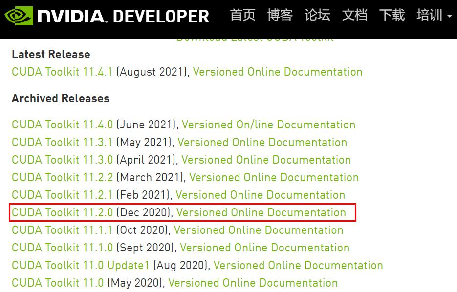
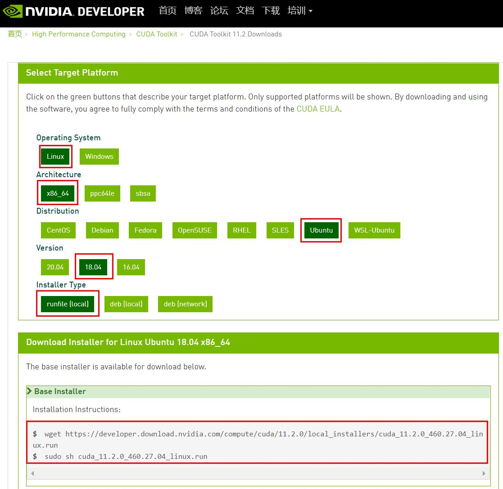
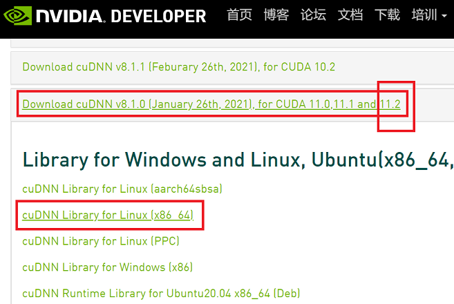
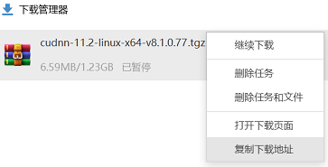

# anaconda

# 环境操作

## 新建环境

```shell
conda create -n tf2 python=3.8
```

## 删除环境

```shell
conda remove -n xxx --all
```

## 环境重命名

conda其实没有重命名指令，实现重命名是通过clone完成的，分两步：

- 先clone一份new name的环境
- 删除old name的环境

比如，想把环境rcnn重命名成tf

```shell
conda create -n tf --clone rcnn
conda remove -n rcnn --all
```


# 安装tensorflow

## 安装tensorflow2.5-gpu

本节默认安装的是Tensorflow2.5-GPU版本。其他版本安装方法也可以参考。

### 下载安装anaconda

下载最新版或指定版的anaconda：

```shell
wget https://mirrors.tuna.tsinghua.edu.cn/anaconda/archive/Anaconda3-2021.05-Linux-x86_64.sh
```

下好之后，进行安装：

```shell
sh Anaconda3-2021.05-Linux-x86_64.sh
```

如果conda的初始化时选择了yes，那么已经配置了环境变量，输入简单的命令测试一下：

```bash
conda activate # 进入conda环境 出现(base)则说明安装成功
conda deactivate # 退出conda环境
```

新建虚拟环境：

```shell
conda create -n tf2 python=3.8
```

配置国内镜像源：

第一次运行 conda config命令时，将会在用户的home目录创建`.condarc`配置文件，是一种可选的（optional）运行期配置文件，其默认情况下是不存在的。 

（windows：C:\users\username\，linux：/home/username/）

```shell
conda config
```

添加清华镜像和中科大镜像，文件内容如下：

```shell
channels:
  - https://mirrors.tuna.tsinghua.edu.cn/anaconda/pkgs/main/
  - https://mirrors.tuna.tsinghua.edu.cn/anaconda/pkgs/free/
  - https://mirrors.ustc.edu.cn/anaconda/pkgs/free/
  - https://mirrors.tuna.tsinghua.edu.cn/anaconda/cloud/conda-forge/
  - https://mirrors.tuna.tsinghua.edu.cn/anaconda/cloud/msys2/
  - https://mirrors.tuna.tsinghua.edu.cn/anaconda/cloud/bioconda/
  - https://mirrors.tuna.tsinghua.edu.cn/anaconda/cloud/menpo/
  - https://mirrors.tuna.tsinghua.edu.cn/anaconda/cloud/pytorch/
  - defaults
show_channel_urls: true
```

或者

```shell
# 配置国内源，方便安装Numpy,Matplotlib等
conda config --add channels https://mirrors.tuna.tsinghua.edu.cn/anaconda/pkgs/free/
conda config --add channels https://mirrors.tuna.tsinghua.edu.cn/anaconda/pkgs/main/
# 配置国内源，安装PyTorch用
conda config --add channels https://mirrors.tuna.tsinghua.edu.cn/anaconda/cloud/pytorch/
# 显示源地址
conda config --set show_channel_urls yes
```

效果都一样。

关闭控制台窗口，重新打开才会重新加载配置。

如果有更好用的源，可以按照上面的格式继续增加。

查看conda信息

```shell
conda info
```

### 安装tensorflow-gpu

 pip会自动给你安装最新的Tensorflow-gpu版本

```shell
pip install -i https://pypi.tuna.tsinghua.edu.cn/simple tensorflow-gpu
```

如果pip安装失败怎么办，手动下载安装文件：

打开[清华镜像源](https://pypi.tuna.tsinghua.edu.cn/simple/)，找到tensorflow-gpu

下载pip安装时命令行里出现的版本，我这里是

 ```
tensorflow_gpu-2.6.0-cp38-cp38-manylinux2010_x86_64.whl (458.4 MB)
 ```

下载后在该文件目录下cmd输入（注意换成自己对应的名字）：

```shell
pip install tensorflow_gpu-2.6.0-cp38-cp38-manylinux2010_x86_64.whl
```

其实到这里tensorflow部分安装完了，接下来安装显卡部分的。

### 根据tf-gpu版本找对应cuda和cudnn版本

Tensorflow2.5 GPU相关配置一览

| 本文安装项目          | 版本                         |
| --------------------- | ---------------------------- |
| python                | 3.6-3.9（博主是3.7.0）       |
| Tensorflow（CPU/GPU） | 2.5.0                        |
| Cuda（GPU版本所需）   | 11.2                         |
| Cudnn（GPU版本所需）  | v8.1.0（与Cuda版本匹配即可） |

如果要安装其他版本亦可类似从→[官网](https://tensorflow.google.cn/install/source?hl=en)这里找。Tensorflow、Cuda和Cudnn版本必须对应好。


### 安装cuda

直接先安装CUDA，而不是先独立安装GPU驱动，在安装CUDA的过程中，会安装好相应的GPU驱动，省时省力，比较方便。

[Cuda下载](https://developer.nvidia.com/cuda-toolkit-archive)



点击上图红框后然后按下图操作：



按上图操作下载：

```shell
wget https://developer.download.nvidia.com/compute/cuda/11.2.0/local_installers/cuda_11.2.0_460.27.04_linux.run
sudo sh cuda_11.2.0_460.27.04_linux.run
```

如果你已经预装了nvidia驱动，可能会遇到这个问题：

> Existing package manager installation of the driver found. It is strongly recommended that you remove this before continuing。

这时候选择只装cuda而不装驱动：

```shell
sudo sh cuda_11.2.0_460.27.04_linux.run --toolkit --silent --override
```

或者先删除现有的驱动然后再安装，具体见：

[Error installing Cuda toolkit: Existing package manager installation of the driver found](https://askubuntu.com/questions/1211919/error-installing-cuda-toolkit-existing-package-manager-installation-of-the-driv)

> Just run into this exact problem in Ubuntu18.04. And after some search, my solution is the following:
>
> 1. If you are sure that your driver version matches the cuda-toolkit version you are gonna install, refer to @domainxz answer, add `--toolkit` to only install toolkit and not to care about nvidia driver. Check [this](https://docs.nvidia.com/cuda/cuda-toolkit-release-notes/index.html) link for compatibility. (Scroll down to CUDA Driver table).
> 2. If you want CUDA to handle the compatibility problem for you, you need to uninstall your current drivers. Follow the instructions in [the official documentation](https://docs.nvidia.com/cuda/cuda-installation-guide-linux/index.html#runfile). After you entered the text screen after reboot, uninstall your previous Nvidia driver and run the cuda runfile. For Ubuntu 18.04, what I did and worked:
>
> ```
>     sudo apt-get remove --purge nvidia\*
>     sudo apt-get autoremove
>     sudo sh cuda-*.run --silient --override
> ```
>
> The official documentation is actually very detailed... Just make sure you follow each step and you should be fine.

也可以这样卸载：

1、查看系统中安装了哪些NVIDIA的驱动

```
sudo dpkg --list | grep nvidia-*
```

2、卸载NVIDIA驱动

可以直接在软件管理中卸载驱动（参考），同时也可以使用apt-get卸载NVIDIA驱动：

```shell
sudo apt-get --purge remove nvidia-*
# 也有的说用下面的命令进行卸载，我个人均有尝试，无碍
sudo apt-get --purge remove "*nvidia*"
```

**添加环境变量**

安装完之后，在`.bashrc配置文件`中`添加环境变量`

```shell
vim ~/.barshrc
export PATH=/usr/local/cuda-11.2/bin:$PATH 
export LD_LIBRARY_PATH=/usr/local/cuda-11.2/lib64:$LD_LIBRARY_PATH
```

使`.bashrc`生效：`source .bashrc `。

**测试cuda是否安装成功**

查看版本信息：一般当你安装好cuda之后，可以输入`nvcc -V`查看安装cuda的版本信息。

```shell
nvcc: NVIDIA (R) Cuda compiler driver
Copyright (c) 2005-2020 NVIDIA Corporation
Built on Mon_Nov_30_19:08:53_PST_2020
Cuda compilation tools, release 11.2, V11.2.67
Build cuda_11.2.r11.2/compiler.29373293_0
```

**卸载cuda**

如果安装cuda失败，或者是安装的版本不能够匹配，此时可能面临重新安装，同样也要卸载之前安装打cuda。

直接删除安装位置的cuda文件：

```python
sudo rm -rf /usr/local/cuda
sudo rm -rf /usr/local/cuda-11.2
```

### 安装cudnn

[Cudnn下载地址](https://developer.nvidia.com/rdp/cudnn-archive)

有很多版本，选了个兼容Cuda 11.2，因为前面高版本出错问题多的缘故，最终选择出现早的版本



需要注册后下载，如果想从linux上直接线上下载，那么就请不要下载到本地，在下载前的最后一步复制下载地址，因为只有一次机会，在linux下载。或者下载到window，上传到linux上也行。



```shell
wget https://developer.download.nvidia.cn/compute/machine-learning/cudnn/secure/8.1.0.77/11.2_20210127/cudnn-11.2-linux-x64-v8.1.0.77.tgz?fIolTbf7p-EYtg1E2vyPHzxFoAdBgzd-6WmHkgOnq2Wvgt9QRehQXvqzYkQsKdxHPjqAVLFpW_90p3IMSF6XXifm7v1AY0NrYiEanPyNv7mDEaiq8uCI_bCMnTytKngNF-pXj_jHpIBtNyiRM6gwirh74pRTlHWmpR-CTN2d_RN9U8SXB12ohvy0T5k8RG3jYCkHPlHCULmnQA8YM9A
```

然后再把上面的名字改为原名：

```shell
mv cudnn-11.2-linux-x64-v8.1.0.77.tgz\?fIolTb...lHCU cudnn-11.2-linux-x64-v8.1.0.77.tgz
```

解压文件，解压后目录为cuda：

```shell
tar -xvf cudnn-11.2-linux-x64-v8.1.0.77.tgz
```

查看cuda安装路径

```shell
which nvcc
# 显示
# /usr/local/cuda-11.2/bin/nvcc
```

进入解压cudnn目录，拷贝文件到cuda目录，并更改文件权限

```shell
cd cuda/
sudo cp include/cudnn* /usr/local/cuda-11.2/include
sudo cp lib64/libcudnn* /usr/local/cuda-11.2/lib64
sudo chmod a+r /usr/local/cuda-11.2/include/cudnn*
sudo chmod a+r /usr/local/cuda-11.2/lib64/libcudnn*
```

删除刚才解压的cudnn目录

```shell
cd ~
rm -rf cuda
```

### 查看安装的tensorflow能否使用gpu

```shell
conda activate tf2
python
```

在python中输入

```python
import tensorflow as tf
print(tf.__version__)
print(tf.test.is_gpu_available())  # 返回true值代表GPU可用，返回false代表GPU不可用
print(tf.config.list_physical_devices('GPU'))
```

即可得知结果：

```
2.6.0
True
[PhysicalDevice(name='/physical_device:GPU:0', device_type='GPU')]
```

如果返回的结果里有这样的语句：

```
successful NUMA node read from SysFS had negative value (-1), but there must be at least one NUMA node, so returning NUMA node zero
```

则意味着你的内核没有NUMA支持。你可以在[这里](https://en.wikipedia.org/wiki/Non-uniform_memory_access)和[这里](https://pubs.vmware.com/vsphere-4-esx-vcenter/index.jsp?topic=/com.vmware.vsphere.resourcemanagement.doc_41/using_numa_systems_with_esx_esxi/c_what_is_numa.html)阅读关于NUMA的[信息](https://pubs.vmware.com/vsphere-4-esx-vcenter/index.jsp?topic=/com.vmware.vsphere.resourcemanagement.doc_41/using_numa_systems_with_esx_esxi/c_what_is_numa.html)。

关于NUMA，粗略地说，如果你有双核CPU，它们都有自己的内存，并且必须通过较慢的QPI链接访问另一个处理器的内存。所以每个CPU +内存都是NUMA节点。

潜在地，你可以将两个不同的NUMA节点视为两个不同的设备，并将你的网络结构化以优化不同的节点内/节点间带宽 

不过，我认为现在TF中没有足够的线路来执行此操作。检测也无法正常工作 - 我只是在装有2个NUMA节点的机器上尝试过，它仍然打印相同的消息并初始化为1个NUMA节点。

## 安装tensorflow2.1-gpu

具体参考：[Centos7 安装Tensorflow2.1 GPU以及Pytorch1.3 GPU（CUDA10.1）](https://blog.csdn.net/qq_37541097/article/details/103933366)

参照上述教程安装完之后，可能会出现一些问题，如：

**关于import tensorflow出现的FutureWarning问题及解决**

在安装完tensorflow-gpu之后，等不及进去python里试验一下是否装成功，结果第一个import tensorflow as tf便出现了如下问题：

```
FutureWarning: Passing (type, 1) or ‘1type’ as a synonym of type is deprecated; in a future version of numpy, it will be understood as (type, (1,)) / ‘(1,)type’.
_np_quint8 = np.dtype([(“quint8”, np.uint8, 1)])
```

**解决办法：**

对h5py进行升级：`pip install h5py==2.8.0rc1`，对numpy包进行降级：`pip install numpy==1.6.0`。

**cuda 10.1下使用tensorflow-gpu 1.4报错解决办法**

报错信息:

```；
ImportError: libcublas.so.10.0: cannot open shared object file: No such file or directory
```

解决办法：[cuda 10.1下使用tensorflow-gpu 1.4报错解决办法](https://blog.csdn.net/weixin_42398077/article/details/101158496)


## 测试是否支持GPU

```python
import tensorflow as tf
print(tf.__version__)
print(tf.test.is_gpu_available())  # 返回true值代表GPU可用，返回false代表GPU不可用
print(tf.config.list_physical_devices('GPU'))
```


# 其他操作

## 手动复制其他用户的anaconda

注意，这种方法对于pip install安装的可能不能复制。

**（1）复制并修改其他**

切换到root用户，将其他用户的anaconda复制过来：

```shell
cp ../other_user/anaconda ./
```

然后赋予当前用户权限：

```shell
chown -R user ./anaconda
```

然后切换回当前用户，将其他用户的`.bashrc`复制到当前用户中覆盖。如果你并不是一个刚新建的用户，不想改变`.bashrc`中的其他变量，那么就只复制下面的内容，然后注意把其他用户的名字改成你自己的名字：

```shell
# >>> conda initialize >>>
# !! Contents within this block are managed by 'conda init' !!
__conda_setup="$('/home/other_user/anaconda3/bin/conda' 'shell.bash' 'hook' 2> /dev/null)"
if [ $? -eq 0 ]; then
    eval "$__conda_setup"
else
    if [ -f "/home/other_user/anaconda3/etc/profile.d/conda.sh" ]; then
        . "/home/other_user/anaconda3/etc/profile.d/conda.sh"
    else
        export PATH="/home/other_user/anaconda3/bin:$PATH"
    fi
fi
unset __conda_setup
# <<< conda initialize <<<
```

让修改后的环境变量生效

```shell
source ~/.bashrc
```

然后退出当前shell窗口重新打开。`which conda`就会显示你的地址了。

**（2）修改base环境中的可执行文件**

```shell
cd ~/anaconda3/bin
sed -i 's/other_user/user/g' *
```

这个操作，会把bin文件夹下所有文件中第一行含有用户名的文件进行修改，改为当前用户名，

```shell
#!/home/other_user/anaconda3/bin/python
->
#!/home/user/anaconda3/bin/python
```

比如下面这些文件中都含有上述第一行内容。

```shell
/home/anaconda3/bin/conda
/home/anaconda3/bin/pip
/home/anaconda3/bin/conda-env
```

**（3）修改所有虚拟环境中的可执行文件**

比如修改虚拟环境下的可执行文件pip之后，进入虚拟环境后pip和python才可用。

分别进入到每个虚拟环境的bin文件中，将bin文件夹下所有文件中第一行含有用户名的文件进行修改，改为当前用户名，

```shell
cd ~/anaconda3/envs/gpu3070_enabled/bin
sed -i 's/other_user/user/g' *
```

即会修改为

```shell
#!/home/other_user/anaconda3/bin/python
->
#!/home/user/anaconda3/bin/python
```

比如下面这些文件中都含有上述第一行内容。

```shell
/home/anaconda3/envs/gpu3070_enabled/bin/pip
```

## 删除anaconda里的pkgs文件下的包

anaconda文件夹下有个pkgs文件夹。据我观测（没找到正式说明），里面是各种包的各个使用过的版本及压缩包。比如用conda update pandas，那在Lib\site-packages里会更新到新版本。但pkgs里既有新版本，也有旧版本。我推测是conda先把包下载到pkgs里，解压，然后更新site-packages里正式用到的包。所以这个pkgs里的东西能不能删？删了不就可以省很多空间了么？

> 可以通过命令行删除，
>
> Google讨论组里推荐用`conda clean -p`删除未使用的的包；实际`conda clean -a`更强力些。

在Anaconda python中手动删除pkgs文件夹中的所有文件是否安全?

> 实际上，在某些情况下，可以选择除去 pkgs 子目录.如Anaconda社区支持在[此处](https://groups.google.com/a/continuum.io/g/anaconda/c/xV1BiGPmgao?pli=1)所述." pkgs 目录只是一个缓存.您可以将其完全删除.但是，在创建新环境时，将高速缓存中的所有程序包都留在周围效率更高."
>
> 根据[文档](https://docs.conda.io/projects/conda/en/latest/commands/clean.html)，您可以使用 conda clean --packages 删除 pkgs 中未使用的软件包(这会将它们移动到 pkgs/.trash 中，然后可以从中安全删除它们).虽然这不会检查使用返回到程序包缓存的符号链接安装的程序包，但是如果您不使用此类环境或在Windows下工作，则不是主题.我想这就是 conda clean --all 中包含 conda clean --packages 的原因.
>
> 要更积极地节省空间，可以使用 conda clean --force-pkgs-dirs 删除*所有*可写程序包缓存(但要注意的是可能存在环境)与这些目录相关联).如果您不使用环境或在Windows下使用Anaconda，则可能很安全.就我个人而言，我使用此选项没有问题.


# 参考资料

* [Tensorflow2.5安装（安装问题，这一篇全解决）](https://blog.csdn.net/QAQIknow/article/details/118858870)

“安装anaconda+tensorflow-gpu”参考了该博客。

===

* [将nvidia-docker容器导出给其他人使用](https://zhuanlan.zhihu.com/p/112703446)

装docker里的tensorflow可供参考。


