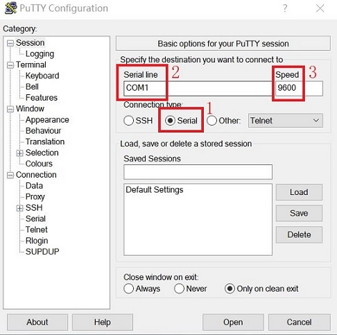

# Linux通信

* [返回上层目录](../linux.md)

* [串口通信](#串口通信)

* [tfp传输](#ftp传输)


# 串口通信

场景：linux板子和电脑通过串口连接。

串口线：如果电脑是笔记本，则一般没有串口，需要串口转USB，建议使用FT232串口转USB线，需要下载驱动。

串口软件选择：

这里建议选择`MobaXterm`作为串口的传输工具。如果不想用这个，或者不方便安装这个，可以用下面的：

* 对于xp系统，选择自带的超级终端（但不建议用超级终端，比较古老，优点是随机自带），超级终端在附件->通讯里可以找到。

* 对于win7-win10系统，选择下载`Putty`软件。如下图打开后，会弹出命令行显示窗口。



# ftp传输

假设我们要把一个linux板子通过网线直接插在win10电脑上，然后通过ftp互相传输文件。

（1）通过串口连接linux板子

  具体方法见对应章节。

（2）接上网线保证能ping通

连接好网线，在win10的命令行窗口中输入`ipconfig -all`找到本机ip，比如`192.168.10.111`。

然后在

通过`ifconfig -a`来

（3）ftp传输


# 网线传输

连接串口

连接网线

设置共享

查看IP：WLAN是192.168.200.168

以太网2是 192.168.137.1

然后通过串口通信来设置linux板子的IP：

```
ifconfig eth0 192.168.137.11
route add default gw 192.168.137.1
```

这里参考[Linux下用ifconfig命令设置IP、掩码、网关](https://blog.csdn.net/qq_28090573/article/details/82714028)

然后在板子上ping主机的WLAN网口：

```
ping 192.168.200.168
```

是通的

再ping百度的网址：

```
ping www.baidu.com
```

是通的，说明板子的DNS是好的，不好的话就修改DNS为`114.114.114.114`。

然后更新sources.list

然后就运行`apt-get update`，如果在这个过程中，你不小心ctrl+c中断了，再次运行`apt-get update`的时候就会出现

>  正在等待报头”（Eg. waiting for headers）

的报错，那就执行下面的命令：

```shell
sudo apt-get clean
cd /var/lib/apt
sudo mv lists lists.old
sudo mkdir -p lists/partial
sudo apt-get clean
sudo apt-get update
```

这里参考[sudo apt-get 正在等待报头](https://blog.csdn.net/liuci3234/article/details/80683706)。