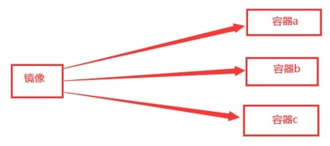

# docker

* [返回上层目录](../coding.md)


# 镜像和容器

## 镜像和容器的区别



两种理解：

* **光盘操作系统**：简单点说，镜像就类似操作系统光盘介质，容器相当于通过光盘安装后的系统。通过光盘(镜像)，我们能在不同机器上部署系统(容器)，系统内的操作只会保留在当前的系统(容器)中，如果要升级系统，需要使用到光盘，但是可能会导致操作系统的数据丢失。

* **类和对象**：容器是由镜像实例化而来，这和我们学习的面向对象的概念十分相似，我们可以把镜像看作类，把容器看作类实例化后的对象。

## 镜像理解

docker的镜像概念类似虚拟机的镜像。是一个只读的模板，一个独立的文件系统，包括运行容器所需的数据，可以用来创建新的容器。（  docker create <image -id > ：为指定的镜像添加一个可读写层，构成一个新的容器；）

例如：一个镜像可以包含一个完整的ubuntu操作系统环境，里面仅安装了mysql或用户需要的其他应用程序。

docker镜像实际上是由一层一层的系统文件组成，这种层级的文件系统被称为UnionFS( Union file system  统一文件系统)，镜像可以基于dockerfile构建，dockerfile是一个描述文件，里面包含了若干条密令，每条命令都会对基础文件系统创建新的层次结构。

docker提供了一个很简单的机制来创建镜像或更新现有的镜像。用户甚至可以从其他人那里下载一个已经做好的镜像直接使用。（镜像是只读的，可以理解为静态文件）

## 容器理解

docker利用容器来运行应用：

docker容器是由docker镜像创建的运行实例。docker容器类似虚拟机，可以执行包含启动，停止，删除等。

每个容器间是相互隔离的。

容器中会运行特定的运用，包含特定应用的代码及所需的依赖文件。可以**把容器看作一个简易版的linux环境**（包含root用户权限，进程空间，用户空间和网络空间等）和运行在其中的应用程序。

相对于镜像来说容器是动态的，容器在启动的时候创建了一层可写层次作为最上层。（   docker create <image -id > ：为指定的镜像添加一个可读写层，构成一个新的容器；）

```shell
docker 容器=镜像+可读层
```


# docker命令

## docker常见命令

新建镜像

```shell
docker build -t image_01.qc:v0.1 /path/to/Dockerfile
```

新建容器

```shell
docker create  --name myrunoob  nginx:latest 
```

运行容器

```shell
docker run --name mynginx -d nginx:latest
docker run -it -v /test:/soft centos /bin/bash
```

进入容器退出

```shell
exit
```

关闭容器

```shell
docker kill e7c  # 支持模糊查找，只写名称的前三个就可以
```

查看容器

```shell
docker ps -all
```

重启容器

```shell
docker start e7c
docker restart e7c  # 即便容器已经启动，restart也会给重启
```

以交互模式进入容器

```shell
docker exec -it e7c /bin/bash
```

删除容器

```shell
docker rm e7c
```


## docker命令集

[docker官网docker base command line](https://docs.docker.com/engine/reference/commandline/docker/)

[菜鸟：docker命令大全](https://www.runoob.com/docker/docker-command-manual.html)


```shell
docker create <image -id> 
```

为指定的镜像添加一个可读写层，构成一个新的容器；

```shell
docker start <container -id>
```

docker start 命令为容器文件系统创建一个进程的隔离空间。注意，每一个容器只能够有一个进行隔离空间；（运行容器）

```shell
docker run <image -id>
```

这个是先利用镜像创建一个容器，然后运行了这个容器；

```shell
docker stop <container -id>
```

停止所用的进程；

```shell
docker kill <container -id>
```

向所用运行在容器的进行发送一个不友好的sigkill信号；

```
docker pause <container -id>
```

将运行中的进程空间暂停

```shell
docker rm <container -id>
```

`docker rm`命令会移除构成容器的可读写层。注意，这个命令**只能对非运行态容器执行**。 

`docker rmi`命令会移除构成镜像的一个只读层。你只能够使用`docker rmi`来移除最顶层（top level layer）（也可以说是镜像），你也可以使用`-f`参数来强制删除中间的只读层。 

```shell
docker commit <container-id>
```

`docker commit`命令将容器的可读写层转换为一个只读层，这样就把一个容器转换成了不可变的镜像。 

```shell
docker save <image-id>
```

`docker save`命令会创建一个镜像的压缩文件，这个文件能够在另外一个主机的Docker上使用。和export命令不同，这个命令为每一个层都保存了它们的元数据。这个命令只能对镜像生效。 

```shell
docker export <container-id>
```

`docker export`命令创建一个tar文件，并且移除了元数据和不必要的层，将多个层整合成了一个层，只保存了当前统一视角看到的内容（注：expoxt后的容器再import到Docker中，通过`docker images –tree`命令只能看到一个镜像；而save后的镜像则不同，它能够看到这个镜像的历史镜像）。 

```
docker history <image-id>
```

`docker history`命令递归地输出指定镜像的历史镜像。 

```shell
docker ps
```

会列出所有运行中的容器；`docker ps -a`列出运行中和未运行的容器；

```shell
docker images -a
```

列出所用的镜像，也可以说列出所用的可读层。


# 参考资料

===

* [容器技术及其应用白皮书（上）-- 容器技术](https://blog.csdn.net/wh211212/article/details/53535881)
* [容器技术及其应用白皮书（下）-- 容器应用](https://blog.csdn.net/wh211212/article/details/53540342)

对容器技术写的不错的文章，待看

* [认识容器，我们从它的历史开始聊起](https://bbs.huaweicloud.com/blogs/285728)

写了对容器的理解。

* [docker -v 挂载问题](https://blog.csdn.net/hnmpf/article/details/80924494)

深入分析了docker -v的挂载问题。

