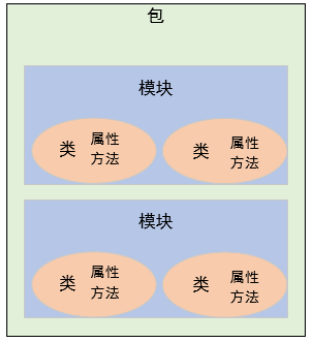

# 类和对象

* [返回顶层目录](../../../README.md#目录)
* [返回上层目录](../python.md)
* [面向对象编程](#面向对象编程)
* [类的构造方法](#类的构造方法)
* [类的访问权限](#类的访问权限)
* [继承](#继承)
* [多态](#多态)
* [引用其他.py文件中的类](#引用其他.py文件中的类)
* [类属性](#类属性)
* [类方法、静态方法](#类方法、静态方法)
* [单例类](#单例类)
* [异常处理](#异常处理)
* [包和模块](#包和模块)


# 面向对象编程

- 面向对象编程（简称oop）：是一种解决软件复用问题的设计和编程方法。

  这种方法把软件系统由相似的操作逻辑、数据、状态等以类的形式描述出来，通过对象实例在软件系统中复用，从而提高软件开发效率。

- 类：一个事物的抽象，定义了一类事物的属性和行为

- 对象：通过类创建的一个具体事物，它具有状态和行为，可以做具体的事情。

- 类和对象的关系

  - 类相当于创建对象的模板，根据类可以创建多个对象

- 类的构成

  - 类的名称
  - 类的属性
  - 类的方法

- 类的定义

  ```python
  class 类名:
  	def 方法名(self[，参数列表])
  ```

- 类名的命名规则按照“大驼峰”

- 定义的方法默认要传入一个self参数，表示自己，self参数必须是第一个参数

- 创建对象：对象变量名 = 类名()

```python
class Dog:
    def eat(self):
        print("小狗正在啃骨头！")
    def drink(self):
        print("小狗正在喝水！")

# 创建对象
wang_cai = Dog()# 旺财
wang_cai.eat()
wang_cai.drink()
print("-----------")
afu = Dog()# 阿福
afu.eat()
afu.drink()
```

# 类的构造方法

- \_\_int\_\_构造方法
  - 调用时间：在对象被实例化时被程序自动调用
  - 作用：用于对象创建时初始化
  - 书写格式：init前后分别是两个下划线
  - 程序不显示定义init方法，则程序默认调用一个无参init方法


构造一个类

```python
class Dog:
    # def __init__(self):# 无参构造方法
    #     print("定义了一条狗")
    def __init__(self, gender, variety, name):# 有参构造方法
        self.gender = gender
        self.variety = variety
        self.name = name
    def get_pro(self):
        print("我的名字是：{}".format(self.name))
    def eat(self):
        print("正在啃骨头")
    def drink(self):
        print("正在喝水")

# wangcai = Dog()
wangcai = Dog("male", "golden", "wangcai")
wangcai.eat()
wangcai.drink()
print(wangcai.name)
print(wangcai.variety)
print(wangcai.gender)
print(wangcai.get_pro())
# print("-------------")
# heibei = Dog("female", "lapulasi", "heibei")
# heibei.eat()
# heibei.drink()
# print(heibei.name)
# print(heibei.variety)
# print(heibei.gender)
```

# 类的访问权限

- 修改对象属性的方法
  - 方法1：对象变量名.属性 = 新值
  - 方法1的问题：
    - 1)可能修改的属性值不合法
    - 2)在类的外部可以随意修改类的内部属性
  - 方法2：对象变量名.内部修改属性方法
- 私有属性
  - 定义：\_\_私有变量名，变量名钱是两个下划线
  - 只能在类的内部使用，类外部不能访问，否则报错
- 私有方法
  - 只能在类内部调用，在类的外部无法调用
  - 定义私有方法在方法前加两个下划线
  - 类内部调用私有方法要使用self.私有方法的方式调用


类的私有属性无法被修改：

```python
class Dog:
    # def __init__(self):# 无参构造方法
    #     print("定义了一条狗")
    def __init__(self, gender, variety, name, age):# 有参构造方法
        self.gender = gender
        self.variety = variety
        self.name = name
        self.__age = age
    def get_pro(self):
        print("gender:{}, variety:{}, name:{}, age:{}".format(self.name, self.variety, self.name, self.__age))
    def set_pro(self, **args):
        if "gender" in args:
            self.gender = args["gender"]
        elif "variety" in args:
            self.variety = args["variety"]
        elif "name" in args:
            self.name = args["name"]
        elif "age" in args:
            if args["age"] < 0 or args["age"] > 20:
                print("非法年龄：{}".format(args["age"]))
            else:
                self.__age = args["age"]
    def eat(self):
        print("正在啃骨头")
    def drink(self):
        print("正在喝水")

wangcai = Dog("male","golden", "wangcai", 1)
wangcai.get_pro()# age:1
wangcai.set_pro(age=100)# 非法年龄：100
wangcai.get_pro()# age:1
wangcai.__age= 10# 类的外部不能对类的四有属性进行修改
wangcai.get_pro()# age:1
```

私有方法

```python
class Comrade:
    def __send_message(self):#私有方法
        print("消息已经汇报给上级")
    def answer(self, secret):
        if secret == "芝麻开门":
            print("接头成功")
            self.__send_message()# 调用私有方法
        else:
            print("接头失败！")
c = Comrade()
c.answer("芝麻开门")
```

# 继承

- 在程序中，继承描述的是类中类型与子类型之间的所属关系，例如猫和狗都属于动物
- 单继承
  - 子类继承一个父类，在定义子类时，小括号()中写父类的类名
  - 父类的非私有属性、方法、会被子类继承
  - 子类中方法的查找：先查找子类中对应的方法，如果找不到，再到父类中查找
  - 子类可以继承父类的属性和方法，也可以继承父类的父类的非私有属性和方法，以此类推
  - 在子类中调用父类的方法：ClassName.methodname(self)
- 多继承
  - object类是所有类的基类，在定义类的时候，不需要显式地在括号中表明继承自object类
  - 多继承：一些子类可以继承多个父类
  - 多继承定义方式：在类名后的括号中添加需要继承的多个类名
  - 多继承中，如果在多个类中有同名的方法，子类调用查找方法的顺序是按照小括号内继承父类从左到右的顺序查找，第一个匹配方法名的父类方法将会被调用

单继承

```python
class Animal:
    def __my(self):
        print("私有方法")
    def eat(self):
        print("---吃---")
    def drink(self):
        print("---喝---")
    def run(self):
        print("--跑---")
class Dog(Animal):
    def hand(self):
        print("***握手***")
    def eat(self):# 重写与父类同名的成员函数
        print("***狗在吃饭***")
class GoldDog(Dog):
    def guide(self):
        Animal.run(self)# 在子类中调用父类的方法
        print("我能导航")
wangcai = Dog()
# 子类可继承父类的非私有方法
wangcai.eat()
wangcai.drink()
wangcai.run()
wangcai.hand()
# wangcai.__my()# 子类不能继承父类的私有方法
# Error: 'Dog' object has no attribute '__my'
jinmao = GoldDog()
jinmao.hand()# 继承父类
jinmao.eat()# 继承父类重新定义的函数
jinmao.drink()# 继承爷爷类
jinmao.guide()
```

多继承：（尽量不雅使用相同的方法名称，以免产生分歧）

```python
class AI:
    def face(self):
        print("人脸识别")
    def data_ana(self):
        print("人工智能的数据分析")
class BigData:
    def data_ana(self):
        print("大数据的数据分析")
class Python(AI, BigData):# 继承了两个父类的方法
    def operate(self):
        print("自动化运维")

py = Python()
py.face()
py.data_ana()
py.operate()
```

# 多态

多态(主要用于JAVA、C#强类型的语言中)

- 一个抽象类有多个子类，不同的类表现出多种形态

```python
class Animal:
    def eat(self):
        print("正在吃饭")
class Dog(Animal):
    def eat(self):
        print("Dog正在吃饭")
class Cat(Animal):
    def eat(self):
        print("Cat正在吃饭")
def show_eat(obj):
    obj.eat()

wangcai = Dog()
show_eat(wangcai)
tom = Cat()
show_eat(tom)
```

# 引用其他.py文件中的类

dog_define.py:

```python
class Dog():
    def eat(self):
        print("狗在吃饭")
```

dog_use.py:

```python
from dog_define import Dog
jinmao = Dog()
jinmao.eat()
```

注意的是，在pycharm中，会发生无法导入同级别其他文件中的类的情况。需要对所在的包右击“Mark directory as”->"sources Root"。

# 类属性

- 实例属性

  - 所属于具体的实例对象，不同的实例对象之间的实例属性互不影响

- 类属性

  - 所属于类对象，多个实例对象之间共享一个类属性

  - 获取类属性方法：类名.类属性

  - 通过实例对象不能修改类属性

    


类属性（在所有对象中共享的属性）

```python
class Person:
    sum_num = 0# 类属性:人类总数，对象全局共享
    def __init__(self, new_name):
        self.name = new_name
        Person.sum_num += 1
p1 = Person("zhangsan")
print(Person.sum_num, p1.sum_num)# 1 1
p2 = Person("lisi")
print(Person.sum_num, p1.sum_num, p2.sum_num)# 2 2 2
p1.sum_num = 100# 相当于动态的添加了一个实例属性，并不能修改类属性
print(Person.sum_num, p1.sum_num, p2.sum_num)# 2 100 2
```

如果名称相同，则优先找实例属性，再找类属性：

建议：尽量使用类名.类属性来调用类属性，以免和实例属性混淆。

```python
class Person:
    sum_num = 0# 类属性:人类总数，对象全局共享
    def __init__(self, new_name, num):
        self.name = new_name
        self.sum_num = num
        Person.sum_num += 1
p1 = Person("zhangsan", 99)
print(Person.sum_num, p1.sum_num)# 1 99
```

# 类方法、静态方法

- 类方法
  - 所属与类对象，使用@classmethod修饰的方法
  - 定义类方法的第一个参数通常以"cls"参数作为类对象被传入
  - 调用方式：类名.类方法 或者 实例对象.类方法（不推荐）
- 静态方法
  - 使用@staticmethod修饰的方法，不需要默认传递任何参数
  - 调用方式：类名.静态方法 或者 实例对象.静态方法

```python
class Person:
    sum_num = 0# 类属性:人类总数，对象全局共享
    def __init__(self, new_name):
        self.name = new_name
        Person.sum_num += 1
    @classmethod
    def add_sum_num(cls):
        cls.sum_num += 1
        print(cls.sum_num)

# 类名调用类方法
Person.add_sum_num()# 1
p1 = Person("zhangsan")
print(Person.sum_num, p1.sum_num)# 2 2
# 不建议用实例对象调用类方法
p1.add_sum_num()# 3
```

静态方法

静态方法几乎和类和对象本身没什么关系,所以不建议使用静态方法。

```python
class Person:
    sum_num = 0# 类属性:人类总数，对象全局共享
    def __init__(self, new_name):
        self.name = new_name
        Person.sum_num += 1
    @staticmethod
    def static_test():
        print("-----静态方法-----")
        Person.sum_num += 1
        print(Person.sum_num)

Person.static_test()
print("------")
p1 = Person("p1")
p1.static_test()
```

在类方法和静态方法中，不能直接调用实例属性。

# 单例类

- \_\_new\_\_(cls)
  - 超类object类内置的方法，用户创建对象，返回创建对象的引用
  - 先在内存里创建一个对象，在根据\_\_init\_\_添加具体的类的属性
  - 必须要提供cls参数，代表类对象
  - 必须要有返回值，返回创建对象的引用
- 单例类
  - 在整个程序系统中确保某一个类只有一个实例对象。比如数据库连接的类，确保只有一个数据库连接的类，保证系统的性能。


实例化对象的过程

- 1、调用\_\_new\_\_方法创建对象，并返回创建的对象的引用。（new是创建具体对象的，而不是创建类属性的，类属性在new之前就已经被python解释器创建了）
- 2、调用\_\_init\_\_构造方法初始化对象，将先创建的对象的引用作为参数传入，此时self指向的是上一步new方法创建的对象的引用
- 3、初始化对象结束，将对象的引用返回给具体的对象变量(如例子中的db)

```python
class DataBaseObj(object):
    def __init__(self):
        # __init__是在__new__基础上完成了一些其他的初始化的操作
        print("__init__构造方法")
    def __new__(cls):# 重写父类的__new__方法
        # cls代表的是类对象
        print("cls_id:{}",id(cls))
        return object.__new__(cls)# 必须要返回一个对象
# 类就像是一个制造商，new就是前期的原材料购买环节，
# init就是在原材料基础上加工初始化商品的缓解.
print("DataBaseObj_id:", id(DataBaseObj))
# DataBaseObj_id: 6092792
db = DataBaseObj()
# cls_id:{} 6092792
# __init__构造方法
print(db)
# <__main__.DataBaseObj object at 0x0000000002869588>
```

单例类：

```python
class SingleObj:
    instance = None
    def __init__(self):
        print("__init__")
    def __new__(cls):
        if cls.instance == None:
            cls.instance = object.__new__(cls)
        # 类属性指向实例对象
        return  cls.instance

s1 = SingleObj()# __init__
print(id(s1))# 34452592
s2 = SingleObj()# __init__
print(id(s2))# 34452592
```

# 异常处理

- 捕获异常

  ```python
  try:
  	逻辑代码块
  except ExceptionType as err:
  	异常处理方法
  ```

- 捕获多个异常

  ```python
  try:
  	逻辑代码块
  except (ExceptionType1, ExceptionType1, ...) as err:
  	异常处理方法
  ```

- 捕获所有可能发生发生的异常

  ```python
  try:
  	逻辑代码块
  except (ExceptionType1, ExceptionType1, ...) as err:
  	异常处理方法
  except Exception as err:
  	异常处理方法
  ```

- finally，常用于关闭文件或数据库连接等程序运行过程中，是否发生异常，程序都要处理。不论是否产生异常，均要执行

  ```python
  try:
  	逻辑代码块
  except (ExceptionType1, ExceptionType1, ...) as err:
  	异常处理方法
  except Exception as err:
  	异常处理方法
  finally:
    	无论是否有异常产生，都会执行这里的代码块！
  ```

- 函数嵌套异常传递


单个

```python
try:
    open("test.txt", "r")
except FileNotFoundError as err:
    print("捕获到了异常：文件不存在!",err)
print("哈哈")
```

多个(一旦出错，后面的代码均不会执行)

```python
try:
    print(num)
    open("test.txt", "r")
except (NameError, FileNotFoundError) as err:
    print(err)
print("哈哈")
```

所有

```python
try:
    print(num)
    open("test.txt", "r")
except (NameError) as err1:
    print(err1)
except Exception as err2:
    print(err2)
print("哈哈")
```

finally

```python
f = None
try:
    f = open("test.txt", "r")
except Exception as err:
    print(err)
    if f != None:
        print("关闭文件")
        f.close()
finally:
    print("不论发生什么，都会执行我")
print("哈哈")
```

函数嵌套，也即程序调用时发生异常

```python
def test1():
    print("-------test1-------")
    print(num)
    print("-------test2--------")
def test2():
    print("*******test2********")
    try:
        test1()
    except Exception as err:
        print("捕获到了test1函数的异常", err)
    print("********test-2********")

test2()
```

# 包和模块

- python项目结构

  - 一个项目里有多个包，一个包里有多个模块(.py)，一个模块就是一个以.py结尾的文件，一个模块内可以定义变量、函数、类等。

    


- 模块的名字：.py文件的名字

- 包下可以包含子包

- 不同包下可以有相同的模块名称，使用“包名.模块名”的方法区分

- 引入模块的方式

  - 引入单个模块：import model_name

  - 引入多个模块：import model_name1, model_name2, ...

  - 引入模块中的指定函数：

    from model_name import funcc1, func2, ...

- 包中必须包含一个默认的\_\_init\_\_文件

  - 用于标识一个包，而不是一个普通的文件夹

  - **会在包或者该包下的模块被引入时自动调用**

  - 常用于设置包和模块的一些初始化操作

    如\_\_init\__.py可写成：

    ```python
    print("init文件自动被调用")
    # import business.model1
    __all__ = ['model1','model2']
    ```

    以便

    ```python
    from business import *
    ```


不同的包之间可以创建同名的模块(.py)。


