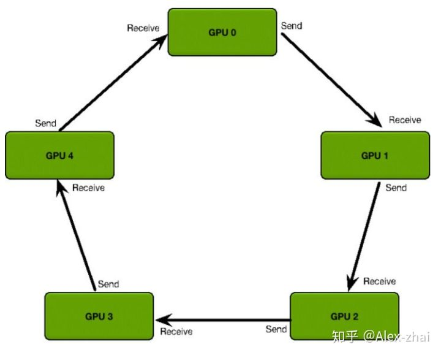
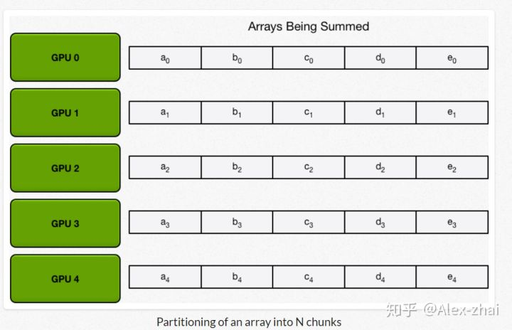
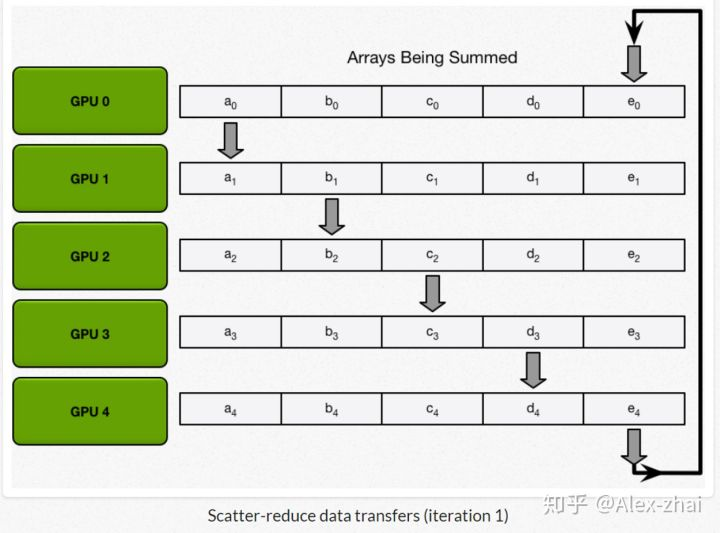
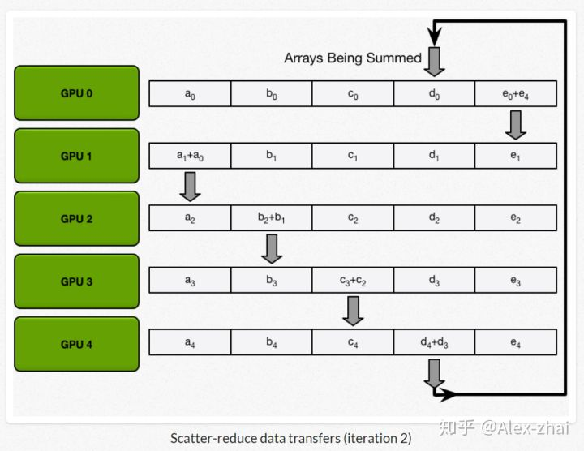
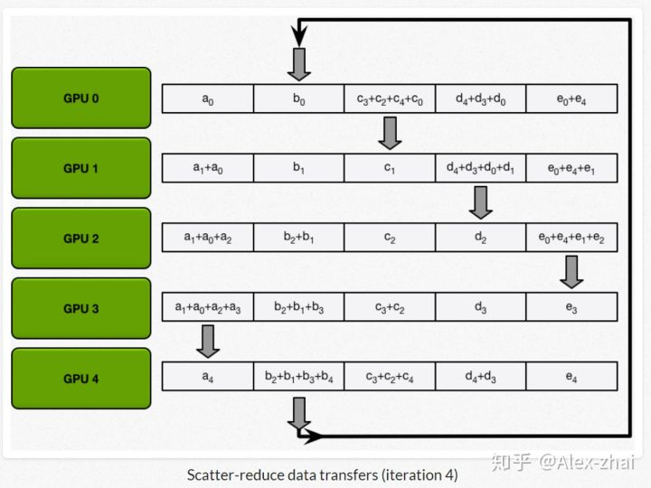
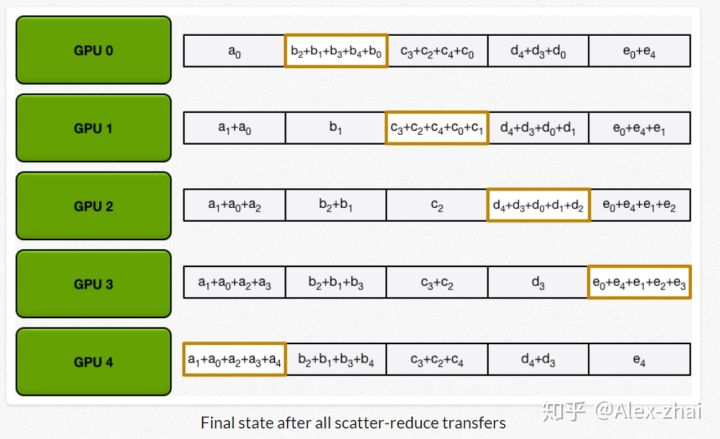
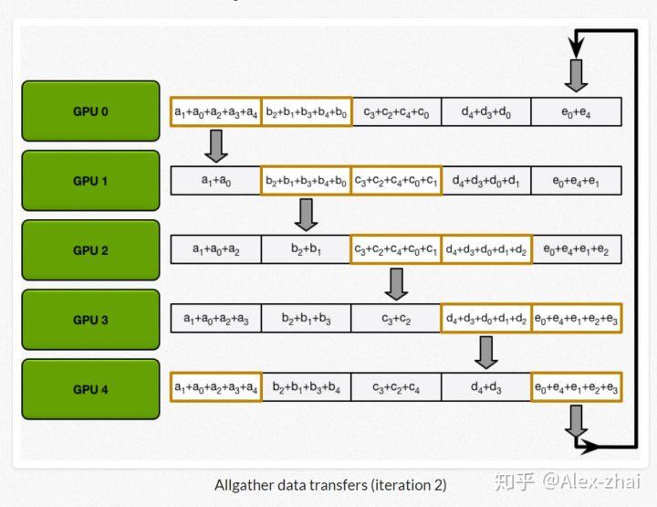
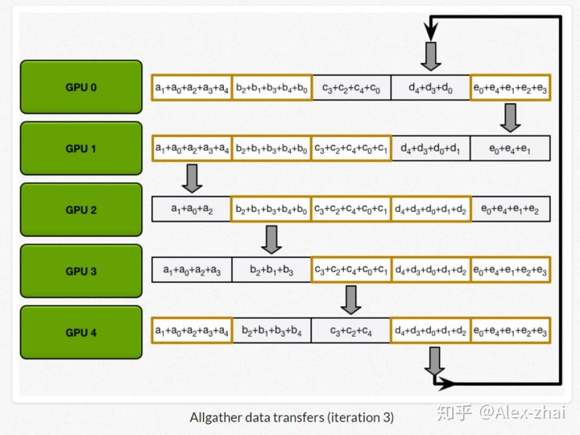
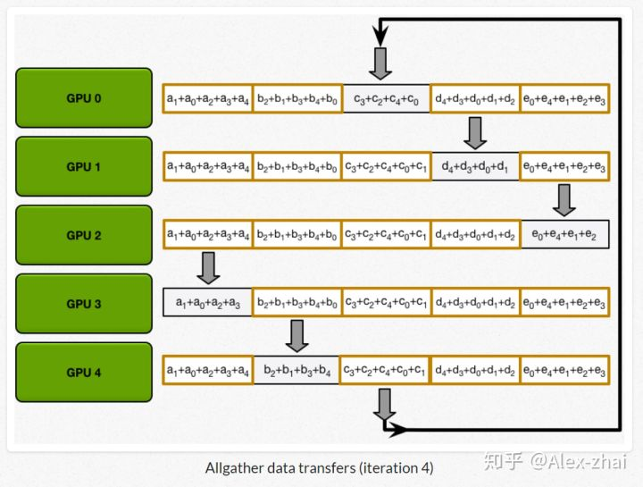
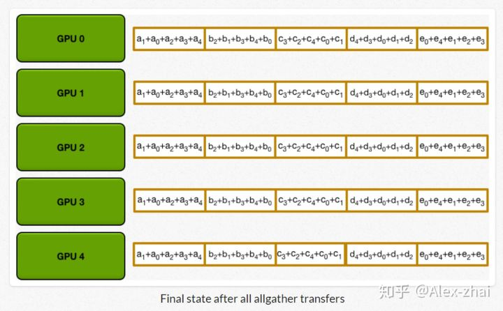

# Tensorflow分布式架构

* [返回上层目录](../tensorflow1.0.md)
* [Ring-All-reduce算法](#Ring-All-reduce算法)
  * [同步更新方式的网络瓶颈定量分析](#同步更新方式的网络瓶颈定量分析)
  * [Ring-All-reduce框架下同步更新算法](#Ring-All-reduce框架下同步更新算法)
    * [scatter-reduce](#scatter-reduce)
    * [Allgather](#Allgather)

# Ring-All-reduce算法

首先还是先回顾下参数同步更新和异步更新的区别：

同步更新模式下，所有GPU在同一时间点与参数服务器交换、融合梯度；

异步更新模式下，所有GPU各自独立与参数服务器通信，交换、融合梯度。

- 异步更新通信效率高速度快，但往往收敛不佳，因为一些速度慢的节点总会提供过时、错误的梯度方向。可通过上一篇介绍的Stale Synchronous Parallel Parameter Server方法缓解该问题。
- 同步更新通信效率低，通常训练慢，但训练收敛稳定，因为同步更新基本等同于单卡调大 的batch size 训练。

但是传统的同步更新方法（各个gpu卡算好梯度，求和算平均的方式），在融合梯度时，会产生巨大的通信数据量，这种通信压力往往在模型参数量很大时，显得很明显。因此我们需要找到一种方法，来解决同步更新的网络瓶颈问题。其中最具代表性的一种方法就是：ring all-reduce。

## 同步更新方式的网络瓶颈定量分析

这边假设有1个server端（存放参数），10个worker端（计算梯度），模型是Deep Speech 2，参数量300M，相当于 1.2 G 的大小的内存数据（300M * sizeof(float)）。假设网络带宽 1G bytes/s （万兆网卡），10 卡同步更新，需要 10.8 s 完成参数 Send。在单 ps 节点、有限带宽环境下，通信时间随着GPU数量的增加而线性增长，很难想象一个10卡的集群每训练一个 batch 都需要等待 10 ~ 20s 来同步参数！通信时延几乎完全覆盖掉了GPU并行计算节节省下的计算时间。当然也可以通过一些技巧来缓解通信压力，比如增加server的个数。

## Ring-All-reduce框架下同步更新算法

定义GPU集群的拓扑结构：

每个GPU只从左邻居接受数据、并发送数据给右邻居。

算法主要分两步：

1. scatter-reduce：会逐步交换彼此的梯度并融合，最后每个GPU都会包含完整融合梯度的一部分。

2. allgather：GPU会逐步交换彼此不完整的融合梯度，最后所有GPU都会得到完整的融合梯度

### scatter-reduce

举例：数组求和

Step1：将数组在每个GPU上都分块

Step2：N-1轮的scatter-reduce，每一轮中，每个GPU将自己的一个chunk发给右邻居，并接收左邻居发来的chunk，并累加。

### Allgather

和scatter-reduce操作类似，只不过将每个chunk里面的操作由累加值变为替换。

通信代价分析：

* 每个GPU在Scatter Reduce阶段，接收N-1次数据，N是GPU数量；

* 每个GPU在allgather阶段，接收N-1次 数据；

* 每个GPU每次发送K/N大小数据块，K是总数据大小；

所以，Data Transferred=2(N−1)*K/N ，随着GPU数量N增加，总传输量恒定。也就是理论上，随着GPU数量的增加，ring all-reduce有线性加速能力。

下面一篇文章，将给大家介绍tensorflow中是如何实现ring all-reduce算法的。

# 参考资料

* [浅谈Tensorflow分布式架构：ring all-reduce算法](https://zhuanlan.zhihu.com/p/69797852)

“ring all-reduce算法”参考了该知乎专栏文章。

