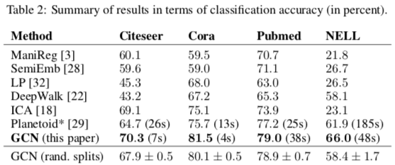
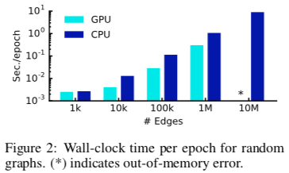

# 基于图卷积网络的半监督学习

* [返回上层目录](graph-convolutional-networks.md)
* [概括](#概括)
* [基于图的半监督学习](#基于图的半监督学习)
* [谱图卷积简介](#谱图卷积简介)
  * [谱图卷积](#谱图卷积)
  * [切比雪夫近似谱卷积](#切比雪夫近似谱卷积)
  * [基于切比雪夫近似的GCN](#基于切比雪夫近似的GCN)
* [本文工作](#本文工作)
  * [Layer-wise线性模型](#Layer-wise线性模型)
  * [卷积层](#卷积层)
  * [分层传播](#分层传播)
  * [半监督GCN框架](#半监督GCN框架)
  * [两层GCN例子](#两层GCN例子)
* [效果](#效果)
* [讨论](#讨论)
  * [半监督模模型](#半监督模模型)
  * [限制及未来工作](#限制及未来工作)

>论文：Semi-Supervised Classification with Graph Convolutional Networks
>作者：Thomas N. Kipf, Max Welling
>来源：ICLR 2017

PDF: [*SEMI-SUPERVISED CLASSIFICATION WITH GRAPH CONVOLUTIONAL NETWORKS*](https://openreview.net/pdf?id=SJU4ayYgl)

PyTorch源码：[Graph Convolutional Networks in PyTorch](https://github.com/tkipf/pygcn)

# 概括

semi-GCN是一篇经典的GCN论文，作者提出了一种简单且有效GCN框架，使用切比雪夫一阶展开近似谱卷积，使每一个卷积层仅处理一阶邻域信息，然后通过分层传播规则叠加一个个卷积层达到多阶邻域信息传播。

# 基于图的半监督学习

图结构反映了节点之间的相似性，大量未标记的样本（节点）加入到模型训练中有助于提升分类效果，故基于图的半监督学习是一件很自然且重要的事情。

**传统方法是**假设“相连节点应该相似，具有相同标签”，将基于图的正则项Lreg显示加入到损失函数中进行学习：
$$
\begin{aligned}
\mathcal{L}&=\mathcal{L}_0+\lambda\mathcal{L}_{reg}\\
\text{with}\quad\mathcal{L}_{reg}&=\sum_{i,j}A_{ij}||f(X_i)-f(X_j)||^2=f(X)^T\Delta f(X)
\end{aligned}
$$
这个假设太严格了，极大限制模型能力，因为节点相连不一定都是相似，但会包含附加信息。

# 谱图卷积简介

GCN主流有两大类方法：

1. **基于空间的方法(spatial domain):**将图数据规则化，这样就可以直接用CNN来处理了
2. **基于谱方法(spectral domain):**利用谱图理论（spectral graph theory）直接处理图数据，本文是该类方法的代表作，简短介绍下相关的工作。

## 谱图卷积

**谱方法的理论基础，直接对图结构数据及节点特征进行卷积操作**

定义为信号(特征)x与卷积核gθ在傅立叶域上的乘积:
$$
g_{\theta}x=Ug_{\theta}U^TX
$$
但上述卷积计算复杂度比较大： 特征向量矩阵U相乘计算复杂度为O(|N^2|) ，以及图的拉普拉斯矩阵分解开销。

## 切比雪夫近似谱卷积

为了缓解计算问题，Hammond在2011年论文[*Wavelets on graphs via spectral graph theory - HAL-Inria*](https://hal.inria.fr/inria-00541855/document)提出可以用切比雪夫多项式展开近似卷积核gθ（**类似泰勒展开**）：
$$
g_{theta}*x\approx \sum_{k=0}^K\theta_k'T_k(\tilde{L})x
$$

- 使用切比雪夫是因为是递归性质，计算复杂度低
- 上述多项式取前K项，即表示对k跳内邻居及特征进行卷积计算，即**谱图卷积不再依赖于整个图，而只是依赖于距离中心节点K步之内的节点（即K阶邻居）**

## 基于切比雪夫近似的GCN

2016年Defferrard在[*Convolutional Neural Networks on Graphs with Fast Localized Spectral Filtering*](https://arxiv.org/pdf/1606.09375.pdf)将上述切比雪夫近似的卷积核应用到CNN中，端到端处理图数据。

# 本文工作

本文对Defferrard的工作进一步简化，每一个卷积层仅处理一阶邻居特征，通过分层传播规则叠加一个个卷积层达到多阶邻居特征传播。

## Layer-wise线性模型

近似的谱图卷积虽然可以建立起K阶邻居的依赖，然而，却仍然需要在$\tilde{L}$上进行K阶运算。在实际过程中，这一运算的代价也是非常大的。为了降低运算代价，本文进一步简化了该运算，即限定K=1。此时，谱图卷积可以近似为$\tilde{L}$（或L）的线性函数。

当然，这样做的代价是，只能建立起一阶邻居的依赖。对于这一问题，可以通过堆积多层图卷积网络建立K阶邻居的依赖，而且，这样做的另一个优势是，在建立K>1阶邻居的依赖时，不需要受到切比雪夫多项式的限制。

为了进一步简化运算，在GCN的线性模型中，本文定义λmax≈2。此时，我们可以得到图谱卷积的一阶线性近似：
$$
\begin{aligned}
&g_{\theta'}*x\approx\theta_0'x+\theta_1'\left(L-I_N\right)x=\theta_0'x-\theta_1'D^{\text{—}\frac{1}{2}}AD^{\text{—}\frac{1}{2}}x\\
\Rightarrow&\theta\left(I_N-D^{\text{—}\frac{1}{2}}AD^{\text{—}\frac{1}{2}}\right)x
\end{aligned}
$$
可以看到，该式中仅有两个参数θ'\_0与θ'\_1。若需建立k阶邻居上的依赖，可以通过设置k层这样的滤波器来实现。

在实际的过程中，可以通过对参数进行约束来避免过拟合，并进一步简化运算复杂度。例如，可以令
$$
\theta=\theta_0'=-\theta_1'
$$
，从而得到
$$
g_{\theta}*x\approx\theta\left(I_N+D^{\text{—}\frac{1}{2}}AD^{\text{—}\frac{1}{2}}\right)x
$$
需要注意的是，
$$
I_N+D^{\text{—}\frac{1}{2}}AD^{\text{—}\frac{1}{2}}
$$
的特征值范围为[0,2]，这意味着，当不停地重复该操作时（网络非常深时），可能会引起梯度爆炸或梯度消失。为了减弱这一问题，本文提出了一种 renormalization trick：
$$
I_N+D^{\text{—}\frac{1}{2}}AD^{\text{—}\frac{1}{2}}\Rightarrow\tilde{D}^{\text{—}\frac{1}{2}}\tilde{A}\tilde{D}^{\text{—}\frac{1}{2}}
$$
其中，
$$
\tilde{A}=A+I_N,\quad \tilde{D}_{ii}=\sum_j\tilde{A}_{ij}
$$
当图中每个节点的表示不是单独的标量而是一个大小为C的向量时，可以使用其变体进行处理：
$$
Z=\tilde{D}^{\text{—}\frac{1}{2}}\tilde{A}\tilde{D}^{\text{—}\frac{1}{2}}X\Theta
$$
其中，
$$
\Theta\in\mathbb{R}^{C\times F}
$$
表示参数矩阵，
$$
Z\in\mathbb{R}^{N\times F}
$$
为相应的卷积结果。此时，每个节点的节点表示被更新成了一个新的F维向量，该F维向量包含了相应的一阶邻居上的信息。

## 卷积层

使用切比雪夫一阶展开（K=1，线性）的卷积核，外套一个非线性单元。
$$
H^{(l+1)}=\sigma\left(\tilde{D}^{\text{—}\frac{1}{2}}\tilde{A}\tilde{D}^{\text{—}\frac{1}{2}}H^{(l)}W^{(l)}\right)
$$
$H^{(l)}$为上一个卷积层的输出，表示为节点该层的embedding，作为第l+1个卷积层的输入，
$$
H^{(0)}=X
$$
 ，X为节点自身特征。
$$
\tilde{D}^{\text{—}\frac{1}{2}}\tilde{A}\tilde{D}^{\text{—}\frac{1}{2}}H^{(l)}
$$
为一阶近似卷积核，可以简单理解成加权平均邻接特征。

1. 增加self-loops，使在卷积计算时也会考虑当前节点自身特征：
   $
   \tilde{A}=A+I
   $
    ，A为邻接矩阵

2. 对$\tilde{A}$进行对称归一化：
   $
   \hat{A}=\tilde{D}^{\text{—}\frac{1}{2}}\tilde{A}\tilde{D}^{\text{—}\frac{1}{2}}
   $
   。避免邻居数量越多，卷积后结果越大的情况以及考虑了邻居的度大小对卷积的影响。

σ为非线性激活单元，如RELU，$W^{(l)}$为卷积层参数，**每个节点共享该参数**。

## 分层传播

每个卷积层仅处理一阶邻居特征，堆叠起来可以达到处理K阶内邻居特征。

这种作法一方面缓解当节点度分布非常广时的过拟合情况，另外也可以以更少的代价建立更深层的模型。

## 半监督GCN框架

输入：节点X1, X2, X3, X4，每个节点包含C维特征。

输出：经过卷积层的处理，最终输出F个分类对应的预测概率Z1, Z2, Z3, Z4

训练：其中X1, X4为带标签节点，X2, X3不带标签，共同训练，并计算带标签的节点损失，进行后向传播。

## 两层GCN例子

$$
Z=f(X,A)=\text{softmax}\left(\tilde{A}\text{ReLU}\left(\tilde{A}XW^{(0)}\right)W^{(1)}\right)
$$

1. 输入:节点特征矩阵
   $
   X\in R^{N\times C}
   $
   及邻接矩阵
   $
   A\in R^{N\times N}
   $

2. 预处理邻接矩阵A：
   $
   \hat{A}=\tilde{D}^{\text{—}\frac{1}{2}}\tilde{A}\tilde{D}^{\text{—}\frac{1}{2}}
   $

3. 第一层卷积+ReLU非线性转换：
   $
   H^{(0)}=\text{ReLU}\left(\hat{A}XW^{(0)}\right)
   $

4. 第二层卷积+softmax转换后输出： 
   $
   \begin{aligned}
   &Z=f(X,A)=\text{softmax}\left(\tilde{A}H^{(0)}W^{(1)}\right)=\text{softmax}\left(\tilde{A}\text{ReLU}\left(\tilde{A}XW^{(0)}\right)W^{(1)}\right)\\
   \Rightarrow &Z=H^{(1)}
   \end{aligned}
   $

实现复杂度为O(|E|CHF) ，C为X的维度，H为中间层维度、F为输出层维度。

# 效果

相比其他算法，效果及计算时间有明显的改进

**不同传播模型的对比**

**计算时间**

1000W边就只能CPU计算了，一个epoch 差不多要10s

硬件：

Hardwareused:16-coreIntel Xeon CPU E5-2640 v3 @ 2.60GHz, GeForce GTX TITAN X

# 讨论

## 半监督模模型

相关算法如基于图拉普拉斯正则项假设边仅编码节点相似度，限制了模型能力，而基于skip-gram的方法需要多步（随机游走+skip-gram），很难一起优化。

## 限制及未来工作

**内存限制：**由于内存原因，大图不能在GPU中工作， 通过mini-batch的梯度下降可以有一定缓解作用，然而应该考虑GCN模型的层数，如果设置为K层，则每个节点K层内的邻居必须存在在内存中，在密度高的图中可能需要进一步的近似。

**有向边和边特征处理：**不支持有向边 和 边特征， 可以将原始有向图表示为无向二分图，可以处理有向边和边上特征，**其中附加节点表示原始图中的边**。

**假设限制**
$$
\tilde{A}=A+I_N
$$
表示自连接与相邻节点的边相等重要，但是对于一些数据集，可能需要引入lambda 权衡:
$$
\tilde{A}=A+\lambda I_N
$$

# 参考资料

* [semi-GCN：基于图的半监督学习](https://zhuanlan.zhihu.com/p/65276194)
* [《Semi-Supervised Classification with Graph Convolutional Networks》阅读笔记](https://zhuanlan.zhihu.com/p/31067515)

本文参考了这两篇知乎专栏文章。

===

[经典半监督图卷积神经网络Semi-GCN](https://zhuanlan.zhihu.com/p/5817806)

