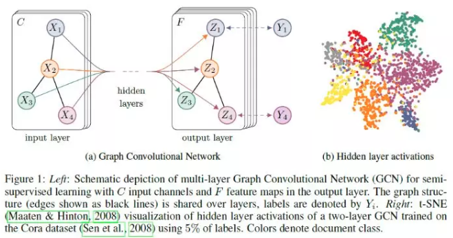
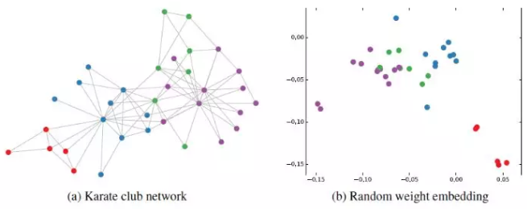
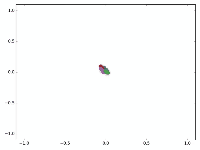

# GCN图卷积网络初步理解

* [返回上层目录](../graph-convolutional-networks.md)
* [GCN是做什么的](#GCN是做什么的)
* [GCN长啥样，吓人吗](#GCN长啥样，吓人吗)
* [GCN为什么是这个样子](#GCN为什么是这个样子)
* [GCN有多牛](#GCN有多牛)
* [其他关于GCN的点滴](#其他关于GCN的点滴)

>GCN问世已经有几年了（2016年就诞生了），但是这两年尤为火爆。本人愚钝，一直没能搞懂这个GCN为何物，最开始是看清华写的一篇三四十页的综述，读了几页就没读了；后来直接拜读GCN的开山之作，也是读到中间的数学部分就跪了；再后来在知乎上看大神们的讲解，直接被排山倒海般的公式——什么傅里叶变换、什么拉普拉斯算子等等，给搞蒙了，越读越觉得：“哇这些大佬好厉害，哎我怎么这么菜！”。
>
>就这么反反复复，尝试一次放弃一次，终于慢慢有点理解了，慢慢从那些公式的里跳了出来，看到了全局，也就慢慢明白了GCN的原理。今天，我就记录一下我对GCN“阶段性”的理解。

GCN的概念首次提出于ICLR2017（成文于2016年）：

# GCN是做什么的

在扎进GCN的汪洋大海前，我们先搞清楚这个玩意儿是做什么的，有什么用。

深度学习一直都是被几大经典模型给统治着，如CNN、RNN等等，它们无论再CV还是NLP领域都取得了优异的效果，那这个GCN是怎么跑出来的？是因为**我们发现了很多CNN、RNN无法解决或者效果不好的问题——图结构的数据**。

回忆一下，我们做图像识别，对象是图片，是一个二维的结构，于是人们发明了CNN这种神奇的模型来提取图片的特征。CNN的核心在于它的kernel，kernel是一个个小窗口，在图片上平移，通过卷积的方式来提取特征。这里的关键在于图片结构上的**平移不变性**：一个小窗口无论移动到图片的哪一个位置，其内部的结构都是一模一样的，因此CNN可以实现**参数共享**。这就是CNN的精髓所在。

再回忆一下RNN系列，它的对象是自然语言这样的序列信息，是一个一维的结构，RNN就是专门针对这些序列的结构而设计的，通过各种门的操作，使得序列前后的信息互相影响，从而很好地捕捉序列的特征。

上面讲的图片或者语言，都属于**欧式空间**的数据，因此才有维度的概念，欧式空间的数据的特点就是结构很规则。但是现实生活中，其实有很多很多不规则的数据结构，典型的就是图结构，或称拓扑结构，如社交网络、化学分子结构、知识图谱等等；即使是语言，实际上其内部也是复杂的树形结构，也是一种图结构；而像图片，在做目标识别的时候，我们关注的实际上只是二维图片上的部分关键点，这些点组成的也是一个图的结构。

图的结构一般来说是十分不规则的，可以认为是**无限维**的一种数据，所以它**没有平移不变性**。每一个节点的周围结构可能都是独一无二的，这种结构的数据，就让传统的CNN、RNN瞬间失效。所以很多学者从上个世纪就开始研究怎么处理这类数据了。这里涌现出了很多方法，例如GNN、DeepWalk、node2vec等等，GCN只是其中一种，这里只讲GCN，其他的后面有空再讨论。

GCN，图卷积神经网络，实际上跟CNN的作用一样，就是一个特征提取器，只不过它的对象是图数据。GCN精妙地设计了一种从图数据中提取特征的方法，从而让我们可以使用这些特征去对图数据进行**节点分类（node classification）、图分类（graph classification）、边预测（link prediction）**，还可以顺便得到**图的嵌入表示（graph embedding）**，可见用途广泛。因此现在人们脑洞大开，让GCN到各个领域中发光发热。

# GCN长啥样，吓人吗

GCN的公式看起来还是有点吓人的，论文里的公式更是吓破了我的胆儿。但后来才发现，其实90%的内容根本不必理会，只是为了从数学上严谨地把事情给讲清楚，但是完全不影响我们的理解，尤其对于我这种“追求直觉，不求甚解”之人。

下面进入正题，我们直接看看GCN的核心部分是什么样子：

假设我们手头有一批图数据，其中有N个节点（node），每个节点都有自己的特征，我们设这些**节点的特征组成一个N×D维的矩阵X**，然后**各个节点之间的关系也会形成一个N×N维的矩阵A**，也称为邻接矩阵（adjacency matrix）。X和A便是我们模型的输入。

GCN也是一个神经网络层，它的层与层之间的传播方式是：
$$
H^{(l+1)}=\sigma\left(\tilde{D}^{-\frac{1}{2}}\tilde{A}\tilde{D}^{-\frac{1}{2}}H^{(l)}W^{(l)}\right)
$$
这个公式中：

* $\tilde{A}=A+I$，I是单位矩阵
* $\tilde{D}$是$\tilde{A}$的度矩阵（degree matrix），一般是出度
* H是每一层的特征，对于输入层的话，H就是X
* $\sigma$是非线性激活函数

我们先不用考虑为什么要这样去设计一个公式。我们现在只用知道：
$$
\tilde{D}^{-\frac{1}{2}}\tilde{A}\tilde{D}^{-\frac{1}{2}}
$$
这个部分，**是可以事先算好的**，因为$\tilde{D}$由A计算而来，而A是我们的输入之一。

所以对于不需要去了解数学原理、只想应用GCN来解决实际问题的人来说，你只用知道：哦，这个GCN设计了一个牛逼的公式，用这个公式就可以很好地提取图的特征。这就够了，毕竟不是什么事情都需要知道内部原理，这是根据需求决定的。

为了直观理解，我们用论文中的一幅图：

上图中的GCN输入一个图，通过若干层GCN每个node的特征从X变成了Z，但是，无论中间有多少层，**node之间的连接关系，即A，都是共享的**。

假设我们构造一个两层的GCN，激活函数分别采用ReLU和softmax，则整体的正向传播的公式为：
$$
Z=f(X,A)=\text{softmax}\left(\hat{A}\ \text{ReLU}\left(\hat{A}\ X\ W^{(0)}\right)W^{(1)}\right)
$$
最后，我们针对所有带标签的节点计算cross entropy损失函数：
$$
L=-\sum_{l\in y_L}\sum_{f=1}^FY_{lf}\text{ln}Z_{lf}
$$
就可以训练一个node classification的模型了。由于即使只有很少的node有标签也能训练，作者称他们的方法为**半监督分类**。

当然，你也可以用这个方法去做graph classification、link prediction，只是把损失函数给变化一下即可。

# GCN为什么是这个样子

我前后翻看了很多人的解读，但是读了一圈，最让我清楚明白为什么GCN的公式是这样子的居然是作者Kipf自己的博客：http://tkipf.github.io/graph-convolutional-networks/ 推荐大家一读。

作者给出了一个由简入繁的过程来解释：

我们的每一层GCN的输入都是邻接矩阵A和node的特征H，那么我们直接做一个内积，再乘一个参数矩阵W，然后激活一下，就相当于一个**简单的神经网络层**嘛，是不是也可以呢？
$$
f(H^{(l)},A)=\sigma\left(A\ H^{(l)}\ W^{(l)}\right)
$$
实验证明，即使就这么简单的神经网络层，就已经很强大了。这个简单模型应该大家都能理解吧，这就是正常的神经网络操作。

但是这个简单模型有几个局限性：

* 只使用A的话，由于A的对角线上都是0，所以在和特征矩阵H相乘的时候，只会计算一个node的所有邻居的特征的加权和，该node自己的特征却被忽略了。因此，**我们可以做一个小小的改动，给A加上一个单位矩阵I**，这样就让对角线元素变成1了。

* A是**没有经过归一化**的矩阵，这样与特征矩阵相乘会改变特征原本的分布，产生一些不可预测的问题。所以我们对A做一个标准化处理。首先让A的每一行加起来为1，我们可以乘以一个D的逆，D就是度矩阵。我们可以进一步把D的拆开与A相乘，得到一个对称且归一化的矩阵：
  $
  D^{-\frac{1}{2}}\ A\ D^{-\frac{1}{2}}
  $

通过对上面两个局限的改进，我们便得到了最终的层特征传播公式：
$$
f(H^{(l)},A)=\sigma\left(\hat{D}^{-\frac{1}{2}}\ A\ \hat{D}^{-\frac{1}{2}}H^{(l)}W^{(l)}\right)
$$
其中，
$$
\hat{A}=A+I,\hat{D}\text{ is degree matrix of }\hat{A}
$$
公式中的
$$
D^{-\frac{1}{2}}AD^{-\frac{1}{2}}
$$
与**对称归一化拉普拉斯矩阵**十分类似，而在谱图卷积的核心就是使用对称归一化拉普拉斯矩阵，这也是GCN的卷积叫法的来历。原论文中给出了完整的从谱卷积到GCN的一步步推导，我是看不下去的，大家有兴趣可以自行阅读。

# GCN有多牛

在看了上面的公式以及训练方法之后，我并没有觉得GCN有多么特别，无非就是一个设计巧妙的公式嘛，也许我不用这么复杂的公式，多加一点训练数据或者把模型做深，也可能达到媲美的效果呢。

但是一直到我读到了论文的附录部分，我才顿时发现：GCN原来这么牛啊！

为啥呢？

**因为即使不训练，完全使用随机初始化的参数W，GCN提取出来的特征就以及十分优秀了！**这跟CNN不训练是完全不一样的，后者不训练是根本得不到什么有效特征的。

我们看论文原文：

然后作者做了一个实验，使用一个俱乐部会员的关系网络，使用随机初始化的GCN进行特征提取，得到各个node的embedding，然后可视化：

可以发现，在原数据中同类别的node，经过GCN的提取出的embedding，已经在空间上自动聚类了。

而这种聚类结果，**可以和DeepWalk、node2vec这种经过复杂训练得到的node embedding的效果媲美了**。

说的夸张一点，比赛还没开始，GCN就已经在终点了。看到这里我不禁猛拍大腿打呼：“NB！”

还没训练就已经效果这么好，那**给少量的标注信息，GCN的效果就会更加出色**。

作者接着给每一类的node，提供仅仅一个标注样本，然后去训练，得到的可视化效果如下：

这是整片论文让我印象最深刻的地方。

看到这里，我觉得，以后有机会，确实得详细地吧GCN背后的数学琢磨琢磨，其中的玄妙之处究竟为何，其物理本质为何。这个时候，回忆起在知乎上看到的各路大神从各种角度解读GCN，例如从热量传播的角度，从一个群体中每个人的工资的角度，生动形象地解释。这一刻，历来痛恨数学的我，我感受到了一丝数学之美，于是凌晨两点的我，打开了天猫，下单了一本正版《数学之美》。哦，数学啊，你真如一朵美丽的玫瑰，每次被你的美所吸引，都要深深受到刺痛，我何时才能懂得你、拥有你？

# 其他关于GCN的点滴

1. 对于很多网络，我们可能没有节点的特征，这个时候可以使用GCN吗？答案是可以的，如论文中作者对那个俱乐部网络，采用的方法就是用**单位矩阵 I 替换特征矩阵 X**。
2. 我没有任何的节点类别的标注，或者什么其他的标注信息，可以使用GCN吗？当然，就如前面讲的，不训练的GCN，也可以用来提取graph embedding，而且效果还不错。
3. GCN网络的层数多少比较好？论文的作者做过GCN网络深度的对比研究，在他们的实验中发现，GCN层数不宜多，2-3层的效果就很好了。

# 参考资料

* [何时能懂你的心——图卷积神经网络（GCN）](https://mp.weixin.qq.com/s/I3MsVSR0SNIKe-a9WRhGPQ)

本文主要参考此文章。
