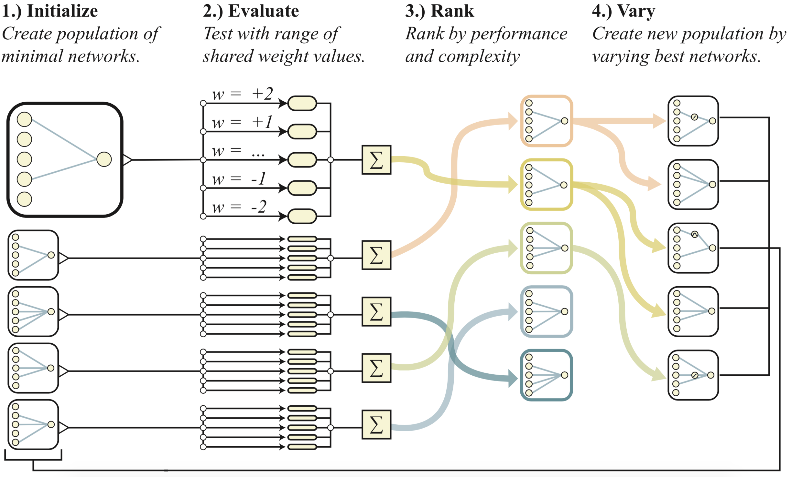
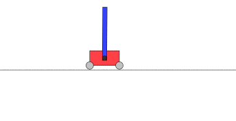
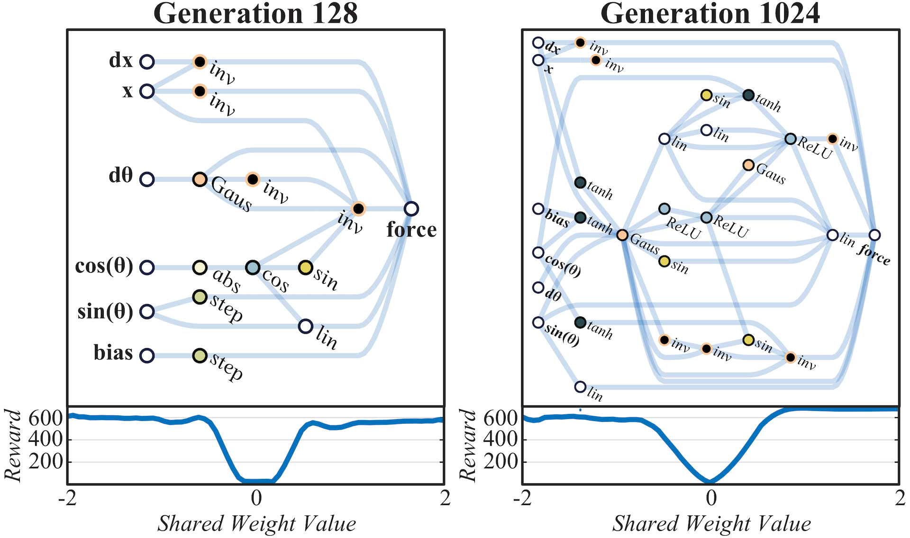
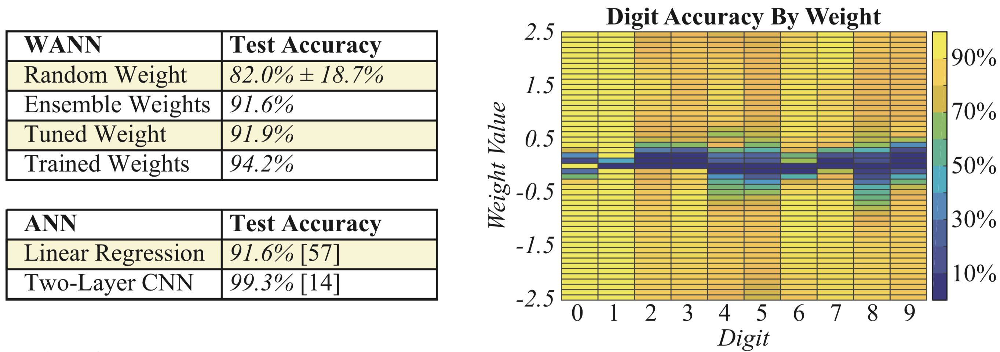

# 权重无关的神经网络

* [返回顶层目录](../../README.md#目录)
* [返回上层目录](neural-architecture-search.md)
* [简介](#简介)
* [相关工作](#相关工作)
* [权重无关的神经网络搜索](#权重无关的神经网络搜索)
  * [拓扑搜索](#拓扑搜索)
  * [性能和复杂度评判](#性能和复杂度评判)
* [实验结果](#实验结果)
  * [连续控制](#连续控制)
  * [分类](#分类)
* [总结和未来工作](#总结和未来工作)

    <iframe width="620" height="315"
        src="pic/two-leg-robot.mp4">
    </iframe>

论文：[Weight Agnostic Neural Networks](https://arxiv.org/pdf/1906.04358.pdf)

博客：[weightagnostic.github.io](https://weightagnostic.github.io/)

如下是两个不用学习权重的神经网络示例，分别是二足行走智能体（上）和赛车（下）：

 

# 简介

（1）受到动物先天行为的启发

具有先天性行为的动物常常从刚生下的那一刻就能获得一定的能力来躲避天敌。比如蜥蜴和蛇，刚破壳就已经能躲避天敌了；刚刚破壳而出的小鸭子，自己不用别人教就能会游泳和进食，以及刚破壳的鸡，就能分辨出捕食者了。

然而，我们目前训练一个智能体来完成任务时，是先选一个神经网络架构，认为它对该任务能够通过学习权值来得到一个想要的策略，然后通过学习算法来找到该策略的权值。

受到自然界先天性行为进化的启发，我们发展出一个能够天然地执行给定任务的神经网络，即便其权值是随机给定的。有了这样的神经网络架构，智能体无需学习权值，就已经能很好的完成任务了。

为了评估这些网络，研究者使用从统一随机分布中采样的单个共享权重参数来连接网络层，并评估期望性能。结果显示，该方法可以找到少量神经网络架构，这些架构可以在没有权重训练的情况下执行多个强化学习任务，或 MNIST 等监督学习任务。

（2）以前就有不用学习的神经网络

数十年的神经网络研究已经为各种任务领域提供了强归纳偏执的构造模块。比如，卷积网络就特别适合处理图像。

即使是随机初始化的CNN也可以用作人工的先验，用于图像处理任务，如超分辨率和修复。带有习得的线性输出层的随机初始化的LSTM能够预测时间序列，而传统的RNN就不行。近期在自注意力机制和胶囊网络的研究拓宽了创建适用于多个任务的架构的构造模块范围。

因此，受到随机初始化的CNN和LSTM的影响，该研究旨在搜索权重无关的神经网络，即这些具备强归纳偏置的网络可以使用随机权重执行不同任务。

为了寻找具备强归纳偏置的神经网络架构，我们提出通过降低权重重要性的方式来搜索网络架构。具体步骤为：

1）为每一个网络连接提供单一的共享权重参数；

2）在较大的权重参数值范围内评估网络。

该研究没有采用优化固定网络权重的方式，而是优化在大范围权重值上都有良好性能的架构。我们揭示了，该方法可生成使用随机权重参数执行不同连续控制任务的网络。

权重无关神经网络示例：二足行走智能体（左）、赛车（右）：

研究者通过降低权重重要性的方式搜索架构。网络使用单一的共享权重值。所有架构在大范围权重值上进行性能优化后，仍然能够在没有权重训练的情况下执行不同任务。

# 相关工作

神经网络拓扑搜索：神经网络拓扑的搜索算法起源于20世纪90年代的进化计算领域。我们的方法基于一种能同时优化网络权重和结构的拓扑搜索算法。

算法信息理论：一个好的模型应该是最能压缩其数据，包括描述模型本身的成本（奥卡姆剃刀原则）。我们将权重共享应用于整个网络以简化网络，并将权重视为从固定分布中采样的随机变量。

网络修剪：网络修剪是从一个完整的训练好的网络中去除权值较小的连接，而我们的方法是从没有连接开始，并根据需要增加网络连接的复杂性，而且复杂性没有上限。

神经科学：人类童年早期通过形成新的神经元突触来学习技能和形成记忆，大脑会根据新体验来更新自身的网络连接。我们鼓励智能体基于环境交互通过不断让网络增长来编码所需技能，而不是通过学习权值。

# 权重无关的神经网络搜索

创建能够编码解决方案的网络架构，和神经架构搜索（NAS），完全是两个本质不同的问题。NAS的目标是，由其生成的架构，一旦被训练好，就能超过由人类设计的架构，但是从没有人说，解决方案只适用于NAS找到的网络结构。NAS创建的网络，如果不经过训练，则无法解决问题，权重才是其解决方案，而不是架构，其找到的架构仅仅是适合其权重的一个更好的底层。

为了生成自身就能编码解决方案的架构，必须最小化权重的重要性。在评估网络性能时，我们没有选择使用最优权重值的网络，而是从随机分布中抽取权重值。用权重采样取代权重训练可以确保性能只与网络拓扑结构有关。

然而，由于维数灾难，除了最简单的网络外，高维权重空间的可靠采样在所有网络上都是不可行的。但通过在所有权重上执行权重共享，权重值的数量减少到 1，就会非常直接和高效，使我们通过少数实验就能估计网络性能，从而可以搜索更好的搜索网络架构。

权重无关的神经网络（WANN）的搜索总结如下：

1. 创建最少神经网络拓扑结构的初始群组；
2. 在多个部署（rollout）上对每个网络进行评估，每个部署分配一个不同的共享权重值；
3. 根据网络的性能和复杂度对其进行排序；
4. 通过改变排名最高的网络拓扑结构创建新的群组，这些拓扑结构是通过锦标赛选择法根据概率选择的。

然后，算法从(2)开始重复，生成复杂度递增的权重无关拓扑结构，其性能优于之前的几代。

## 拓扑搜索

用于搜索神经网络拓扑的算子受到神经进化算法 NEAT 的启发。不过 NEAT 中的拓扑和权重值是同时进行优化的，我们无视权重，仅使用拓扑搜索算子。

初始的种群由稀疏连接网络、没有隐藏节点的网络，以及输入和输出层之间仅有部分可能连接的网络组成。通过对已有网络使用如下三种操作之一来创建新网络：

* 插入节点

  为了插入节点，我们将已有连接分裂成两个连接，这两个连接均通过这个新的隐藏节点，该新节点的激活函数是随机赋予的

* 添加连接

  在之前未连接的节点直接加入新的连接

* 改变激活函数

  隐藏节点的激活函数是随机分配的。激活函数包含了常见的（如线性、sigmoid、ReLU）和不常见的（高斯、正弦、阶跃）。激活函数编码输入和输出之间的多种关系。

下图是用于网络拓扑搜索空间的三种操作：

## 性能和复杂度评判

我们使用数个共享的权重（[-2, -1, -0.5, +0.5, +1, +2]）来减小评估网络拓扑时的变量。一个网络拓扑的平均性能是，使用这些不同的权值的所有部署的累计奖励的平均值。

根据算法信息理论（和奥卡姆剃刀原则类似），我们还关注网络本身的复杂度。给两个性能接近的不同网络，我们选择更简单的网络。在评价一个网络性能时，我们不仅考虑其在种群中的排序，也考虑网络本身的大小，这样搜索的目标就成了一个多目标优化问题。

我们应用连接代价技术来生成更简单，模块化和可演化的网络。网络拓扑基于三个标准判断：所有权重的平均性能，单个最佳权重的最优性能以及网络中的连接数。我们并没有试图用人工制定的对每个新任务的奖励函数去平衡这些标准，而是根据[支配排序](https://wenku.baidu.com/view/61daf00d0508763230121235.html)对这些解决方案进行排名。

以这种方式对网络进行排序要求复杂性的任何增加都要伴随着性能的提高。在鼓励最小和模块化网络的同时，这种约束会让更大的架构变化（在有效果之前可能需要多次添加网络连接）难以实现。 为了放宽这种约束，我们仅按概率对复杂度进行排序：在80％的情况下，网络根据平均性能和网络连接数进行排名，而另外20％的排名则通过平均性能和最佳性能来完成。

# 实验结果

## 连续控制

在如下三个连续控制任务上对权重无关的神经网络进行评估：

（1）车杆上摆

任务：杆必须从下垂位置摆动到竖直向上，同时小车不能超出轨道边界。

奖励：其每个时间步的奖励是小车距离边界的距离和杆的角度。

（2）双足行走

任务：引导双足智能体穿越随机地形。

奖励：行驶距离，以及电机扭矩的成本，以鼓励有效运动

（3）赛车

任务：用三个连续命令（油门、转向、刹车）控制汽车沿着赛道行驶。

奖励：在一定时限内在赛道上的行驶距离。

在实验中，我们比较了以下4种情况下100次试验的平均表现： 

1. 随机权重：从μ(-2,2)范围内抽取的单个权重。
2. 随机共享权重：从μ(-2,2)范围内中抽取的单个共享权重。
3. 调整共享权重：在μ(-2,2)范围内表现最好的共享权重值。
4. 调整权重：使用基于群体信息的强化调整的个体权重。

下表为权值随机采样和权值经过训练的连续控制任务的性能

注：上表中的值是减去了作为baseline的传统固定拓扑网络（需要学习参数）的值。即使使用随机权重，WANN都能执行任务。

虽然WANN的架构本身就编码了解决方案的强归纳偏执，但是其并不是完全和权值无关：当对权值赋予随机值后，它就会失败。WANN通过编码输入和输出之间的关系来运行，因此虽然权重的大小并不重要，但它们的一致性，特别是符号的一致性却很重要。使用单个共享权重的另一个好处是，调整此单个参数变得非常容易，无需使用梯度下降法。

表现最佳的共享权值即使不是最优的行为，也也令人满意：摆动几次后平衡的杆，即便步态低效但依然能够行走，会蹭到拐角的狂野驾驶行为。 这些基本行为完全在网络架构内编码。虽然WANN不用训练就能执行，但依然可以经过训练权重后达到和当前业内领先类似的性能。

下图是权重无关的拓扑网络的迭代历程：

由于网络规模小到可以解释，我们可以通过查看网络图来了解其运行机制（见上图）。解决“车杆上摆”的WANN网络发展过程就展现了在网络架构内对关系的编码方式。在早期的网络空间中，不可避免的需要使用随机探索的方式。到了第32代，出现了让表现一致的的初步结构：适用于X位置的三个反相结构防止小车离开轨道。轨道中间是零，左边为负，右边为正。当小车处于负位置时施加正力，反之亦然，这样就编码出了朝向轨道中心的强吸引器。

随着搜索过程的继续，有些控制器能够在直立位置保持更长时间，到第128代时，这个保持时间已经长到能够让杆保持平衡。虽然在可变权重条件下，这种更复杂的平衡机制在可靠性上低于摆动和居中行为，但更可靠的行为可以确保系统恢复，并再次尝试直到找到新的平衡状态。值得注意的是，由于这些网络对关系进行编码，并依赖于系统之间的相互对立的张力，因此网络的行为与广泛的共享权重值保持一致。

在双足行走器和赛车比赛任务中，WANN网络控制器在简单性和模块性方面的表现同样出色。前者仅使用了25种可能输入中的17种，忽略了许多LIDAR传感器信息和膝盖运动速度数据。 WANN架构不仅可以在未训练单个权重的情况下完成任务，而且仅使用了210个连接，比常用拓扑网络架构（SOTA的baseline方法中使用了2804个连接）低一个数量级。

在赛车比赛实验中，能编码出稳定驾驶行为的WANN架构简单的优势也很突出。只需要稀疏连接的双层网络和单个权重值，就能编码合格的驾驶行为。虽然SOTA的baseline方法也给出了预训练RNN模型的隐藏状态，但除了VAE对其控制器的表示外，我们的控制器仅在VAE的潜在空间上运行。尽管如此，WANN还是能够开发出一种前馈控制器，可以获得性能相当的分数。未来我们将探索如何从搜索中去掉网络架构的前馈约束，让WANN能够发展出带记忆状态的循环网络连接。

## 分类

在强化学习任务中取得的好成绩让我们考虑扩大WANN的应用范围。对输入信号之间的关系进行编码的WANN非常适合强化学习任务。不过，分类问题远没有这么模糊，性能要求也要严格得多。与强化学习不同，分类任务中的架构设计一直是人们关注的焦点。为了验证概念，我们研究了WANN在MNIST数据集上的表现。

即使在高维分类任务中，WANN的表现也非常出色。 只使用单个权重值，WANN就能够对MNIST上的数字以及具有通过梯度下降训练的数千个权重的单层神经网络进行分类，产生的架构灵活性很高，仍然可以继续进行权重训练，进一步提高准确性。

直接对权重范围进行全部扫描，当然可以找到在训练集上表现最佳的权重值，但WANN的结构提供了另一个有趣的方式。在每个权重值处，WANN的预测是不同的。在MNIST上，可以看出每个数字的精度是不一样的。可以将网络的每个权重值视为不同的分类器，这样可能使用具有多个权重值的单个WANN，作为“自包含组合”。

在最简单的集合方法中，通过组合一系列不同权值的WANN来创建网络集合。 这些网络中的每一个都有一个投票权，并且该集合根据获得最多投票的类别对样本进行分类。 这种方法产生的预测远比随机选择的重量值更准确，并且仅比最佳可能的权值略差一点点。 这种简单朴素的集合的成功，会鼓励进行预测或对架构进行搜索时尝试更复杂的集成技术。

下图的左图是MNIST数据集的分类预测精度，右图是WANN不同权值的预测精度：

# 总结和未来工作

在这项工作中，我们介绍了一种方法，用于搜索具有强归纳偏差的简单神经网络架构，以执行给定任务。由于网络经过优化后可以在一系列值上使用单一共享的权值参数，因此可以轻松调整此单个参数以提高性能。可以从最佳共享权值进一步调整每一个单独的权值。

为了开发能够在其环境中编码许多不同有用任务的单个WANN，可以考虑开发一种具有强固有偏差的WANN用于固有动机，并且在一个开放的环境总不断优化其架构以在追求新颖性方面表现良好。这样的WANN可以通过好奇心奖励信号编码多种技能，这些技能可以在以后的环境中轻松地针对特定下游任务进行微调。

虽然我们的方法通过添加连接来学习日益复杂的网络架构，但网络修剪方法通过删除来找到新的架构。还可以学习一种能够在不学习权重的情况下执行附加任务的被修剪的网络。

深度学习的成功归功于我们能够使用梯度下降训练大型神经网络的权重，这些神经网络由大型数据集上精心设计的构建块组成。虽然取得了很大进展，但也存在局限性，因为我们仅限于梯度下降能够训练的架构空间。例如，有效地训练依赖于离散分量的模型或利用基于梯度方法的自适应计算机制仍然是一个具有挑战性的研究领域。我们希望我们的这项工作能够鼓励进一步的研究，以促进新网络架构的发现，这些架构不仅具有实际领域的归纳偏执，而且还可以使用可能不需要梯度计算的算法进行训练。

在这项工作中发现的网络与卷积神经网络的性能不匹配并不令人惊讶，不然会是一个令人尴尬的成就。几十年来，CNN架构已经被人类科学家和工程师所完善，但这并不是对最初释放CNN能力的现有结构的重新洗牌。卷积层本身曾是新的构建块，构建块具有很强的视觉任务归纳偏执，其发现和应用帮助深度学习取得了令人难以置信的进步。自从卷积神经网络被发现以来，研究界可用的计算资源已经显着增长。如果我们将这些资源用于自动发现，并希望在网络架构上实现不仅仅是逐步改进，我们相信它也值得尝试新的构建块，而不仅仅是如何布局构建块。

# 参考资料

* [真正的神经网络，敢于不学习权重](https://mp.weixin.qq.com/s/znwsjfczWNpT8wHjy2CYlA)
* [告别深度学习炼丹术！谷歌大脑提出“权重无关”神经网络](https://mp.weixin.qq.com/s/V_2lpkBDM__FmV2Ib1EssA)
