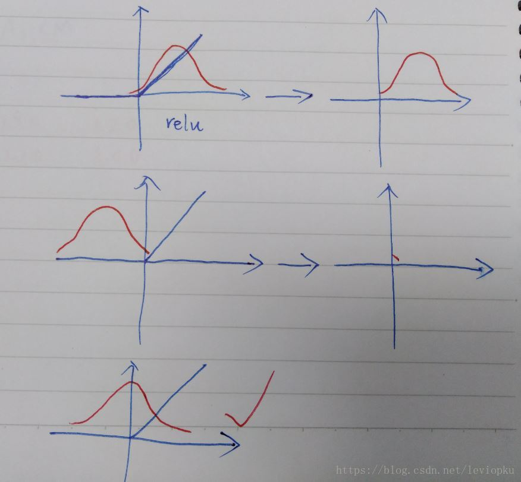
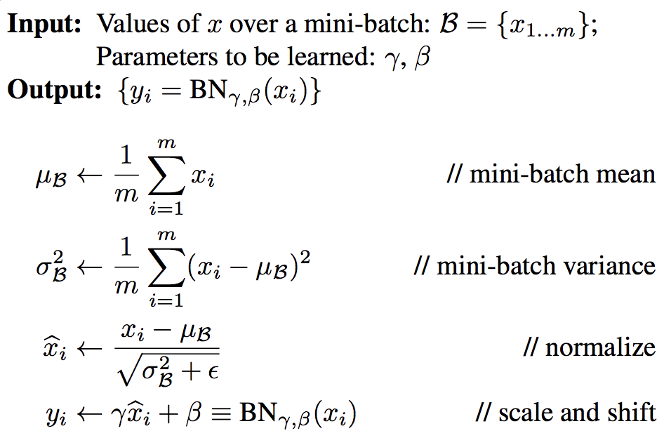

# Batch Normalization

* [返回上层目录](../tips.md)
* [BN用在哪里](#BN用在哪里)
* [BN怎么操作](#BN怎么操作)
* [深入理解BN](#深入理解BN)
* [总结](#总结)

信号处理的解释：relu 是二极管， bn 就是电容器过滤掉直流成份，并控制增益不要超载，多么简单的道理。

pdf: [*Batch Normalization: Accelerating Deep Network Training by  Reducing Internal Covariate Shift*](http://proceedings.mlr.press/v37/ioffe15.pdf)

BN目前已经成为了调参师面试必问题之一了。同时，BN层也慢慢变成了神经网络不可分割的一部分了，相比其他优化操作比如dropout, l1, l2, momentum，影子变量等等，BN是最无可替代的。

**这篇博文想以最通俗的方法解释BN，避免大量术语以及杂七杂八的公式**。

# BN用在哪里

BN往往用在卷积层之后，激活函数之前(比如对于darknet-53来说，conv+BN+relu成为一个标配，构成最小组件)。当然，BN不一定用在conv之后，但**用在激活函数之前是几乎必须的**（这样才能发挥它的作用）。

我们把神经网络各层之间的传递称为特征图（feature map），特征图在传递的过程中，就需要用BN进行调整。为什么要调整呢？

我们在训练的时候，都是输入一批一批的训练数据（mini-batch），比如batch size=32，那一次输入32个数据。这一数据可能满足一个分布A，如果A分布比较任性，那分布A在通过激活函数（非线性层）时，修剪率会很高或者很低。（修剪率是我自己定义的一个说法，神经网络就是通过特征提取层（如conv）提取特征再通过激活函数修剪从而实现神经网络的函数表达力）

多说不如一张图：

上图展示了3种分布情况，当batch特征图分布比较任性（batch比较小的时候，很容易出现任性的情况，如上图前两种情况）。上述用的激活函数是relu，在输入大于0时保持不变，小于0时变为0。对于一二两种情况，要么修剪得过少，等于没用激活函数；要么修剪得过多，一大批0传到后面。当然，在不断训练的过程中，情况一二都会慢慢减少，因为特征提取层越来越牛x。但这需要用更多训练时间去填补，而且最终的性能不会很好，虽然是batch训练，但它的视野没到batch分布那个层面。视野太窄，也更容易过拟合。如果用其他激活函数比如sigmoid/tanh等，还有梯度加速弥散的问题存在。(自己可以画图看看，两端抑制)

OK，我们想要的是上图表示的第三种情况，激活函数的修剪率适中。这就需要用到BN操作了。

# BN怎么操作

先看论文里的截图：

第一步，我们获得了一个mini-batch的输入$\mathcal{B} = {x_1,..., x_m}$，可以看出batch size就是$m$。

第二步，求这个batch的均值$\mu$和方差$\sigma$

第三步，对所有$x_i\in \mathcal{B}$，进行一个标准化，得到$\hat{x}_i$。

第四步，对$\hat{x}_i$做一个线性变换，得到输出$y_i$。

现在对上述四个步骤做一个全面分析：

我们获取一个任意分布，对这个分布包含的数据做一个标准化。这个操作是否十分熟悉呢？我们回到高中的正态分布：
$$
f(x)=\frac{1}{\sqrt{2\pi}\sigma}\text{exp}\left(-\frac{(x-\mu)^2}{2\sigma^2}\right)
$$
标准化一个高斯分布是怎么做的呢？**对于$x\sim N(\mu,\ \sigma^2)$而言，如果$\hat{x} = (x- \mu)/\sigma$，则$\hat{x}\sim N(0, 1)$**。这个标准化公式（即$\hat{x} = (x- \mu)/\sigma$），可以通过正态分布的概率密度公式推出来，在这里就不做详解了。

对于自然界很多分布，都可以用（类）高斯分布来建模。同样，可以用这个公式$\hat{x} = (x- \mu)/\sigma$来进行标准化（这个标准化公式不仅适用高斯分布），标准化之后的分布满足期望为**0**，方差为**1**。比较一下标准化公式和第三步的公式：
$$
\hat{x}_i\leftarrow \frac{x_i-\mu_{\mathcal{B}}}{\sqrt{\sigma^2_{\mathcal{B}}+\epsilon}}
$$
多了一个$\epsilon$，这里的$\epsilon$是一个很小的数，避免由分母等于0带来的系统错误，所以其实两个公式是等价的。

对于标准正态分布而言，刚好满足我在上图中描述的第三种情况。钟形曲线刚好关于y轴对称。

想必会有人认为，按理说BN操作到这里就结束了，为什么还会有第四步呢？

**第4步恰好是BN的精髓之处：$\gamma$和$\beta$是可学习的**。我们获得**一个关于y轴对称的分布真的是最符合神经网络训练的吗？没有任何理由能证明这点**。事实上，$\gamma$和$\beta$为输出的线性调整参数，可以让分布曲线压缩或延长一点，左移或右移一点。由于$\gamma$和$\beta$是可训练的，那么意味着神经网络会随着训练过程自己挑选一个最适合的分布。如果我们固执地不用$\gamma$和$\beta$会怎么样呢？那势必会把压力转移到特征提取层，虽然最后结果依然可观，但训练压力会很大。你想想，**一边只需要训练两个数，另一边需要训练特征提取层来符合最优分布就是关于y轴的对称曲线。前者自然训练成本更低**。

# 深入理解BN

个人认为三点，深度学习那本书已经讲的比较清楚了

1. BN的启发来自于对数据做preprocess，比如一般的中心化和标准化，白化等方法。这个方法引入到每一个隐藏层去，就是一般的normalize方案

2. 但一般的normalize，会影响BP。因为normalize的参数其实是当前weight的函数，如果忽略这一点，来做BP，计算出来的gradient 是不正确的，体现出来的就是在下一次forward计算中，Normalize会影响gradient update的效果，并不是最优的梯度方向。所以在paper中需要计算对于mu和sigma的导数，加入到BP中去，才能得到正确的gradient

3. 引入$\gamma$和$\beta$。normalize的过程其实损失了表达能力，原来的参数集是(w, b)，经过normalize之后，b被中心化了，而w必须隐式的满足归一化条件，从而自由度降低了一维。为了得到同样的自由参数数目，引入$\gamma$和$\beta$可以解决这个问题。

   最初看到gamma和beta的时候，会有些疑惑，为什么这个技巧会有用。Goodfellow那本书的argument比较合理，gamma和beta代表的其实是input分布的var和bias，对于一般的网络，不做BN的话，这两个维度是高度依赖前面网络的weight，会出现复杂的非线性。但提取出来之后，这里的gamma和beta跟前面的weight就无关了，而变成了这一层的学习参数，更加有利于优化的过程。

4. 如同paper中讨论的，BN本身还有正则化的效果。正则化的效果在于初始分界面在数据中间的概率提高了很多倍，降低了迭代过程中分界面掉到数据外围局部最优的可能性。

# 总结

BN就是调整每层网络输出数据的分布，使其进入激活函数的作用区。激活函数的作用区就是指原点附近的区域，梯度弥散率低，区分率高。同时，BN会在训练过程中，自己调节数据分布，使其“更合理”地进入激活函数。

所以，BN有以下特点：

1. 加速收敛。减少epoch轮数，因为不必训练神经网络去适应数据的分布。同时，完美地使用了激活函数对数据的“修剪”，减少梯度弥散。同时，学习率也可以大一点。

2. 准确率更高。这也是得亏于对激活函数的完美使用，切得更准，垂直度更高。比如，yolo v2加入BN后，mAP提高了2%。

这以上两个特点，具有普世性价值，这也是BN势不可挡的原因。

3. 对初始化的值不敏感，因为假设初始化值增加了一倍，但是均值和方差也都增加了一倍，所以相当于没增加。

# 参考资料

* [【AI数学】Batch-Normalization详细解析](https://blog.csdn.net/leviopku/article/details/83109422)

由于该文章简单易懂，本文主要参考此文章。

* [李宏毅深度学习(2017)](https://www.bilibili.com/video/av9770302?p=10)
* [Batch Normalization 详解 李宏毅](https://blog.csdn.net/Li_haiyu/article/details/80292183)

李宏毅讲的

* [深度学习中 Batch Normalization为什么效果好？](https://www.zhihu.com/question/38102762/answer/182201393)

“深入理解BN”参考了此回答。

* [《Batch Normalization Accelerating Deep Network Training by Reducing Internal Covariate Shift》阅读笔记与实现](https://blog.csdn.net/happynear/article/details/44238541)

“深入理解BN”第四点参考此博客。

===

* [Batch Normalization导读](https://blog.csdn.net/malefactor/article/details/51476961#comments)

这是张俊林写的，需要好好读一下。

