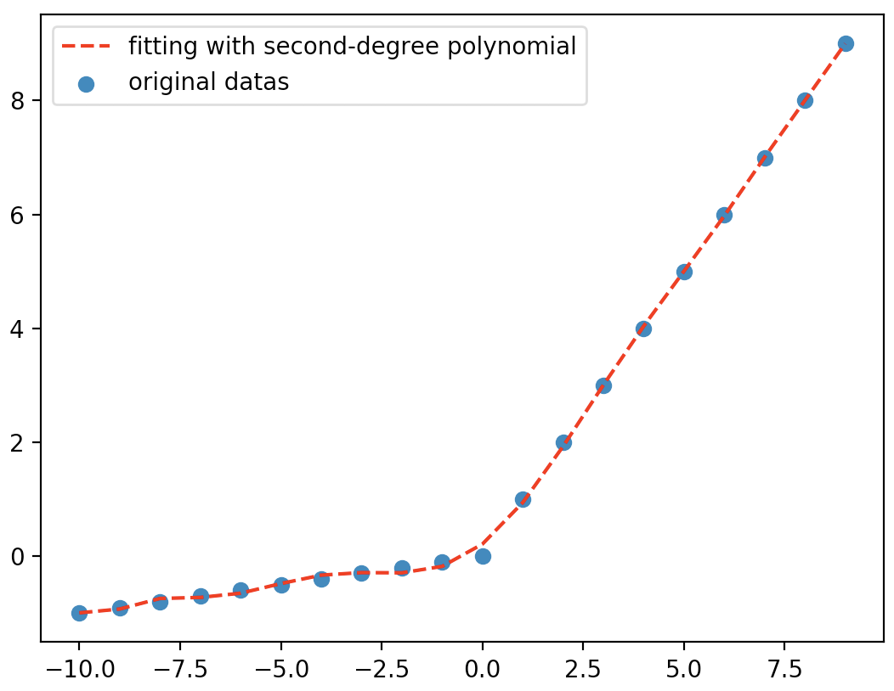

# 深度学习的高阶特征交叉原理

* [返回上层目录](../tips.md)
* [sigmoid](#sigmoid)
* [relu](#relu)


我们总说深度学习可以进行高阶的特征交叉，但是没人说到底是怎么交叉的，那现在就详细定性分析一下。

# sigmoid

如果把sogmoid看成是简单的$sigmoid(x)=x+x^2$（为什么可以看成，因为泰勒展开呀），仅仅凭借**非线性激活函数的一阶项和二阶项通过多层**就已经能起到了高阶特征交叉的作用。
$$
\begin{aligned}
&\sigma(w_{11}\sigma(w_{11}x_1+w_{12}x_2)+w_{21}\sigma(w_{21}x_1+w_{22}x_2))\\
\approx&\sigma(\sigma(x_1+x_2)+\sigma(x_1+x_2))\\
\approx&\sigma((x_1+x_2)+(x_1+x_2)^2)\ \ \  \sigma(x)=x+x^2\\
\approx&\sigma(x_1+x_2+x_1^2+x_2^2+x_1x_2)\ \ \  \sigma(x)=x+x^2\\
\approx&(x_1+x_2+x_1^2+x_2^2+x_1x_2)+(x_1+x_2+x_1^2+x_2^2+x_1x_2)^2\\
\approx&(x_1+x_2+x_1^2+x_2^2+x_1x_2+x_1^3+x_2^3+x_1^2x_2+x_1x_2^2+x_1^4+x_2^4+x_1^2x_2^2+x_1^3x_2+x_1x_2^3)
\end{aligned}
$$

# relu

这样推导很清晰，有个问题，如果激活函数是relu的话该怎么推导呢？

relu可以看成是导数连续的光滑函数的分段线性离散化，所以我们反过来用relu的离散点可以拟合成连续可导的光滑函数 。下图就是用10阶多项式函数对relu进行拟合：



这里当然要放上上图的代码啦：

```python
import numpy as np
import matplotlib.pyplot as plt


def relu(x, leaky=0.1):
    if x >= 0:
        ret = x
    else:
        ret = leaky * x
    return ret


x = np.arange(-10, 10, 1)
y = [relu(x) for x in x]
# 用10次多项式拟合x，y数组
a = np.polyfit(x,y,10)
# 拟合完之后用这个函数来生成多项式对象
b = np.poly1d(a)
# 生成多项式对象之后，就是获取x在这个多项式处的值
print(b.coefficients)
c = b(x)
# 对原始数据画散点图
plt.scatter(x, y, marker='o', label='original datas')
# 对拟合之后的数据，也就是x，c数组画图
plt.plot(x, c, ls='--', c='red', label='polynomial fitting')
plt.legend()
plt.show()
```

因为它的大于零的部分是线性增长的，所以我们猜测它的高阶项是非常小的，主要是低阶项在起作用，上图的拟合函数的系数如下：
$$
\begin{aligned}
&x^{10}=6.07335221e^{-09}\\ 
&x^9=1.30143262e^{-08}\\ 
&x^8=-1.52639454e^{-06}\\ 
&x^7=-2.23983403e^{-06}\\ 
&x^6=1.44036671e^{-04}\\   
&x^5=1.25396014e^{-04}\\ 
&x^4=-6.45528501e^{-03}\\ 
&x^3=-2.52140119e^{-03}\\
&x^2=1.74796855e^{-01}\\
&x^1=5.63144794e^{-01}\\
&x^0=2.12781922e^{-01}
\end{aligned}
$$
所以其实在0附近，主要是x的一次项和二次项在起作用。所以relu的推导方法和sigmoid是一样的。

