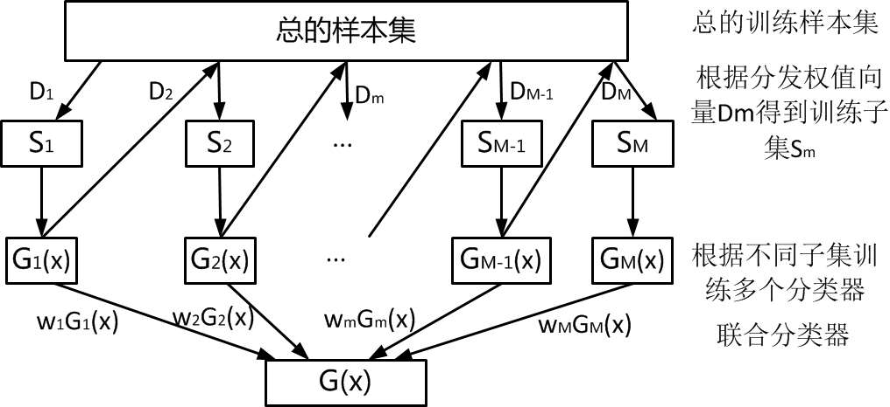
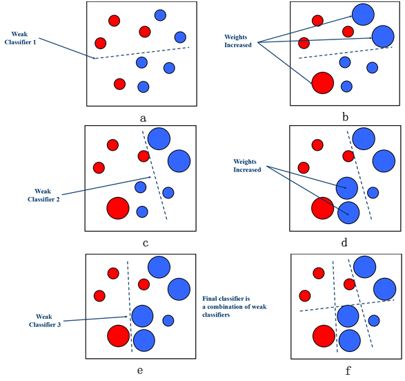

# AdaBoost

* [返回上层目录](../ensemble-learning.md)
* [AdaBoost概述](#AdaBoost概述)
* [AdaBoost算法](#AdaBoost算法)
* [AdaBoost算法的训练误差分析](#AdaBoost算法的训练误差分析)
* [AdaBoost算法的解释](#AdaBoost算法的解释)
  * [前向分布算法](#前向分布算法)
  * [前向分步算法与AdaBoost](#前向分步算法与AdaBoost)
* [AdaBoost算法的优点](#AdaBoost算法的优点)

# AdaBoost概述

由于Boosting算法在解决实际问题时有一个重大的缺陷，即他们都要求事先知道弱分类算法分类正确率的下限，这在实际问题中很难做到，后来Freund和Schapire提出了AdaBoost 算法，该算法的效率与Freund方法的效率几乎一样，却**不需要知道弱分类算法分类正确率的下限**，可以非常容易地应用到实际问题中。

AdaBoost是Boosting算法家族中代表算法，AdaBoost主要是在整个训练集上维护一个分布权值向量Dm，用赋予权重的训练集通过弱分类算法产生分类假设Gm，即基分类器，然后计算他的错误率，用得到的错误率去更新分布权值向量Dm，对错误分类的样本分配更大的权值，正确分类的样本赋予更小的权值。每次更新后用相同的弱分类算法产生新的分类假设，这些分类假设的序列构成多分类器。对这些多分类器用加权的方法进行联合，最后得到决策结果。

这种方法不要求产生的单个分类器有高的识别率，即不要求寻找识别率很高的基分类算法，**只要产生的基分类器的识别率大于0.5，就可作为该多分类器序列中的一员**。

# AdaBoost算法

算法流程如下图所示，AdaBoost重复调用弱学习算法（多轮调用产生多个分类器），首轮调用弱学习算法时，按均匀分布从样本集中选取子集作为该次训练集，以后每轮对前一轮训练失败的样本，赋予较大的分布权值（Dm为第m轮各个样本在样本集中参与训练的权值），使其在这一轮训练出现的权值增加，即在后面的训练学习中集中对比较难训练的样本进行学习，从而得到M个弱的基分类器，G1, G2, ... , Gm，其中Gm有相应的权值wm，并且其权值大小根据该分类器的效果而定。最后的分类器由生成的多个分类器加权联合产生。

现在叙述AdaBoost算法，

输入：训练数据集
$$
T=\{ (x_1,y_1), (x_2,y_2), ... , (x_N,y_N) \}
$$
其中，每个样本点由实例与标记组成。实例xi∈X=R^n，yi∈Y=\{+1,-1\}；弱学习算法；

输出：最终分类器G(x)

（1）初始化训练数据的权值分布
$$
D_1=(w_{11}, ... , w_{1i}, , ... ,w_{1N}),\quad w_{1i}=\frac{1}{N},\quad i=1,2,...,N
$$
（2）对m=1,2,...,M

（a）使用具有权值分布Dm的训练数据学习，得到基本分类器
$$
G_m(x):\ X\rightarrow \{ -1, +1 \}
$$
（b）计算Gm(x)在训练数据集上的分类误差率
$$
e_m=P(G_m(x_i)\neq y_i)=\sum_{i=1}^Nw_{mi}I(G_m(x_i)\neq y_i)
$$
（c）计算Gm(x)的系数
$$
\alpha_m=\frac{1}{2}\text{log}\frac{1-e_m}{e_m}
$$
这里的对数是自然对数

（d）更新训练数据集的权值分布
$$
\begin{aligned}
D_{m+1}&=(w_{m+1,1},...,w_{m+1,i},...,w_{m+1,N})\\
w_{m+1,i}&=\frac{w_{mi}}{Z_m}\text{exp}(-\alpha_my_iG_m(x_i)),\quad i=1,2,...,N\\
\end{aligned}
$$
这里，Zm是规范化因子
$$
Z_m=\sum_{i=1}^Nw_{mi}\text{exp}(-\alpha_my_iG_m(x_i))
$$
它使D(m+1)成为一个概率分布。

（3）构建基本分类器的线性组合
$$
f(x)=\sum_{m=1}^M\alpha_mG_m(x)
$$
得到最终分类器
$$
G(x)=\text{sign}(f(x))=\text{sign}\left( \sum_{m=1}^M\alpha_mG_m(x) \right)
$$

---

对AdaBoost算法做如下**说明**：

**步骤（1）**假设训练数据集具有均匀的权值分布，即每个训练样本在基本分类器的学习中作用相同，这一假设保证第一步能够在原始数据上学习基本分类器G1(x)。

**步骤（2）**AdaBoost反复学习基本分类器，在每一轮m=1,2,...,M顺次地执行下列操作：

（a）使用当前分布Dm加权的训练数据集，学习基本分类器Gm(x)。

（b）计算基本分类器Gm(x)在加权训练数据集上的分类误差率：
$$
e_m=P(G_m(x_i)\neq y_i)=\sum_{G_m(x_i)\neq y_i}w_{mi}
$$
这里，w(mi)表示第m轮中第i个实例的权值，
$$
\sum_{i=1}^Nw_{mi}=1
$$
。这表明，Gm(x)在加权的训练数据集上的分类误差率是被Gm(x)误分类样本的权值之和，由此可以看出数据权值分布Dm与基本分类器Gm(x)的分类误差率的关系。

（c）计算基本分类器Gm(x)的系数αm。αm表示Gm(x)在最终分类器中的重要性。由前面的αm的计算公式（位于算法第c步）可知，当em≤1/2时，αm≥0，并且αm随着em的减小而增大，所以**分类误差率越小的基本分类器在最终分类器中的作用越大**。

（d）更新训练数据的权值分布为下一轮作准备，前面算法第d步的w(m+1,i)可以写成
$$
\begin{aligned}
w_{m+1,i}=
\left\{\begin{matrix}
&\frac{w_{mi}}{Z_m}\text{exp}(-\alpha_m), &\quad G_m(x_i)=y_i\\
&\frac{w_{mi}}{Z_m}\text{exp}(\alpha_m), &\quad G_m(x_i)\neq y_i\\ 
\end{matrix}\right.
\end{aligned}
$$
由此可知，被基本分类器Gm(x)误分类的样本的权值得以扩大，而被正确分类的样本的权值却得以缩小。两相比较，误分类的样本的权值被放大了
$$
e^{2\alpha_m}=\frac{1-e_m}{e_m}
$$
倍。因此，误分类样本在下一轮学习中起到更大的作用。**不改变所给的训练数据，而不断改变训练数据权值的分布，使得训练数据在基本分类器的学习中起不同的作用，这是AdaBoost的一个特点**。

**步骤（3）**线性组合f(x)实现M个基本分类器的加权表决。系数αm表示了基本分类器Gm(x)的重要性，这里，所有αm之和并不为1。f(x)的符号决定实例x的类，f(x)的绝对值表示分类的确信度。**利用基本分类器的线性组合构建最终分类器是AdaBoost的另一个特点**。

下图是对AdaBoost分类过程中样本权值的变化及最终的f(x)的**形象表示**：

# AdaBoost算法的训练误差分析

AdaBoost最基本的性质是它能在学习过程中不断减少训练误差，即在训练数据及上分类误差率。关于这个问题有下面的定理：

**AdaBoost的训练误差界**

AdaBoost算法最终分类器的训练误差界为
$$
\frac{1}{N}\sum_{i=1}^NI(G(x_i)\neq y_i)\leqslant\frac{1}{N}\sum_i\text{exp}(-y_if(x_i))=\prod_mZ_m
$$
这里，G(x)，f(x)和Zm分别由上面已经给出。

**证明**：当G(x)≠yi时，yif(xi)<0，因而exp(-yif(xi))≥1。由此直接推导出前半部分。

后半部分的推导要用到Zm的定义式及其上式的变形：
$$
w_{mi}\text{exp}(-\alpha_my_iG_m(x_i))=Z_mw_{m+1,i}
$$
现推导如下：
$$
\begin{aligned}
&\frac{1}{N}\sum_i\text{exp}(-y_if(x_i))\\
=&\frac{1}{N}\sum_i\text{exp}\left(-\sum_{m=1}^M\alpha_my_iG_m(x_i)\right)\\
=&\sum_iw_{1i}\prod_{m=1}^M\text{exp}\left(-\alpha_my_iG_m(x_i)\right)\\
=&Z_1\sum_iw_{2i}\prod_{m=2}^M\text{exp}\left(-\alpha_my_iG_m(x_i)\right)\\
=&Z_1Z_2\sum_iw_{3i}\prod_{m=3}^M\text{exp}\left(-\alpha_my_iG_m(x_i)\right)\\
=&...\\
=&Z_1Z_2...Z_{M-1}\sum_iw_{Mi}\text{exp}\left(-\alpha_My_iG_M(x_i)\right)\\
=&\prod_{m=1}^MZ_m\\
\end{aligned}
$$
这一定理说明，可以在每一轮选取适当的Gm使得Zm最小，从而使训练误差下降最快。

---

**这里就有疑惑了，分类器Gm的选取原则不是应该是分类误差率最小吗？这里成了让Zm最小了？**

**即分类器Gm的选取原则到底是：**

* **分类误差率最小？**
* **Zm最小？**

**哪一个才对啊？其实，这两个本质是一样滴，不冲突。为啥？来看下面的解释：**

**由下面的定理中对Zm的计算可知，**
$$
Z_m=\sqrt{1-4\gamma_m^2}
$$
**要使Zm最小，其实就是使γm最大。而γm又是什么呢？**
$$
\gamma_m=\frac{1}{2}-e_m
$$
**所以，要使γm最大，就要使em最小。而em是什么呢？大哥，em就是分类器Gm的分类误差率呀。所以，让Zm最小，就是要让em（分类误差率）最小，这两个是等价的，不冲突的，一致的。**

---

对二分类问题，有如下结果：

**定理：二分类问题AdaBoost的训练误差界**
$$
\prod_{m=1}^MZ_m=\prod_{m=1}^M[2\sqrt{e_m(1-e_m)}]=\prod_{m=1}^M\sqrt{(1-4\gamma_m^2)}\leqslant\text{exp}\left( -2\sum_{m=1}^M\gamma_m^2 \right)
$$
这里，
$$
\gamma_m=\frac{1}{2}-e_m
$$
证明：由Zm的定义及em的定义得
$$
\begin{aligned}
Z_m&=\sum_{i=1}^Nw_{mi}\text{exp}\left(-\alpha_my_iG_m(x_i)\right)\\
&=\sum_{y_i=G_m(x_i)}w_{mi}e^{-\alpha_m}+\sum_{y_i\neq G_m(x_i)}w_{mi}e^{\alpha_m}\\
&=(1-e_m)e^{-\alpha_m}+e_me^{\alpha_m}\\
&=2\sqrt{e_m(1-e_m)}\\
&=\sqrt{1-4\gamma^2_m}\\
\end{aligned}
$$
至于不等式
$$
\prod_{m=1}^M\sqrt{(1-4\gamma_m^2)}\leqslant\text{exp}\left( -2\sum_{m=1}^M\gamma_m^2 \right)
$$
则可先由exp(x)和sqrt(1-x)在点x=0的泰勒展开式推出不等式
$$
\sqrt{(1-4\gamma_m^2)}\leqslant\text{exp}(-2\gamma_m^2)
$$
进而得到该不等式。

**推论**：如果存在γ>0，对所有m有γm≥γ，则
$$
\frac{1}{N}\sum_{i=1}^NI(G(x_i)\neq y_i)\leqslant\text{exp}(-2M\gamma^2)
$$
这表明在此条件下AdaBoost的训练误差是以指数速率下降的。这一性质当然是很有吸引力的。

注意，AdaBoost算法不需要知道下界γ。这正是Freund与Schapire设计AdaBoost时所考虑到的。与一些早期的提升方法不同，Adaboost具有适应性，即它能适应若分类器各自的训练误差率。这也是它名称（自适应提升）的由来，Ada是Adaptive的简写。

# AdaBoost算法的解释

AdaBoost算法还有另一个解释，即可以认为AdaBosst算法是模型为加法模型、损失函数为指数函数、学习算法为前向分布算法时的二分类学习方法。

## 前向分布算法

考虑加法模型
$$
f(x)=\sum_{m=1}^M\beta_mb(x;\gamma_m)
$$
其中，b(x;γm)为基函数，γm为基函数的参数，βm为基函数的系数。

显然，上面构建的基本分类器的线性组合
$$
f(x)=\sum_{m=1}^M\alpha_mG_m(x)
$$
是一个加法模型。

在给定训练数据及损失函数L(y,f(x))的条件下，学习加法模型f(x)成为经验风险极小化即损失函数极小化问题：
$$
\mathop{\text{min}}_{\beta_m,\gamma_m}\sum_{i=1}^NL\left( y_i, \sum_{m=1}^M\beta_mb(x_i;\gamma_m) \right)
$$
通常这是一个复杂的优化问题，前向分布算法求解这一优化问题的想法是：廻学习的是加法模型，如果能够从前到后，每一步只需吸一个基函数及其系数，逐步逼近优化目标函数式，那么就可以建华优化的复杂度。具体地，每步只需优化如下损失函数：
$$
\mathop{\text{min}}_{\beta,\gamma}\sum_{i=1}^NL(y_i,\beta b(x_i;\gamma))
$$
给定训练数据集T=\{ (x1,y1), (x2,y2), ... , (xN,yN) \}，xi∈X=R^n，yi∈Y=\{+1,-1\}。损失函数L(y,f(x))和基函数的结合\{ b(x;γ) \}，学习加法模型f(x)的前项分布算法如下：

**前向分步算法**：

输入：训练数据集集T=\{ (x1,y1), (x2,y2), ... , (xN,yN) \}；损失函数L(y,f(x))；基函数集\{ b(x;γ) \}；

输出：加法模型f(x)。

（1）初始化f0(x)=0

（2）对m=1,2,...,M

（a）极小化损失函数
$$
(\beta_m,\gamma_m)=\text{arg }\mathop{\text{min}}_{\beta,\gamma}\sum_{i=1}^NL(y_i,f_{m-1}(x_i)+\beta b(x_i; \gamma))
$$
得到参数βm，γm

（b）更新
$$
f_m(x)=f_{m-1}(x)+\beta_mb(x; \gamma_m)
$$
（3）得到加法模型
$$
f(x)=f_M(x)=\sum_{m=1}^M\beta_mb(x;\gamma_m)
$$
这样，前向分步算法将同时求解m=1到M所有参数βm，γm的优化问题简化为主次求解各个βm，γm的优化问题。

## 前向分步算法与AdaBoost

由前项分布算法可以推导出AdaBoost，用定理叙述这一关系。

**定理**：AdaBoost算法是前向分布加法算法的特例。这时，模型是由基本分类器组成的加法模型，损失函数是指数函数。

证明：前向分布算法学习的是加法模型，当基函数为基本分类器时，该加法模型等价于AdaBoost的最终分类器。
$$
f(x)=\sum_{m=1}^M\alpha_mG_m(x)
$$
由基本分类器Gm(x)及其系数αm组成，m=1,2,...,M。前向分布算法逐一学习基函数，这一过程与AdaBoos算法逐一学习基本分类器的过程一致。下面证明**前向分步算法的损失函数是指数损失函数**。
$$
L(y,f(x))=exp[-y\ f(x)]
$$
时，其学习的具体操作等价于AdaBoost算法学习的具体操作。

假设经过m-1轮迭代，前向分布算法已经得到
$$
\begin{aligned}
f_{m-1}(x)&=f_{m-2}(x)+\alpha_{m-1}G_{m-1}(x)\\
&=\alpha_1G_1(x)+...+\alpha_{m-1}G_{m-1}(x)
\end{aligned}
$$
在第m轮迭代中，得到αm，Gm(x)和fm(x)。
$$
f_m(x)=f_{m-1}(x)+\alpha_mG_m(x)
$$
目标是使前向分布算法得到的αm和Gm(x)使fm(x)在训练数据集T上的指数损失最小，即
$$
(\alpha_m,G_m(x))=\text{arg }\mathop{\text{min}}_{\alpha,G}\sum_{i=1}^N\text{exp}[-y_i(f_{m-1}(x_i)+\alpha G(x_i))]
$$
上式可以表示为
$$
(\alpha_m,G_m(x))=\text{arg }\mathop{\text{min}}_{\alpha,G}\sum_{i=1}^N\overline{w}_{mi}\text{exp}[-y_i\alpha G(x_i)]
$$
其中，
$$
\overline{w}_{mi}=\text{exp}[-y_if_{m-1}(x_i)]
$$
。因为
$$
\overline{w}_{mi}
$$
既不依赖α也不依赖于G，所以与最小化无关。但其依赖于$f_{m-1}(x)$，随着每一轮迭代而发生改变。

现证使上上式达到最小的α\*m和G\*m(x)就是AdaBoost算法所得到的αm和Gm(x)。求解上上式可分两步：

首先，求G\*m(x)。对任意α>0，使上上式最小的G(x)由下式得到：
$$
G_m^*(x)=\text{arg }\mathop{\text{min}}_{G}\sum_{i=1}^N\overline{w}_{mi}I(y_i\neq G(x_i))
$$
**注：这里为什么能和上上式是等效的？有待研究。**

**有个启发（数学上不严谨，有待证明）就是，注意Zm的定义**
$$
Z_m=\sum_{i=1}^Nw_{mi}\text{exp}(-\alpha_my_iG_m(x_i))
$$
**和**
$$
(\alpha_m,G_m(x))=\text{arg }\mathop{\text{min}}_{\alpha,G}\sum_{i=1}^N\overline{w}_{mi}\text{exp}[-y_i\alpha G(x_i)]
$$
**是很类似的。也就是说**
$$
\begin{aligned}
&(\alpha_m,G_m(x))\\
=&\text{arg }\mathop{\text{min}}_{\alpha,G}\sum_{i=1}^N\overline{w}_{mi}\text{exp}[-y_i\alpha G(x_i)]\\
\approx &\text{arg }\mathop{\text{min}}_{\alpha,G}\ Z_m\\
\end{aligned}
$$
**而前面已经说过了，Zm就是Gm的分类误差率。所以当然能由分类误差率得到啊，因为这两者本来就是等价的嘛。**

---

此分类器G\*m(x)即为AdaBoost算法的基本分类器Gm(x)，因为它是使第m轮甲醛训练数据分类误差率最小的基本分类器。

之后，求α\*m，上上上式中，
$$
\begin{aligned}
&\sum_{i=1}^N\overline{w}_{mi}\text{exp}[-y_i\alpha G(x_i)]\\
=&\sum_{y_i=G_m(x_i)}\overline{w}_{mi}\text{exp}(-\alpha)+\sum_{y_i\neq G_m(x_i)}\overline{w}_{mi}\text{exp}(\alpha)\\
=&(e^{\alpha}-e^{-\alpha})\sum_{i=1}^N\overline{w}_{mi}I(y_i\neq G(x_i))+e^{-\alpha}\sum_{i=1}^N\overline{w}_{mi}
\end{aligned}
$$
将已求得的G\*m(x)带入上式，对α求导并使倒数为0，即得到使上上式最小的α。
$$
\alpha_m^*=\frac{1}{2}\text{log}\frac{1-e_m}{e_m}
$$
其中，em是分类误差率：
$$
e_m=\frac
{\sum_{i=1}^N\overline{N}_{mi}I(y_i\neq G_m(x_i))}
{\sum_{i=1}^N\overline{N}_{mi}}
=
\sum_{i=1}^Nw_{mi}I(y_i\neq G_m(x_i))
$$
这里的α\*m与AdaBoost算法第2（c）步的αm完全一致。

最后来看每一轮样本权值的更新。由
$$
f_m(x)=f_{m-1}(x)+\alpha_mG_m(x)
$$
以及
$$
\overline{w}_{mi}=\text{exp}[-y_if_{m-1}(x_i)]
$$

，可得
$$
\overline{w}_{m+1,i}=\overline{w}_{m,i}\text{exp}[-y_i\alpha_mG_m(x)]
$$
这与AdaBoost算法第2（d）步的样本权重的更新，只相差规范化因子，因而等价。

# AdaBoost算法的优点

- AdaBoost是一种有很高精度的分类器
- AdaBoost可以支持各种方式构建的弱分类器，如最简单的x<v这样的分类器，AdaBoost提供的是框架
- 构造弱分类器简单，不用进行特征筛选
- 不用担心过拟合

# 参考资料

* 《统计学习方法》李航

本文主要参考这本书的对应章节。
