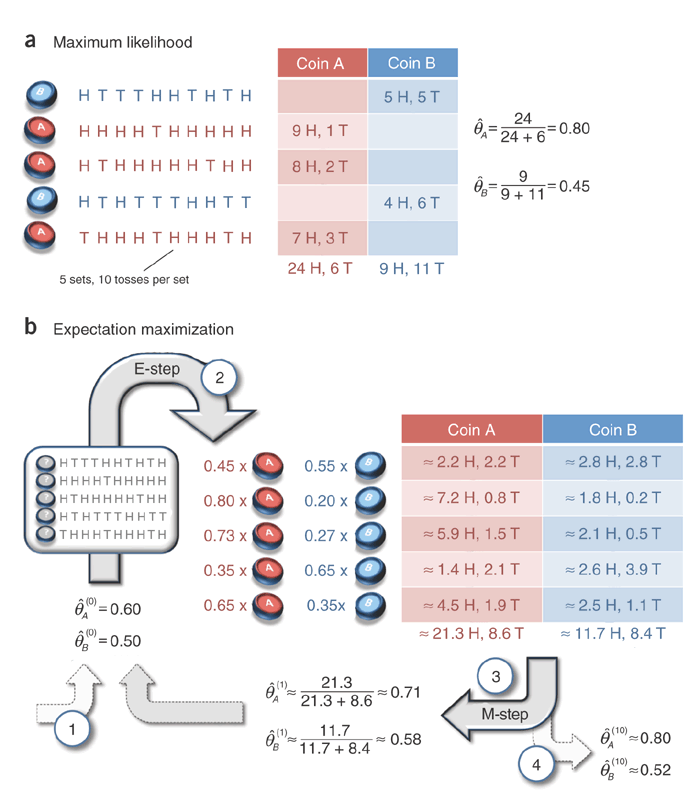
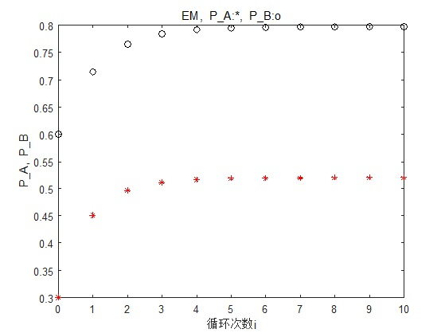
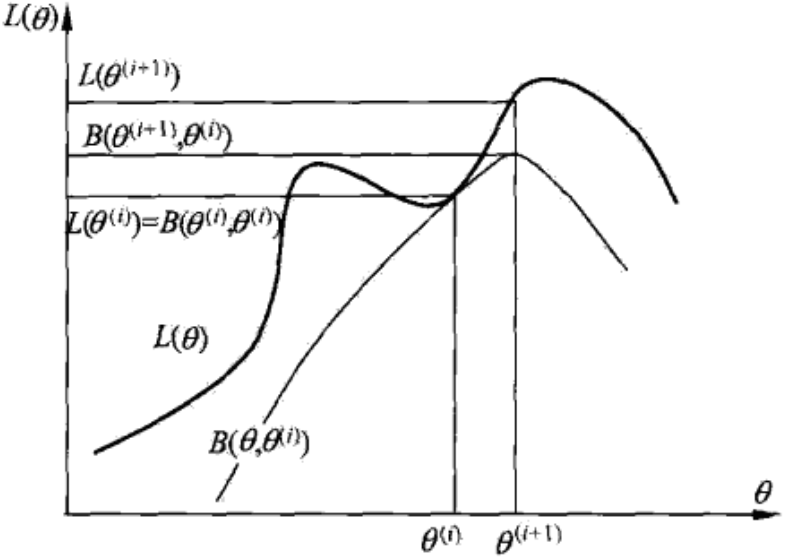

# EM算法

* [返回上层目录](../machine-learning.md)
* [EM算法的引入](#EM算法的引入)
  * [用投硬币理解EM算法](#用投硬币理解EM算法)
* [EM算法详述](#EM算法详述)
  * [EM算法公式](#EM算法公式)
  * [EM算法的推导](#EM算法的推导)
  * [EM算法在非监督学习中的应用](#EM算法在非监督学习中的应用)
  * [EM算法的收敛性](#EM算法的收敛性)
* [EM算法应用](#EM算法应用)
  * [EM算法在高斯混合模型中的应用](#EM算法在高斯混合模型中的应用)
    * [高斯混合模型](#高斯混合模型)
    * [高斯混合模型参数估计的EM算法](#高斯混合模型参数估计的EM算法)
  * [EM算法在掷硬币模型中的应用](#EM算法在掷硬币模型中的应用)
    * [伯努利混合模型](#伯努利混合模型)
    * [伯努利混合模型参数估计的EM算法](#伯努利混合模型参数估计的EM算法)
* [EM算法的推广](#EM算法的推广)


EM算法是一种迭代算法，1977年由Dempster等人总结提出，用于含有隐变量（hidden variable）的概率模型参数的极大似然估计，或极大后验概率估计。EM算法的每次迭代由两步组成：**E步，求期望（expectation）**；**M步，求极大（maximization）**。所以这一算法称为期望极大算法（expectation maximization algorithm），简称EM算法。本章首先叙述EM算法，然后讨论EM算法的收敛性；作为EM算法的应用，介绍髙斯混合模型的学习；最后叙述EM算法的推广——GEM算法。

# EM算法的引入

概率模型有时既含有观测变量（observable variable），又含有**隐变量**或潜在变量（latent variable）。如果概率模型的变量都是观测变童，那么给定数据，可以直接用极大似然估计法，或贝叶斯估计法估计模型参数。但是，当模型含有隐变量时，就不能简单地使用这些估计方法。**EM算法就是含有隐变量的概率模型参数的极大似然估计法，或极大后验概率估计法**。我们仅讨论极大似然估计，极大后验概率估计与其类似。

也就是说，EM算法当做最大似然估计的拓展，解决难以给出解析解（含有隐变量）的最大似然估计（MLE）（或极大后验概率）问题。

## 用投硬币理解EM算法

推一篇Nature Biotech的EM tutorial文章，用了一个投硬币的例子来讲EM算法的思想。

> Do, C. B., & Batzoglou, S. (2008). [《What is the expectation maximization algorithm?》]((http://ai.stanford.edu/~chuongdo/papers/em_tutorial.pdf)). *Nature biotechnology*, *26*(8), 897.

现在有两个硬币A和B，要估计的参数是它们各自翻正面（head）的概率。观察的过程是先随机选A或者B，然后扔10次。以上步骤重复5次。

如果知道每次选的是A还是B，那可以直接估计（见下图a）。如果不知道选的是A还是B（隐变量），只观测到5次循环共50次投币的结果，这时就没法直接估计A和B的正面概率。EM算法此时可起作用（见下图b）。

推荐读原文，没有复杂的数学公式，通俗易懂。



上图中第一次抛硬币时硬币A的0.45是什么意思？是怎么得到的？意思是这轮投掷的10次硬币，是硬币A的可能性有多少。这其实是一个最大似然估计，即
$$
\begin{aligned}
P_A=0.6^5\times 0.4^5=0.00079626\\
P_B=0.5^5\times 0.5^5=0.00097656\\
P_A'=P_A/(P_A+P_B)=0.45\\
P_B'=P_B/(P_A+P_B)=0.55
\end{aligned}
$$
**对例子的解释：**

**这个例子中的隐变量z，其实就是每次抛硬币的时候，选择硬币A和硬币B的概率。**

* **在E（期望）步，我们得到隐变量的估计值**

  **但为什么叫期望呢？因为为了求Q函数，要求得Q函数就必须求隐变量的期望值。为什么要求所谓的Q函数，而不是参数的似然函数呢？因为隐变量的存在，导致似然函数是一个累积和的对数，即log∑，这个不好计算呀，要转成∑log才能计算出来啊，而这个∑log，就是Q函数啊。即因为参数似然函数不好求，才转而求Q函数的**

* **在M（最大化）步，我们得到模型参数的值**

  **这相当于最大似然，但却是Q函数的最大似然。为什么Q函数的最大似然，就能相当于参数的最大似然呢？因为Q函数是参数最大似然的下界，只要Q函数是增大的，那参数似然函数也是增大的**

简单的说，**EM算法就是先由当前的θn的分布，推测出缺失值z的最适合的分布，再由已知的数据+缺失数据z，去推测下一步θ(n+1)的分布**。

这是我根据上图写的matlab代码：

```matlab
%% 先验概率
p_A_up = 0.6;% 估计的A硬币正面朝上的概率
p_B_up = 0.5;% 估计的B硬币正面朝上的概率
disp(['p_A_up(0) = ',num2str(p_A_up),' p_B_up(0) = ',num2str(p_B_up)]);
plot(0,p_A_up,'r*', 0,p_B_up,'ko'); hold on; 
xlabel('循环次数i'); ylabel('P\_A,  P\_B'); title('EM,  P\_A:*,  P\_B:o'); pause(0.15);
%% 实验样本描述
n_total = 10;
n_up_1 = 5; n_up_2 = 9; n_up_3 = 8; n_up_4 = 4; n_up_5 = 7; 
%% E_step and M_step
for i = 1:10
    % 第一次实验（10次投币）
    p_A_likelyhood_1 = p_A_up^n_up_1 * (1-p_A_up)^(n_total-n_up_1);
    p_B_likelyhood_1 = p_B_up^n_up_1 * (1-p_B_up)^(n_total-n_up_1);
    p_AB_likelyhood_1 = p_A_likelyhood_1 + p_B_likelyhood_1;
    p_A_likelyhood_1 = p_A_likelyhood_1 / p_AB_likelyhood_1;
    p_B_likelyhood_1 = p_B_likelyhood_1 / p_AB_likelyhood_1;
    n_up_A_1 = n_up_1 * p_A_likelyhood_1; n_down_A_1 = (n_total - n_up_1) * p_A_likelyhood_1;
    n_up_B_1 = n_up_1 * p_B_likelyhood_1; n_down_B_1 = (n_total - n_up_1) * p_B_likelyhood_1;

    % 第二次实验（10次投币）
    p_A_likelyhood_2 = p_A_up^n_up_2 * (1-p_A_up)^(n_total-n_up_2);
    p_B_likelyhood_2 = p_B_up^n_up_2 * (1-p_B_up)^(n_total-n_up_2);
    p_AB_likelyhood_2 = p_A_likelyhood_2 + p_B_likelyhood_2;
    p_A_likelyhood_2 = p_A_likelyhood_2 / p_AB_likelyhood_2;
    p_B_likelyhood_2 = p_B_likelyhood_2 / p_AB_likelyhood_2;
    n_up_A_2 = n_up_2 * p_A_likelyhood_2; n_down_A_2 = (n_total - n_up_2) * p_A_likelyhood_2;
    n_up_B_2 = n_up_2 * p_B_likelyhood_2; n_down_B_2 = (n_total - n_up_2) * p_B_likelyhood_2;

    % 第三次实验（10次投币）
    p_A_likelyhood_3 = p_A_up^n_up_3 * (1-p_A_up)^(n_total-n_up_3);
    p_B_likelyhood_3 = p_B_up^n_up_3 * (1-p_B_up)^(n_total-n_up_3);
    p_AB_likelyhood_3 = p_A_likelyhood_3 + p_B_likelyhood_3;
    p_A_likelyhood_3 = p_A_likelyhood_3 / p_AB_likelyhood_3;
    p_B_likelyhood_3 = p_B_likelyhood_3 / p_AB_likelyhood_3;
    n_up_A_3 = n_up_3 * p_A_likelyhood_3; n_down_A_3 = (n_total - n_up_3) * p_A_likelyhood_3;
    n_up_B_3 = n_up_3 * p_B_likelyhood_3; n_down_B_3 = (n_total - n_up_3) * p_B_likelyhood_3;

    % 第四次实验（10次投币）
    p_A_likelyhood_4 = p_A_up^n_up_4 * (1-p_A_up)^(n_total-n_up_4);
    p_B_likelyhood_4 = p_B_up^n_up_4 * (1-p_B_up)^(n_total-n_up_4);
    p_AB_likelyhood_4 = p_A_likelyhood_4 + p_B_likelyhood_4;
    p_A_likelyhood_4 = p_A_likelyhood_4 / p_AB_likelyhood_4;
    p_B_likelyhood_4 = p_B_likelyhood_4 / p_AB_likelyhood_4;
    n_up_A_4 = n_up_4 * p_A_likelyhood_4; n_down_A_4 = (n_total - n_up_4) * p_A_likelyhood_4;
    n_up_B_4 = n_up_4 * p_B_likelyhood_4; n_down_B_4 = (n_total - n_up_4) * p_B_likelyhood_4;

    % 第五次实验（10次投币）
    p_A_likelyhood_5 = p_A_up^n_up_5 * (1-p_A_up)^(n_total-n_up_5);
    p_B_likelyhood_5 = p_B_up^n_up_5 * (1-p_B_up)^(n_total-n_up_5);
    p_AB_likelyhood_5 = p_A_likelyhood_5 + p_B_likelyhood_5;
    p_A_likelyhood_5 = p_A_likelyhood_5 / p_AB_likelyhood_5;
    p_B_likelyhood_5 = p_B_likelyhood_5 / p_AB_likelyhood_5;
    n_up_A_5 = n_up_5 * p_A_likelyhood_5; n_down_A_5 = (n_total - n_up_5) * p_A_likelyhood_5;
    n_up_B_5 = n_up_5 * p_B_likelyhood_5; n_down_B_5 = (n_total - n_up_5) * p_B_likelyhood_5;
    
    % A硬币的全部投币结果
    n_up_A_total= n_up_A_1 + n_up_A_2 + n_up_A_3 + n_up_A_4 + n_up_A_5;
    n_down_A_total= n_down_A_1 + n_down_A_2 + n_down_A_3 + n_down_A_4 + n_down_A_5;
    p_A_up = n_up_A_total / (n_up_A_total + n_down_A_total);
    
    % B硬币的全部投币结果
    n_up_B_total= n_up_B_1 + n_up_B_2 + n_up_B_3 + n_up_B_4 + n_up_B_5;
    n_down_B_total= n_down_B_1 + n_down_B_2 + n_down_B_3 + n_down_B_4 + n_down_B_5;
    p_B_up = n_up_B_total / (n_up_B_total + n_down_B_total);
    
    % 输出显示A和B硬币的正面朝上概率的估计值。A和B硬币是隐变量，因为实验并没有告诉你是A还是B。
    disp(['p_A_up(',num2str(i),') = ',num2str(p_A_up),' p_B_up(',num2str(i),') = ',num2str(p_B_up)]);
    plot(i,p_A_up,'r*', i,p_B_up,'ko'); pause(0.15);
end
hold off
```

matlab运行的收敛过程如下所示，A硬币正面朝上的概率由最初猜测的0.6收敛为了最终的0.80，B硬币正面朝上的概率由最初猜测的0.5收敛到了最终的0.52。


而如果

* 取A硬币正面朝上的概率初值为0.3
* 取B硬币正面朝上的概率初值为0.6

那么得到的模型参数的极大似然估计是：

* A硬币正面朝上的概率最终值为0.52
* B硬币正面朝上的概率最终值为0.80

matlab运行的收敛过程如下所示：



这就是说，**EM算法与初值的选择有关，选择不同的初值可能得到不同的参数估计值**。

# EM算法详述

一般地，用Y表示观测随机变量的数据，Z表示隐随机变量的数据。**Y和Z连在一起称为完全数据，观测数据Y又称为不完全数据**。

假设给定观测数据Y，其概率分布是P(Y | θ)，其中θ是需要估计的模型参数，那么不完全数据Y的似然函数是P(Y | θ)，对数似然函数L(θ)=log P(Y | θ)；

假设Y和Z的联合概率分布是P(Y, Z | θ)，那么完全数据的对数似然函数是log P(Y, Z | θ)。

**EM算法通过迭代求不完全数据Y的对数似然函数L(θ)=log P(Y | θ)的极大似然估计**。每次迭代包含两步：

* E步，求期望
* M步，求极大化

下面来介绍EM算法。

## EM算法公式

输入：观测变量数据Y，隐变量数据Z，联合分布P(Y, Z | θ)，条件分布P(Z | Y, θ)；

输出：模型参数θ。

（1）选择参数的初值θ(0)，开始迭代；

（2）E步：记θ(i)为第i次迭代参数θ的估计值，在第i+1次迭代的E步，计算
$$
\begin{aligned}
Q(\theta,\theta^{(i)})&=E_Z[\text{log}P(Y,Z|\theta)|Y,\theta^{(i)}]\\
&=\sum_Z\text{log}P(Y,Z|\theta)P(Z|Y,\theta^{(i)})\\
\end{aligned}
$$
这里，P(Z|Y,θ(I))是在给定观测数据Y和当前的参数估计θ(i)下隐变量数据Z的条件概率分布；

（3）M步：求使Q(θ,θ(i))极大化的θ，确定第i+1次迭代的参数的估计值θ(i+1)。
$$
\theta^{(i+1)}=\text{arg }\mathop{\text{max}}_{\theta}Q(\theta,\theta^{(i)})
$$
（4）重复第（2）步和第（3）步，直到收敛

上上式的函数Q(θ , θ(i))是EM算法的核心，称为Q函数。

**Q函数定义**：完全数据的对数似然函数log P(Y, Z | θ)关于在给定观测数据Y和当前参数θ(i)下对未观测数据Z的条件分布条件概率分布P(Z | Y, θ(i))的期望称为Q函数，即
$$
Q(\theta, \theta^{(i)})=E_Z[\text{log}P(Y, Z | \theta) | Y, \theta^{(i)}]
$$
下面关于EM算法做几点说明：

步骤（1）参数的初值可以任意选择，但需注意EM算法对初值是敏感的。

步骤（2）E步求Q(θ, θ(i))。Q函数式中Z是未观测数据，Y是观测数据，注意，Q(θ , θ(i))的第1个变元表示要极大化的参数，第2个变元表示参数的当前估计值。每次迭代实际在求Q函数及其极大。

步骤（3）M步求Q(θ , θ(i))的极大化，得到θ(i+1)，完成一次迭代θ(i)→θ(i+1)。后面将证明每次迭代使似然函数增大或达到局部极值。

步骤（4）给出停止迭代的条件，一般是对较小的正数ε1，ε2，若满足
$$
||\theta^{(i+1)}-\theta^{(i)}||<\epsilon_1\quad \text{or}\quad || Q(\theta^{(i+1)},\theta^{(i)})-Q(\theta^{(i)},\theta^{(i)}) ||<\epsilon_2
$$
则停止迭代。

## EM算法的推导

上面叙述了EM算法，为什么EM算法能近似实现对观测数据的极大似然估计呢？

下面通过**近似求解**观测数据的对数似然函数的极大化问题来导出EM算法，由此可以清楚地看出EM算法的作用。

我们面对一个含有隐变量的概率模型，目标是极大化观测数据（不完全数据）Y关于参数θ的对数似然函数，即极大化
$$
\begin{aligned}
L(\theta)&=\text{log}P(Y | \theta)\\
&=\text{log}\sum_ZP(Y,Z|\theta)\\
&=\text{log}\left( \sum_ZP(Y|Z,\theta)P(Z|\theta) \right)
\end{aligned}
$$
注意到这一极大化的主要困难是上式中有**未观察数据**并有**包含累计和（或积分）的对数log∑**。log∑不好计算，要转成∑log才能计算出来，而这个∑log，就是下面要提到的Q函数。是因为观测数据的似然函数不好求，才转而求Q函数的。

事实上，EM算法是通过迭代，逐步近似极大化L(θ)的。假设在第i次迭代后θ的估计值是θ(i)。我们希望新估计值θ能使L(θ)增加，即L(θ)>L(θ(i))，并逐步达到极大值。为此，考虑两者的差：
$$
L(\theta)-L(\theta^{(i)})=\text{log}\left( \sum_ZP(Y | Z, \theta)P(Z | \theta) \right)-\text{log}P(Y|\theta^{(i)})
$$
利用Jensen不等式得到其下界：
$$
\begin{aligned}
L(\theta)-L(\theta^{(i)})&=\text{log}\left(\sum_ZP(Y|Z,\theta^{(i)})\frac{P(Y|Z,\theta)P(Z|\theta)}{P(Y|Z,\theta^{(\theta)})} \right)-\text{log}P(Y|\theta^{(i)})\\
&\geqslant\sum_ZP(Z|Y,\theta^{(i)})\text{log}\frac{P(Y|Z,\theta)P(Z|\theta)}{P(Z|Y,\theta^{(i)})}-\sum_ZP(Z|Y,\theta^{(i)})\text{log}P(Y|\theta^{(i)})\\
&=\sum_ZP(Z|Y,\theta^{(i)})\text{log}\frac{P(Y|Z,\theta)P(Z|\theta)}{P(Z|Y,\theta^{(i)})P(Y|\theta^{(i)})}\\
\end{aligned}
$$
**注意：上面为啥要用Jensen不等式嘞？目的是将难以计算的log∑变为容易计算的∑log。而且，正好还是大于，即找到了下界，这样可以利用下界的最大值来提升函数的最大值。**

令
$$
B(\theta,\theta^{(i)})=L(\theta^{(i)})+\sum_ZP(Z|Y, \theta^{(i)})\text{log}\frac{P(Y|Z,\theta)P(Z|\theta)}{P(Z|Y,\theta^{(i)})P(Y|\theta^{(i)})}
$$
则
$$
L(\theta)\geqslant B(\theta,\theta^{(i)})
$$
即函数B(θ , θ(i))是L(θ)的一个下界（注意，函数B是随着每次θ的更新都在变化的），而且由上上式可知，
$$
L(\theta^{(i)})=B(\theta^{(i)},\theta^{(i)})
$$
因此，**任何可以使B(θ , θ(i))增大的θ，也可以使L(θ)增大**。**为了使L(θ)有尽可能大的增长，选择θ(i+1)使B(θ , θ(i+1))达到极大**，即（注意，这里函数B达到极大。并不意味着L达到了极大，只是有尽可能大的增长而已，即只是**逼近**L的最大化而已，所以前面才说是EM算法能**近似**实现对观测数据的极大似然估计）
$$
\theta^{(i+1)}=\text{arg }\mathop{\text{max}}_{\theta}B(\theta, \theta^{(i)})
$$
现在求θ(i+1)表达式。省去对θ的极大化而言是常数的项，有
$$
\begin{aligned}
\theta^{(i+1)}&=\text{arg }\mathop{\text{max}}_{\theta}B(\theta, \theta^{(i)})\\
&=\text{arg }\mathop{\text{max}}_{\theta}\left( L(\theta^{(i)})+\sum_ZP(Z | Y, \theta^{(i)})\text{log}\frac{P(Y|Z,\theta)P(Z |\theta)}{P(Z|Y,\theta^{(i)})P(Y|\theta^{(i)})} \right)\\
&=\text{arg }\mathop{\text{max}}_{\theta}\left( \sum_ZP(Z | Y, \theta^{(i)})\text{log}(P(Y|Z,\theta)P(Z |\theta)) \right)\\
&=\text{arg }\mathop{\text{max}}_{\theta}\left( \sum_ZP(Z | Y, \theta^{(i)})\text{log}P(Y,Z|\theta) \right)\\
&=\text{arg }\mathop{\text{max}}_{\theta}\left( E_Z[\text{log}P(Y,Z|\theta) | Y, \theta^{(i)}] \right)\\
&=\text{arg }\mathop{\text{max}}_{\theta}Q(\theta, \theta^{(i)})\\
\end{aligned}
$$
**怎么理解上式：**

**不要忘了我们的根本目的：观测数据的似然函数L(θ)的极大似然估计。**

**但是，观测数据的极大似然函数L(θ)中含有隐变量Z，且包含log∑，所以困难是：**

**1，隐变量不知道；**

**2，log∑很难求解。**

**那么现在就换一个思路，把log∑通过Jensen不等式变换为∑log，这样就得到了L(θ)的下界函数B((θ , θ(i))，我们可以通过求使得B(θ , θ(i))最大化的参数θ来逐步近似极大化L(θ)。在求使得B((θ , θ(i))最大化的参数θ的过程中，我们发现其实等价于求使得Q((θ , θ(i))最大化的参数θ。**

**这时候，我们虽然已经解决了前面的L(θ)包含log∑的难题，但是Q((θ , θ(i))仍然含有未观测数据Z，而且Q函数还是完全参数的似然函数关于未观测数据Z的分布的期望。**

**所以，在E（求期望）步，我们是在求Q函数，由于Q函数是关于隐变量Z的期望，所以叫E（期望）步，而在Q函数里面，观测数据的参数与隐变量的期望无关，真正与隐变量的期望有关的，恰好就是隐变量。所以Q函数的期望，其实是对隐变量的期望，那么，在E步，其实就是求隐变量的期望。**

**在M（极大化）步，我们是在求让Q函数最大化的模型参数θ。**

上式等价于EM算法的一次迭代，即求Q函数及其极大化。EM算法是通过不断求解下界的极大化逼近求解对数似然函数极大化的算法。

下图给出EM算法的直观解释。图中上方曲线为L(θ)，下方曲线为B(θ, θ(i))。由前面可知，B(θ, θ(i))为对数似然函数L(θ)的下界，且两个函数在点θ=θ(i)处相等。由上面两个式子可知，**EM算法找到下一个点θ(i+1)使函数B(θ, θ(i))极大化，也使函数Q(θ, θ(i))极大化。这时由于L(θ)≥B(θ , θ(i))，函数B(θ , θ(i))的增加，保证对数似然函数L(θ)在每次迭代过程也是增加的**。EM算法在点θ(i+1)重新计算Q函数值，进行下一次迭代。在这个过程中，对数似然函数L(θ)不断增大。从下图可以推断出**EM算法不能保证找到全局最优值**。



## EM算法在非监督学习中的应用

监督学习是由训练数据\{ (x1,y1), (x2,y2), ... , (xN,yN) \}学习条件概率分布P(Y|X)或决策函数Y=f(X)作为模型，用于分类、回归、标注等任务。这时训练数据中的每个样本点由输入和输出对组成。

有时训练数据只有输入没有对应的输出据\{ (x1,·), (x2,·), ... , (xN,·) \}，从这样的数据学习模型称为非监督学习问题。EM算法可以用于生成模型的非监督学习。生成模型由联合概率分布P(X,Y)，可以认为非监督学习训练数据是联合概率分布产生的数据。X为观测数据，Y为未观测数据。

## EM算法的收敛性

EM算法提供一种近似计算含有隐变量概率模型的极大似然估计的方法。EM算法的最大优点是简单性和普适性。我们很自然就要问：EM算法得到的估计序列是否收敛？如果收敛，是否收敛到全局最大值或局部最大值？下面给出关于EM算法啊收敛的两个定理。

**定理一**

设P(Y|θ)为观测数据的似然函数，θ(i)(i=1,2,...)为EM算法得到的参数估计序列，P(Y | θ(i))(i = 1,2,...)为对应的似然函数序列，则P(Y | θ(i))是单调递增的，即
$$
P(Y|\theta^{(i+1)})\geqslant P(Y|\theta^{(i)})
$$
证明：由于
$$
P(Y|\theta)=\frac{P(Y,Z|\theta)}{P(Z|Y,\theta)}
$$
取对数有
$$
\text{log}P(Y|\theta)=\text{log}P(Y,Z|\theta)-\text{log}P(Z | Y,\theta)
$$
我们已知
$$
Q(\theta,\theta^{(i)})=\sum_Z\text{log}P(Y,Z|\theta)P(Z|Y,\theta^{(i)})
$$
这里令
$$
H(\theta,\theta^{(i)})=\sum_Z\text{log}P(Z|Y,\theta)P(Z|Y,\theta^{(i)})
$$
于是对数似然函数可以写成
$$
\text{log}P(Y|\theta)=Q(\theta,\theta^{(i)})-H(\theta,\theta^{(i)})
$$
在上式中分别取θ为θ(i)和θ(i+1)并相减，有
$$
\begin{aligned}
&\text{log}P(Y|\theta^{(i+1)})-\text{log}P(Y|\theta^{(i)})\\
=&\left[Q(\theta^{(i+1)}, \theta^{(i)}) - Q(\theta^{(i)}, \theta^{(i)}) \right]-\left[H(\theta^{(i+1)}, \theta^{(i)}) - H(\theta^{(i)}, \theta^{(i)}) \right]\\
\end{aligned}
$$
为了证明定理1的结论，即
$$
P(Y|\theta^{(i+1)})\geqslant P(Y|\theta^{(i)})
$$
只需要证上上式右端是非负的。上上式右端的第一项，由于θ(i+1)使Q(θ, θ(i))达到极大，所以有
$$
Q(\theta^{(i+1)},\theta^{(i)})-Q(\theta^{(i)},\theta^{(i)})\geqslant0
$$
其第二项为
$$
\begin{aligned}
&H(\theta^{(i+1)},\theta^{(i)})-H(\theta^{(i)},\theta^{(i)})\\
=&\sum_Z\left( \text{log}\frac{P(Z|Y,\theta^{(i+1)})}{P(Z|Y,\theta^{(i)})} \right)P(Z|Y,\theta^{(i)})\\
\leqslant&\text{log}\left( \sum_Z\frac{P(Z|Y,\theta^{(i+1)})}{P(Z|Y,\theta^{(i)})} P(Z|Y,\theta^{(i)}) \right)\\
=&\text{log}\left( \sum_ZP(Z|Y,\theta^{(i+1)}) \right)\\\\
=&\text{log}(1)\\
=&0\\
\end{aligned}
$$
这里的不等号是由Jensen不等式得到的。

由上两式可知，下式
$$
\text{log}P(Y|\theta^{(i+1)})-\text{log}P(Y|\theta^{(i)})
$$
的右端是非负的。证明完毕。

**定理2**：设L(θ)=log P(Y|θ)为观测数据的对数似然函数，θ(i) (i=1,2,...)为EM算法得到的参数的估计序列，L(θ(i)) (i=1,2,...)为对应的对数似然函数序列。

（1）如果P(Y|θ)有上界，则L(θ(i))=log P(Y | θ(i))收敛到某一值L\*；

（2）在函数Q(θ, θ')与L(θ)满足已定条件下，由EM算法得到的参数估计序列θ(i)的收敛值θ\*是L(θ)的稳定点。

证明：

（1）由L(θ)=log P(Y | θ(i))的单调性及P(Y | θ)的有界性立即得到。

（2）证明从略。

定理2关于函数Q(θ, θ')与L(θ)的条件在大多数情况下都是满足的。EM算法的收敛性包含关于对数似然函数序列L(θ(i))的收敛性和关于参数估计序列θ(i)的收敛性两层意思，前置并不包含后者。此外，**定理只能保证参数估计序列收敛到对数似然函数序列的稳定点，不能保证收敛到极大值点**。所以在应用中，**初值的选择变得非常重要**，常用的方法是选取几个不同的初值进行迭代，然后对得到的各个估计值加以比较，从中选择最好的。

# EM算法应用

EM算法应用机器广泛，主要应用于含有隐变量的概率模型的学习。高斯混合模型的参数估计是EM算法的一个重要应用，隐马尔科夫模型的非监督学习也是EM算法的一个重要应用。

## EM算法在高斯混合模型中的应用

EM算法的一个重要应用就是高斯混合模型的参数估计。高斯混合模型应用广泛，在许多情况下，EM算法是学习高斯混合模型的有效方法。

### 高斯混合模型

**高斯混合模型的定义**：高斯混合模型是指具有如下形式的概率分布模型“
$$
P(y|\theta)=\sum_{k=1}^K\alpha_k\phi(y|\theta_k)
$$
其中，αk是系数，
$$
\alpha_k\geqslant0,\quad \sum_{k=1}^K\alpha_k=1
$$
；Φ(y | θk)是高斯密度分布，
$$
\theta_k=(\mu_k,\sigma_k^2),\quad \phi(y|\theta_k)=\frac{1}{\sqrt{2\pi}}\text{exp}\left( -\frac{(y-\mu_k)^2}{2\sigma_k^2} \right)
$$
称为第k个分模型。

**一般混合模型可以由任意概率分布密度代替上式中的高斯分布密度**，我们这里只介绍最常用的高斯混合模型。

### 高斯混合模型参数估计的EM算法

假设观测数据y1,y2,...,yN由高斯混合模型生成，
$$
P(y|\theta)=\sum_{k=1}^K\alpha_k\phi(y|\theta_k)
$$
其中，
$$
\theta=(\alpha_1,\alpha_2, ... ,\alpha_K,\theta_1,\theta_2, ... , \theta_K)
$$
。我们用EM算法估计高斯混合模型的参数θ。

---

**1.明确隐变量，写出完全数据的对数似然函数**

为什么要写出完全数据的对数似然函数？因为对其求关于隐变量概率分布的期望就是Q函数。

可以设想观测数据yj，j=1,2,...,N，是这样产生的：

首先依靠概率αk选择第k个高斯分布模型Φ(y | θk)；

然后依靠第K个分模型的概率分布Φ(y | θk)生成观测数据yj。这时观测数据yj，j=1,2, ... ,N，是已知的；

反应观测数据yj来自第k个分模型的数据是未知的，k=1,2, ... ,K，以隐变量γ(jk)表示，其定义如下：
$$
\begin{aligned}
&\gamma_{jk}=
\left\{\begin{matrix}
&1,&\text{第j个观测来自第k个分模型}\\ 
&0,&\text{否则}
\end{matrix}\right.\\
&j=1,2,...,N;\quad k=1,2,...,K\\
\end{aligned}
$$
γ(jk)是0-1随机变量。

有了观测数据yj及未观测数据γ(jk)，那么完全数据是
$$
(y_j,\gamma_{j1},\gamma_{j2},...,\gamma_{jK}),\quad j=1,2,...,N
$$
于是，可以写出完全数据的似然函数：
$$
\begin{aligned}
P(y,\gamma|\theta)&=\prod_{j=1}^NP(y_j,\gamma_{j1},\gamma_{j2},...,\gamma_{jK}|\theta)\\
&=\prod_{k=1}^K\prod_{j=1}^N\left[ \alpha_k\phi(y_j|\theta_k) \right]^{\gamma_{jk}}\\
&=\prod_{k=1}^K\alpha_k^{n_k}\prod_{j=1}^N\left[\phi(y_j|\theta_k) \right]^{\gamma_{jk}}\\
&=\prod_{k=1}^K\alpha_k^{n_k}\prod_{j=1}^N\left[\frac{1}{\sqrt{2\pi}\sigma_k}\text{exp}\left( -\frac{(y_j-\mu_k)^2}{2\sigma^2_k} \right) \right]^{\gamma_{jk}}\\
\end{aligned}
$$
式中，
$$
n_k=\sum_{j=1}^N\gamma_{jk},\quad \sum_{k=1}^Kn_k=N
$$
那么，完全数据的对数似然函数为
$$
\text{log}P(y,\gamma|\theta)=\sum_{k=1}^K\left\{ n_k\text{log}\alpha_k+\sum_{j=1}^N\gamma_{jk}\left[ \text{log}(\frac{1}{\sqrt{2\pi}})-\text{log}\sigma_k-\frac{1}{2\sigma_k^2}(y_j-\mu_k)^2 \right] \right\}
$$

---

**2.EM算法的E步：确定Q函数**
$$
\begin{aligned}
Q(\theta,\theta^{(i)})&=E_{\gamma}[\text{log}P(y,\gamma|\theta)|y,\theta^{(i)}]\\
&=E_{\gamma}\left\{ \sum_{k=1}^K\left\{ n_k\text{log}\alpha_k+\sum_{j=1}^N\gamma_{jk}\left[ \text{log}(\frac{1}{\sqrt{2\pi}})-\text{log}\sigma_k-\frac{1}{2\sigma_k^2}(y_j-\mu_k)^2 \right] \right\} \right\}\\
&=\sum_{k=1}^K\left\{ \sum_{j=1}^N(E\gamma_{jk})\text{log}\alpha_k+\sum_{j=1}^N(E\gamma_{jk})\left[ \text{log}(\frac{1}{\sqrt{2\pi}})-\text{log}\sigma_k-\frac{1}{2\sigma_k^2}(y_j-\mu_k)^2 \right] \right\}
\end{aligned}
$$
这里需要计算E(γ(jk) | y,θ(i))，记作hat(γ(jk))：
$$
\begin{aligned}
\hat{\gamma}_{jk}&=E(\gamma_{jk}|y,\theta^{(i)})\\
&=P(\gamma_{jk}=1|y,\theta^{(i)})\\
&=\frac{P(\gamma_{jk}=1,y_j|\theta^{(i)})}{P(y_j|\theta^{(i)})}\\
&=\frac{P(\gamma_{jk}=1,y_j|\theta^{(i)})}{\sum_{k=1}^KP(\gamma_{jk}=1,y_j|\theta)}\\
&=\frac{P(y_j|\gamma_{jk}=1,\theta^{(i)})P(\gamma_{jk}=1|\theta^{(i)})}{\sum_{k=1}^KP(y_j|\gamma_{jk}=1,\theta^{(i)})P(\gamma_{jk}=1|\theta^{(i)})}\\
&=\frac{\alpha_k\phi(y_i|\theta_k^{(i)})}{\sum_{k=1}^K\alpha_k\phi(y_j|\theta_k^{(i)})}\\
,\ &j=1,2,...,N;\quad k=1,2,...,K
\end{aligned}
$$
hat(γ(jk))是在当前模型参数下第j个观测数据来自第k个分模型的概率，称为分模型k对观测数据yj的相应度。

将
$$
\hat{\gamma}_{jk}=E\gamma_{jk},\quad n_k=\sum_{j=1}^NE\gamma_{jk}
$$
代入上上上式，既得Q函数
$$
Q(\theta,\theta^{(i)})=\sum_{k=1}^K\left\{ n_k\text{log}\alpha_k+\sum_{j=1}^N\hat{\gamma_{jk}}\left[ \text{log}(\frac{1}{\sqrt{2\pi}})-\text{log}\sigma_k-\frac{1}{2\sigma_k^2}(y_j-\mu_k)^2 \right] \right\}
$$

---

**3.计算EM算法的M步**

迭代的M步是求函数Q(θ, θ(i))对θ的极大值，即求新一轮迭代的模型参数：
$$
\theta^{(i+1)}=\text{arg }\mathop{\text{max}}_{\theta}Q(\theta,\theta^{(i)})
$$
用
$$
\hat{\mu}_k,\hat{\sigma}_k^2,\hat{\alpha}_k,\quad k=1,2,...,K
$$
表示θ(i+1)的各参数。求μk和σ^2k只需将上上式（Q函数）分别对μk和σ^2k求偏导数并令其为0，即可得到；求αk是在
$$
\sum_{k=1}^K\alpha_k=1
$$
的条件下求偏导数并令其为0得到的（拉格朗日乘子法）。结果如下：
$$
\begin{aligned}
&\hat{\mu}_k=\frac{\sum_{j=1}^N\hat{\gamma}_{jk}y_j}{\sum_{j=1}^N\hat{\gamma}_{jk}},\quad &k=1,2,...,K\\
&\hat{\sigma}_k^2=\frac{\sum_{j=1}^N\hat{\gamma}_{jk}(y_j-\mu_k)^2}{\sum_{j=1}^N\hat{\gamma}_{jk}},\quad &k=1,2,...,K\\
&\hat{\sigma}_k^2=\frac{n_k}{N}=\frac{\sum_{j=1}^N\hat{\gamma}_{jk}}{N},\quad &k=1,2,...,K\\
\end{aligned}
$$
重复以上计算，知道对数似然函数值不再有明显的变化为止。

现将估计高斯混合模型参数的EM算法总结如下：

**高斯混合模型参数估计的EM算法**

输入：观测数据y1,y2, ... , yN，高斯混合模型；

输出：高斯混合模型参数。

（1）取参数的初始值开始迭代

（2）E步：依据当前模型参数，计算分模型k对观测数据yj的响应度
$$
\begin{aligned}
&\hat{\gamma}_{jk}=\frac{\alpha_k\phi(y_i|\theta_k^{(i)})}{\sum_{k=1}^K\alpha_k\phi(y_j|\theta_k^{(i)})}\\
,&\ \ j=1,2,...,N;\quad k=1,2,...,K
\end{aligned}
$$
然后以此得到Q函数。

（3）M步：计算新一轮迭代的模型参数

通过Q函数求导得到使Q函数极大的参数值：
$$
\begin{aligned}
&\hat{\mu}_k=\frac{\sum_{j=1}^N\hat{\gamma}_{jk}y_j}{\sum_{j=1}^N\hat{\gamma}_{jk}},\quad &k=1,2,...,K\\
&\hat{\sigma}_k^2=\frac{\sum_{j=1}^N\hat{\gamma}_{jk}(y_j-\mu_k)^2}{\sum_{j=1}^N\hat{\gamma}_{jk}},\quad &k=1,2,...,K\\
&\hat{\alpha}_k^2=\frac{n_k}{N}=\frac{\sum_{j=1}^N\hat{\gamma}_{jk}}{N},\quad &k=1,2,...,K\\
\end{aligned}
$$
（4）重复第（2）步和第（3）步，直到收敛。

## EM算法在掷硬币模型中的应用

假设有3枚硬币，分别记作A、B、C。这些硬币正面出现的概率分别为π，p和q。进行如下掷硬币实验：

先掷硬币A，然后根据A硬币的投掷结果选出硬币B或者硬币C，

- 硬币A投掷结果为正面，选硬币B
- 硬币A投掷结果为反面，选硬币C

然后掷选出的硬币B或C，掷硬币的结果，出现正面记作1，出现复变记作0；独立地重复n次试验（这里，n=10），观测结果如下：
$$
1,1,0,1,0,0,1,0,1,1
$$
假设只能观测到掷硬币的最终结果0或1，不能观测掷硬币的过程（硬币A的投掷结果）。问该如何估计三硬币正面朝上的概率，即三硬币模型的参数π，p和q。

解：这个模型其实是一个伯努利分布的混合模型，和上节的高斯混合模型的求解过程类似。即把上节的混合模型中的高斯分布替换成伯努利分布，就是这个例子的概率分布模型了。

### 伯努利混合模型

实际上并没有伯努利混合模型这一叫法，这里采用这种叫是为了方便表述。

**伯努利混合模型的定义**：伯努利混合模型是指具有如下形式的概率分布模型“
$$
P(y|\theta)=\sum_{k=1}^K\alpha_k\phi(y|\theta_k)
$$
其中，αk是系数，
$$
\alpha_k\geqslant0,\quad \sum_{k=1}^K\alpha_k=1
$$
；Φ(y | θk)是伯努利分布，
$$
\theta_k=p_k,\quad \phi(y|\theta_k)=p_k^{y}(1-p_k)^{1-y}
$$
称为第k个分模型；针对此问题，K=2，

### 伯努利混合模型参数估计的EM算法

假设观测数据y1,y2,...,yN由高斯混合模型生成，
$$
P(y|\theta)=\sum_{k=1}^K\alpha_k\phi(y|\theta_k)
$$
其中，
$$
\theta=(\alpha_1,\alpha_2, ... ,\alpha_K,\theta_1,\theta_2, ... , \theta_K)
$$
。我们用EM算法估计伯努利混合模型的参数θ。

------

**1.明确隐变量，写出完全数据的对数似然函数**

为什么要写出完全数据的对数似然函数？因为对其求关于隐变量概率分布的期望就是Q函数。

可以设想观测数据yj，j=1,2,...,N（本问题N=10），是这样产生的：

首先依靠概率αk选择第k个伯努利分布模型Φ(y | θk)；

然后依靠第K个分模型的概率分布Φ(y | θk)生成观测数据yj。这时观测数据yj，j=1,2, ... ,N，是已知的；

反应观测数据yj来自第k个分模型的数据是未知的，k=1,2, ... ,K，以隐变量γ(jk)表示，其定义如下：
$$
\begin{aligned}
&\gamma_{jk}=
\left\{\begin{matrix}
&1,&\text{第j个观测来自第k个分模型}\\ 
&0,&\text{否则}
\end{matrix}\right.\\
&j=1,2,...,N;\quad k=1,2,...,K\\
\end{aligned}
$$
γ(jk)是0-1随机变量。

有了观测数据yj及未观测数据γ(jk)，那么完全数据是
$$
(y_j,\gamma_{j1},\gamma_{j2},...,\gamma_{jK}),\quad j=1,2,...,N
$$
于是，可以写出完全数据的似然函数：
$$
\begin{aligned}
P(y,\gamma|\theta)&=\prod_{j=1}^NP(y_j,\gamma_{j1},\gamma_{j2},...,\gamma_{jK}|\theta)\\
&=\prod_{k=1}^K\prod_{j=1}^N\left[ \alpha_k\phi(y_j|\theta_k) \right]^{\gamma_{jk}}\\
&=\prod_{k=1}^K\alpha_k^{n_k}\prod_{j=1}^N\left[\phi(y_j|\theta_k) \right]^{\gamma_{jk}}\\
&=\prod_{k=1}^K\alpha_k^{n_k}\prod_{j=1}^N\left[ p_k^{y_j}(1-p_k)^{1-y_j} \right]^{\gamma_{jk}}\\
\end{aligned}
$$
式中，
$$
n_k=\sum_{j=1}^N\gamma_{jk},\quad \sum_{k=1}^Kn_k=N
$$
那么，完全数据的对数似然函数为
$$
\text{log}P(y,\gamma|\theta)=\sum_{k=1}^K\left\{ n_k\text{log}\alpha_k+\sum_{j=1}^N\gamma_{jk}\left[ y_j\text{log}p_k + (1-y_j)\text{log}(1-p_k) \right] \right\}
$$

------

**2.EM算法的E步：确定Q函数**
$$
\begin{aligned}
Q(\theta,\theta^{(i)})&=E_{\gamma}[\text{log}P(y,\gamma|\theta)|y,\theta^{(i)}]\\
&=E_{\gamma}\left\{ \sum_{k=1}^K\left\{ n_k\text{log}\alpha_k+\sum_{j=1}^N\gamma_{jk}\left[ y_j\text{log}p_k + (1-y_j)\text{log}(1-p_k) \right] \right\} \right\}\\
&=\sum_{k=1}^K\left\{ \sum_{j=1}^N(E\gamma_{jk})\text{log}\alpha_k+\sum_{j=1}^N(E\gamma_{jk})\left[ y_j\text{log}p_k + (1-y_j)\text{log}(1-p_k)\right] \right\}
\end{aligned}
$$
这里需要计算E(γ(jk) | y,θ(i))，记作hat(γ(jk))：
$$
\begin{aligned}
\hat{\gamma}_{jk}&=E(\gamma_{jk}|y,\theta^{(i)})\\
&=P(\gamma_{jk}=1|y,\theta^{(i)})\\
&=\frac{P(\gamma_{jk}=1,y_j|\theta^{(i)})}{P(y_j|\theta^{(i)})}\\
&=\frac{P(\gamma_{jk}=1,y_j|\theta^{(i)})}{\sum_{k=1}^KP(\gamma_{jk}=1,y_j|\theta)}\\
&=\frac{P(y_j|\gamma_{jk}=1,\theta^{(i)})P(\gamma_{jk}=1|\theta^{(i)})}{\sum_{k=1}^KP(y_j|\gamma_{jk}=1,\theta^{(i)})P(\gamma_{jk}=1|\theta^{(i)})}\\
&=\frac{\alpha_k\phi(y_i|\theta_k^{(i)})}{\sum_{k=1}^K\alpha_k\phi(y_j|\theta_k^{(i)})}\\
,\ &j=1,2,...,N;\quad k=1,2,...,K
\end{aligned}
$$
hat(γ(jk))是在当前模型参数下第j个观测数据来自第k个分模型的概率，称为分模型k对观测数据yj的相应度。

将
$$
\hat{\gamma}_{jk}=E\gamma_{jk},\quad n_k=\sum_{j=1}^NE\gamma_{jk}
$$
代入上上上式，既得Q函数
$$
Q(\theta,\theta^{(i)})=\sum_{k=1}^K\left\{ n_k\text{log}\alpha_k+\sum_{j=1}^N\hat{\gamma_{jk}}\left[ y_j\text{log}p_k + (1-y_j)\text{log}(1-p_k) \right] \right\}
$$

------

**3.计算EM算法的M步**

迭代的M步是求函数Q(θ, θ(i))对θ的极大值，即求新一轮迭代的模型参数：
$$
\theta^{(i+1)}=\text{arg }\mathop{\text{max}}_{\theta}Q(\theta,\theta^{(i)})
$$
用
$$
\hat{p}_k,\hat{\alpha}_k \quad k=1,2,...,K
$$
表示θ(i+1)的各参数。求pk只需将上上式（Q函数）对pk求偏导数并令其为0，即可得到；求αk是在
$$
\sum_{k=1}^K\alpha_k=1
$$
的条件下求偏导数并令其为0得到的（拉格朗日乘子法）。结果如下：
$$
\begin{aligned}
&\hat{p}_k=\frac{\sum_{j=1}^N\hat{\gamma}_{jk}y_j}{\sum_{j=1}^N\hat{\gamma}_{jk}},\quad &k=1,2,...,K\\
&\hat{\alpha}_k^2=\frac{n_k}{N}=\frac{\sum_{j=1}^N\hat{\gamma}_{jk}}{N},\quad &k=1,2,...,K\\
\end{aligned}
$$
重复以上计算，知道对数似然函数值不再有明显的变化为止。

下面具体说明上式如何得到，即如果计算pk和αk。

对于pk：
$$
\begin{aligned}
&\frac{\partial Q}{\partial p_k}=0\\
\Rightarrow&\sum_{j=1}^N\hat{\gamma}_{jk}\left[ \frac{y_i}{p_k} - \frac{1-y_i}{1-p_k} \right] = 0\\
\Rightarrow&\sum_{j=1}^N\hat{\gamma}_{jk}y_j-p_k\sum_{j=1}^N\hat{\gamma}_{jk}=0\\
\Rightarrow&\hat{p}_k=\frac{\sum_{j=1}^N\hat{\gamma}_{jk}y_j}{\sum_{j=1}^N\hat{\gamma}_{jk}}
\end{aligned}
$$
对于αk：
$$
\begin{aligned}
&Q+\lambda(1-\sum_{k=1}^K\alpha_k)\quad \text{拉格朗日乘子法}\\
\Rightarrow&\frac{\partial Q+\lambda(1-\sum_{k=1}^K\alpha_k)}{\partial \alpha_k}=0\\
\Rightarrow&\frac{\sum_{j=1}^N\hat{\gamma}_{jk}}{\alpha_k}-\lambda = 0\\
\Rightarrow&\alpha_k=\frac{\sum_{j=1}^N\hat{\gamma}_{jk}}{\lambda}\\
\Rightarrow&\alpha_k=\frac{\sum_{j=1}^N\hat{\gamma}_{jk}}{N}\\
\end{aligned}
$$
其中，λ由约束条件可计算，如下式所示：
$$
\begin{aligned}
&\sum_{k=1}^K\alpha_k=1\\
\Rightarrow&\sum_{k=1}^K\sum_{j=1}^N\hat{\gamma}_{jk}=\lambda\\
\Rightarrow&\lambda=\sum_{k=1}^Kn_k=N
\end{aligned}
$$

# EM算法的推广

EM算法还可以解释为F含糊的极大-极大算法，基于这个解释有若干变形与推广，如广义期望极大（GEM）算法。

由于时间所限，具体这里暂时不介绍。具体参考李航的《统计学习方法》。

# 参考资料

* 《统计学习方法》李航

本文主要参考了这本书的对应章节。

* [怎么通俗易懂地解释EM算法并且举个例子?](https://www.zhihu.com/question/27976634/answer/153567695)

"通俗易懂地解释EM算法"一节参考此回答。

---

下面资料的待看：

* [EM算法的九层境界：Hinton和Jordan理解的EM算法](https://mp.weixin.qq.com/s?__biz=MzA5ODUxOTA5Mg==&mid=2652560857&idx=3&sn=188be6fbfc614f505c3792285a7cb36c&chksm=8b7e2c82bc09a5945e66483aa889311f4968c200604a189d1a34dc752b90124a0c9d30193720&mpshare=1&scene=1&srcid=0731dbwZHlIqN8ushtUfiF0R#rd)

这个特别推荐，对EM算法的理解很深入。

* [从最大似然到EM算法：一致的理解方式](https://mp.weixin.qq.com/s?__biz=MzIwMTc4ODE0Mw==&mid=2247487878&idx=1&sn=91eace84220bb48f876c50ef7f4b8c5f&chksm=96e9ce06a19e471049fcc02e019569ac648b5e8ed6153bf6a162a1da5b410466c94e5cf43c45&scene=0#rd)
* [EM算法再次总结](https://blog.csdn.net/xueyingxue001/article/details/52020673?from=timeline)
* [EM算法原理总结](https://mp.weixin.qq.com/s?__biz=MzUyMjE2MTE0Mw==&mid=2247486553&idx=1&sn=b8351c5d5f37c7603e7061201aee33fa&chksm=f9d152c1cea6dbd70fbdcad08968ce8051362af8eda8a9064ccfea6ef67a23d6b68214bee69e&mpshare=1&scene=1&srcid=0717m3N9pzw4F5sF8pnlMmln#rd)
* [EM算法存在的意义是什么？](https://www.zhihu.com/question/40797593/answer/453111693)
* [如何感性地理解EM算法？](https://www.jianshu.com/p/1121509ac1dc)

