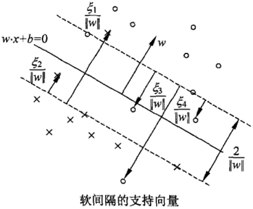
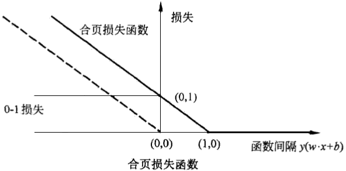

# 线性支持向量机与软间隔最大化

* [返回上层目录](../support-vector-machine.md)

* [线性支持向量机](#线性支持向量机)
* [线性支持向量机学习的对偶算法](#线性支持向量机学习的对偶算法)
* [支持向量](#支持向量)
* [合页损失函数](#合页损失函数)

支持向量机（support vector machines，SVM）是一种二类分类模型。它的基本模型是定义**在特征空间上的间隔最大的线性分类器**，间隔最大使它有别于感知机；支持向量机还包括核技巧，这使它成为实质上的非线性分类器。支持向量机的**学习策略就是间隔最大化**，可形式化为一个求解凸二次规划（convex quadratic programming）的问题，也等价于正则化的合页损失函数的最小化问题。支持向量机的学习算法是求解凸二次规划的最优化算法。

支持向量机学习方法包含构建由简至繁的模型：线性可分支持向量机（ linear support vector machine in linearly separable case )、线性支持向量机（ linear support vector machine)及非线性支持向量机（non-linear support vector machine)。简单模型是复杂模型的基础，也是复杂模型的特殊情况。当训练数据线性可分时，通过硬间隔最大化（ hard margin maximization)，学习一个线性的分类器，即线性可分支持向量机，又称为硬间隔支持向量机；当训练数据近似线性可分时，通过软间隔最大化（ soft margin maximization)，也学习一个线性的分类器，即线性支持向量机，又称为软间隔支持向量机；当训练数据线性不可分时，通过使用核技巧（kemel trick）及软间隔最大化，学习非线性支持向量机。

当输入空间为欧氏空间或离散集合、特征空间为希尔伯特空间时，核函数（kernel function）表示将输入从输入空间映射到特征空间得到的特征向量之间的内积。**通过使用核函数可以学习非线性支持向量机，等价于隐式地在高维的特征空间中学习线性支持向量机**。这样的方法称为核技巧。核方法（ kernel method)是比支持向量机更为一般的机器学习方法。

Cortes与Vapnik提出线性支持向童机，Boser、Guyon与Vapnik又引入核技巧，提出非线性支持向量机。

本章按照上述思路介绍3类支持向量机、核函数及一种快速学习算法——序列最小最优化算法（SMO)。

# 线性支持向量机

线性可分子问题的支持向量机学习方法，对线性不可分训练数据是不适用的，因为这时上述方法中的不等式约束并不能成立。怎么才能将它扩展到线性不可分问题呢？这就需要修改硬间隔最大化，使其成为软间隔最大化。

假设给定一个特征空间上的训练数据集
$$
T=\{(x_1,y_1),(x_2,y_2),...,(x_N,y_N)\}
$$
其中，$x_i\in X=R^n$，$y_i\in Y=\{-1,+1\}$，$i=1,2,...,N$，$x_i$为第i个特征向量，也称为实例，$y_i$为$x_i$的类标记。再假设训练数据集不是线性可分的。通常情况是，训练数据中有一些离群点，将这些离群点除去后，剩下大部分的样本组成的集合是线性可分的。

线性不可分意味着某些样本点是不能满足线性可分中的函数间隔大于等于1的约束条件的。为了解决这个问题，可以对每个样本点$(x_i,y_i)$引进一个松弛变量$\xi_i\geqslant 0$，使函数间隔加上松弛变量大于等于1。这样，约束条件变为
$$
y_i(w\cdot x_i+b)\geqslant1-\xi_i
$$
**上式可以这么理解：$\xi_i$是数据点到其分隔边界的函数距离，而$1-\xi_i$则就是数据点到分界面的函数距离了。原来要求的是数据点到分界面的函数距离要大于等于1，现在就放宽到了数据点到分界面函数距离大于等于1-$\xi_i$。这其实是对异常离群点的一种容忍。**

同时，对每一个松弛变量$\xi_i$，支付一个代价$\xi_i$。原来的目标函数变成了现在的
$$
\frac{1}{2}||w||^2+C\sum_{i=1}^N\xi_i
$$
这里，C>0称为惩罚函数，一般由应用问题决定，C值大时对误分类的惩罚更大，C值小时对误分类的惩罚减小。最小化目标函数（上式）包含了**两层含义**：

* **使**
  $
  \frac{1}{2}||w||^2
  $
  **尽可能小，即间隔尽量大；**

* **同时使误分类点的个数尽可能小，**

  **而C是调和两者的系数**。

有了上面的思路，可以和训练数据集线性可分时一样来考虑训练数据集不可分时的线性支持向量机学习问题。相应于硬间隔最大化，它称为**软间隔最大化**。

线性不可分的线性支持向量机的学习问题变成如下凸二次规划问题（**原始问题**）：
$$
\begin{aligned}
&\mathop{\text{min}}_{w,b,\xi}\quad \frac{1}{2}||w||^2+C\sum_{i=1}^N\xi_i\\
&\text{s.t.}\ \ \quad y_i(w\cdot x_i+b)\geqslant 1-\xi_i,\ i=1,2,...,N\\
&\ \ \ \quad \quad \xi_i\geqslant 0,\ i=1,2,...,N\\
\end{aligned}
$$
原始问题是一个凸二次规划问题，因而关于$(w,b,\xi)$的解是存在的。可以证明w的解是唯一的，但b的解可能不唯一，而是存在于一个区间。

设原始问题的解是$w^*,b^*$，于是可以得到分离超平面$w^*\cdot x+b^*=0$及分类决策函数$f(x)=sign(w^*\cdot x+b^*)$。称这样的模型为训练样本不可分时的线性支持向量机，简称**线性支持向量机**。显然，线性支持向量机包含线性可分支持向量机。由于现实中训练数据集往往是不可分的，线性支持向量机具有更广泛的适用性。

下面给出**线性支持向量机的定义**：

对于给定的线性不可分的训练数据集，通过求解凸二次规划问题，即软间隔最大问题（上述原始问题），得到的分离超平面为
$$
w^*\cdot x+b^*=0
$$
以及相应的分类决策函数
$$
f(x)=\text{sign}(w^*\cdot x+b^*)
$$
称为线性支持向量机。

# 线性支持向量机学习的对偶算法

原始问题的对偶问题是
$$
\begin{aligned}
&\mathop{\text{min}}_{\alpha}\quad \frac{1}{2}\sum_{i=1}^N\sum_{j=1}^N\alpha_i\alpha_jy_iy_j(x_i\cdot x_j)-\sum_{i=1}^N\alpha_i\\
&\text{s.t.}\ \quad \sum_{i=1}^N\alpha_iy_i=0\\
&\ \ \ \quad \quad 0\leqslant\alpha_i\leqslant C,\ i=1,2,...,N\\
\end{aligned}
$$
下面我们来具体说明上述对偶问题是怎么得出的：

原始最优化问题的**拉格朗日函数**是
$$
L(w,b,\xi,\alpha,\mu)=\frac{1}{2}||w||^2+C\sum_{i=1}^N\xi_i-\sum_{i=1}^N\alpha_i(y_i(w\cdot x_i+b)-1+\xi_i)-\sum_{i=1}^N\mu_i\xi_i
$$
其中，
$$
\alpha_i\geqslant0,\quad \mu_i\geqslant0
$$
对偶问题是拉格朗日函数的极大极小问题。

首先求$L(w,b,\xi,\alpha,\mu)$**对$w,b,\xi$的极小**，由
$$
\begin{aligned}
&\bigtriangledown_wL(w,b,\xi,\alpha,\mu)=w-\sum_{i=1}^N\alpha_iy_ix_i=0\\
&\bigtriangledown_bL(w,b,\xi,\alpha,\mu)=-\sum_{i=1}^N\alpha_iy_i=0\\
&\bigtriangledown_{\xi_i}L(w,b,\xi,\alpha,\mu)=C-\alpha_i-\mu_i=0
\end{aligned}
$$
得
$$
\begin{aligned}
&w=\sum_{i=1}^N\alpha_iy_ix_i\\
&\sum_{i=1}^N\alpha_iy_i=0\\
&C-\alpha_i-\mu_i=0\\
\end{aligned}
$$
将上式代入上面的拉格朗日函数，得
$$
\mathop{\text{min}}_{w,b,\xi}L(w,b,\xi,\alpha,\mu)=-\frac{1}{2}\sum_{i=1}^N\sum_{j=1}^N\alpha_i\alpha_jy_iy_j(x_i\cdot x_j)+\sum_{i=1}^N\alpha_i
$$
再对极小（上式）求**$\alpha$的极大**，即得**对偶问题**：
$$
\begin{aligned}
&\mathop{\text{max}}_{\alpha}\quad -\frac{1}{2}\sum_{i=1}^N\sum_{j=1}^N\alpha_i\alpha_jy_iy_j(x_i\cdot x_j)+\sum_{i=1}^N\alpha_i\\
&\text{s.t.}\ \quad \sum_{i=1}^N\alpha_iy_i=0\\
&\ \ \ \quad \quad C-\alpha_i-\mu_i=0\\
&\ \ \ \quad \quad \alpha_i\geqslant0\\
&\ \ \ \quad \quad \mu_i\geqslant0,\ i=1,2,...,N\\
\end{aligned}
$$
**拉格朗日对偶的重要作用是将w的计算提前并消除w，使得优化函数变为拉格朗日乘子的单一参数优化问题**。

将对偶最优化问题（上式）进行变换：利用等式约束（上式第二项约束）消去$\mu_i$，从而只留下变量$\alpha_i$，并将约束（上式后三项约束）写成
$$
0\leqslant\alpha_i\leqslant C
$$
下面具体来说明上式不等式是怎么得到的：
$$
\begin{aligned}
&C-\alpha_i-\mu_i=0 \Rightarrow \mu_i=C-\alpha_i\\
&u_i\geqslant0 \Rightarrow C-\alpha_i\geqslant0 \Rightarrow \alpha_i\leqslant C\\
&\alpha_i\geqslant0 \Rightarrow 0\leqslant \alpha_i\leqslant C
\end{aligned}
$$
再通过取负，将对目标函数求极大转换为求极小，于是得到对偶问题
$$
\begin{aligned}
&\mathop{\text{min}}_{\alpha}\quad \frac{1}{2}\sum_{i=1}^N\sum_{j=1}^N\alpha_i\alpha_jy_iy_j(x_i\cdot x_j)-\sum_{i=1}^N\alpha_i\\
&\text{s.t.}\ \quad \sum_{i=1}^N\alpha_iy_i=0\\
&\ \ \ \quad \quad 0\leqslant\alpha_i\leqslant C,\ i=1,2,...,N\\
\end{aligned}
$$
可以**通过求解对偶问题而得到原始问题的解$(w^*,b^*)$，进而确定分离超平面和决策函数**。为此，我们以定理的形式叙述原始问题的最优解$(w^*,b^*)$和对偶问题的最优解$\alpha^*$的关系。

**定理：原始问题的最优解$(w^*,b^*)$和对偶问题的最优解的$\alpha^*$关系：**

设
$$
\alpha^*=\{\alpha_1^*, \alpha_2^*, ..., \alpha_N^*\}
$$
是上述对偶问题的一个解，若存在$\alpha^*$的一个分量$\alpha_j^*$，$0<\alpha_j^*<C$，则原始问题的解$(w^*,b^*)$可按下式求得：
$$
\begin{aligned}
&w^*=\sum_{i=1}^N\alpha_i^*y_ix_i\\
&b^*=y_j-\sum_{i=1}^Ny_i\alpha_i^*(x_i\cdot x_j)\\
\end{aligned}
$$
证明：

原始问题是凸二次规划问题，满足强对偶问题（凸函数+Slater条件），所以原函数问题和对偶问题等价，则解满足KKT条件。即得
$$
\begin{aligned}
&\bigtriangledown_wL(w,b,\xi,\alpha,\mu)=w-\sum_{i=1}^N\alpha_iy_ix_i=0\\
&\bigtriangledown_bL(w,b,\xi,\alpha,\mu)=-\sum_{i=1}^N\alpha_iy_i=0\\
&\bigtriangledown_{\xi_i}L(w,b,\xi,\alpha,\mu)=C-\alpha_i-\mu=0\\
&\alpha_i^*(y_i(w^*\cdot x_i+b^*)-1+\xi_i)=0\\
&\mu_i^*\xi_i^*=0\\
&y_i(w^*\cdot x_i+b^*)-1+\xi_i^*\geqslant 0\\
&\xi_i^*\geqslant0\\
&\alpha_i^*\geqslant0\\
&\mu_i^*\geqslant 0,\quad i=1,2,...,N\\
\end{aligned}
$$
解释下上式所述的KKT条件：前三项是一阶偏导等于零，**第四五项是互补松弛条件（强对偶性决定的）**，第六七项是原始问题的约束条件，最后两项是对偶问题的约束条件。

由上式KKT条件中的第一项可知，原始问题的解中的第一项成立，即
$$
w^*=\sum_{i=1}^N\alpha_i^*y_ix_i
$$
再由KKT的互补松弛条件（第四五项）得，若存在$\alpha_j^*$，$0<\alpha_j^*<C$，则
$$
y_i(w^*\cdot x_i+b^*)-1=0
$$
。**这里具体是怎么得到的呢？**

**由互补松弛条件的第一项可知，当$\alpha_j^*>0$时，该项括号内才等于零，即**
$$
y_i(w^*\cdot x_i+b^*)-1+\xi_i^*=0
$$
**里面还有个$\xi_i^*$未知，那怎么消去这个$\xi_i^*$呢？由互补松弛条件的第二项可知，当$\mu_i^*>0$时，$\xi_i^*=0$，这时候就能消去$\xi_i^*$了。那么当$\mu_i^*>0$时，$\alpha_j^*$必须满足什么条件呢？或者说，当$\alpha_j^*$满足什么条件时，才能保证$\mu_i^*>0$？我们知道，对偶问题的条件中有一个$C-\alpha_i-\mu_i=0$，即$\mu_i=C-\alpha_i>0$，则$\alpha_i<C$，这时，上式中的$\xi_i^*=0$。也就是说，当$0<\alpha_j^*<C$时，$\xi_i^*=0$，则有**
$$
y_i(w^*\cdot x_i+b^*)-1=0
$$
即由此即得原始问题的解中的第二项（注意上式中1可以写成$y_i^2$，然后可消去$y_i$，求得$b^*$），即
$$
b^*=y_j-\sum_{i=1}^Ny_i\alpha_i^*(x_i\cdot x_j)
$$
。由此定理可知，分离超平面可以写成
$$
\sum_{i=1}^N\alpha_i^*y_i(x\cdot x_i)+b^*=0
$$
分类决策函数可以写成
$$
f(x)=\text{sign}\left( \sum_{i=1}^N\alpha_i^*y_i(x\cdot x_i)+b^* \right)
$$
上式为**线性支持向量机的对偶形式**。

综合前面的结果，有下面的算法。

**线性支持向量机学习算法**

输入：训练数据集$T=\{(x_1,y_1),(x_2,y_2),...,(x_N,y_N)\}$，其中，$x_i\in X=R^n$，$y_i\in Y=\{-1,+1\}$，$i=1,2,...,N$；

输出：分离超平面和分类决策函数。

（1）选择惩罚参数C>0，构造并求解凸二次规划问题（**对偶问题**）
$$
\begin{aligned}
&\mathop{\text{min}}_{\alpha}\quad \frac{1}{2}\sum_{i=1}^N\sum_{j=1}^N\alpha_i\alpha_jy_iy_j(x_i\cdot x_j)-\sum_{i=1}^N\alpha_i\\
&\text{s.t.}\ \quad \sum_{i=1}^N\alpha_iy_i=0\\
&\ \ \ \quad \quad 0\leqslant\alpha_i\leqslant C,\ i=1,2,...,N\\
\end{aligned}
$$
求得最优解
$$
\alpha^*=\{\alpha_1^*, \alpha_2^*, ..., \alpha_N^*\}
$$
（2）计算原问题的最优解的参数$w^*$和$b^*$。
$$
w^*=\sum_{i=1}^N\alpha_i^*y_ix_i
$$
选择$\alpha^*$的一个满足条件$0<\alpha_j^*<C$的分量$\alpha_j^*$ ，计算
$$
b^*=y_j-\sum_{i=1}^Ny_i\alpha_i^*(x_i\cdot x_j)
$$
（3）求得分离超平面和分类决策函数

分离超平面：
$$
w^*\cdot x+b^*=0
$$
分类决策函数：
$$
f(x)=\text{sign}(w^*\cdot x+b^*)
$$
上述步骤（2）中，对任一符合条件$0<\alpha_j^*<C$的$\alpha_j^*$，按照该算法求$b^*$的公式都可以求出$b^*$，但是由于原始问题对b的解并不唯一，所以实际计算时，可以取在所有符合条件的样本点上的平均值。

# 支持向量

在线性不可分的情况下，将对偶问题的解
$$
\alpha^*=(a_1^*,\alpha_2^*,...,\alpha_N^*)^T
$$
中对应于$\alpha_i^*>0$的样本点$(x_i,y_i)$的实例$x_i$称为支持向量（软间隔的支持向量）。如下图所示，这时的支持向量要比线性可分时的情况更复杂一些。图中，分离超平面由实线表示，间隔边界由虚线表示，正例点由“。”表示，负例点由“x”表示。图中还标出了实例xi到间隔边界的距离
$$
\frac{\xi_i}{||w||}
$$

**软间隔的支持向量$x_i$或者在间隔边界上，或者在间隔边界与分离超平面之间，或者在分离超平面误分一侧。**

* 若$\alpha_i^*<C$，则$\xi_i=0$，支持向量恰好落在间隔边界上；
* 若$\alpha_i^*=C$，
  * $0<\xi_i<1$，则分类正确，$x_i$在间隔边界与分离超平面之间；
  * $\xi_i=1$，则$x_i$在分离超平面上；
  * $\xi_i>1$，则$x_i$位于分离超平面误分一侧。

**这里解释下为什么，由上一节我们知道**
$$
\begin{aligned}
&C-\alpha_i^*-\mu_i^*=0\\
&\mu_i^*\xi_i^*=0
\end{aligned}
$$
**所以，当$\alpha_i^*<C$，则$\mu_i^*>0$，所以$\xi_i=0$，即支持向量恰好落在间隔边界上；而当$\alpha_i^*=C$时，$\mu_i^*=0$，所以$\xi_i>0$。**

# 合页损失函数

对于线性支持向量机学习来说，其模型为分离超平面$w^*\cdot x+b^*=0$及决策函数$f(x)=sign(w^*\cdot x+b^*)$，其学习策略为软间隔最大化，学习算法为图二次规划。

线性支持向量机学习还有另外一种解释，就是最小化以下目标函数：
$$
\sum_{i=1}^N\left[ 1-y_i(w\cdot x_i+b) \right]_++\lambda||w||^2
$$
目标函数的第一项是经验损失是或经验风险，函数
$$
L(y(w\cdot x+b))=[1-y(w\cdot x+b)]_+
$$
称为合页损失函数（hinge loss function）。下标“+”表示以下取正值的函数。
$$
\begin{aligned}
\ [z]_+=
\left\{\begin{matrix}
z,\quad z>0\\ 
0,\quad z\leqslant0
\end{matrix}\right.
\end{aligned}
$$
这就是说，当样本点$(x_i,y_i)$被正确分类且间隔函数（确信度）$y_i(w\cdot x_i+b)>1$时，损失是0，否则损失是$1-y_i(w\cdot x_i+b)$，注意到在上图中的实例点$x_4$被正确分类，但损失不是0。目标函数的第2项是系数为$\lambda$的$L_2$范数，是正则化项。

**定理：线性支持向量机原始最优化问题 等价于 合页损失+正则化的最优化问题**

线性支持向量机原始最优化问题
$$
\begin{aligned}
&\mathop{\text{min}}_{w,b,\xi}\quad \frac{1}{2}||w||^2+C\sum_{i=1}^N\xi_i\\
&\text{s.t.}\ \ \quad y_i(w\cdot x_i+b)\geqslant 1-\xi_i,\ i=1,2,...,N\\
&\ \ \ \quad \quad \xi_i\geqslant 0,\ i=1,2,...,N\\
\end{aligned}
$$
等价于合页损失+正则化的最优化问题
$$
\mathop{\text{min}}_{w,b}\ \sum_{i=1}^N\left[ 1-y_i(w\cdot x_i+b) \right]_++\lambda||w||^2
$$
证明：令
$$
\left[ 1-y_i(w\cdot x_i+b) \right]_+=\xi_i
$$
，则$\xi_i\geqslant 0$，原始最优化问题约束条件的第二项成立。

由上式，

* 当$1-y_i(w\cdot x_i+b)>0$时，有$y_i(w\cdot x_i+b)=1-\xi_i$；
* 当$1-y_i(w\cdot x_i+b)\leqslant 0$时，$\xi_i=0$，有$y_i(w\cdot x_i+b)\geqslant 1-\xi_i$

故原始最优化问题约束条件的第一项成立。

于是$w,b,\xi_i$满足原始最优化问题的约束条件。

所以合页损失+正则化最优化问题可写成
$$
\mathop{\text{min}}_{w,b}\sum_{i=1}^N\xi_i+\lambda||w||^2
$$
若取$\lambda=\frac{1}{2C}$，则
$$
\mathop{\text{min}}_{w,b} \frac{1}{C}\left( \frac{1}{2}||w||^2+C\sum_{i=1}^N\xi_i \right)
$$
与原始最优化问题等价。

反之，也可将原始最优化问题表示成合页损失+正则化的最优化问题。

合页损失函数的图形如上图所示，横轴是函数间隔$y(w\cdot x+b)$，纵轴是损失。由于函数像一个合页，故名合页损失函数。

图中还画出0-1损失函数，可以认为它是二类问题的真正的损失函数，而合页损失函数是0-1损失函数的上界。由于0-1损失函数不是连续可导的，直接优化由其构成的目标函数比较困难，可以认为**线性支持向量机是优化由0-1损失函数的上界（合页损失函数）构成的目标函数**。这时的上界损失函数又称为代理损失函数。

**上图中虚线显示的是感知机的损失函数**
$$
\left[ -y_i(w\cdot x_i+b) \right]_+
$$
**。这时，当样本点$(x_i,y_i)$被正确分类时，损失是0，否则损失是$-y_i(w\cdot x_i+b)$。相比之下，合页损失函数不仅要分类正确，而且确信度要足够高时损失才是0。也就是说，合页损失函数对学习有更高的要求。这就是SVM和感知机分本质区别！**

# 参考资料

* 《统计学习方法》李航

本章的结构和大部分内容均参考此书对应章节。

