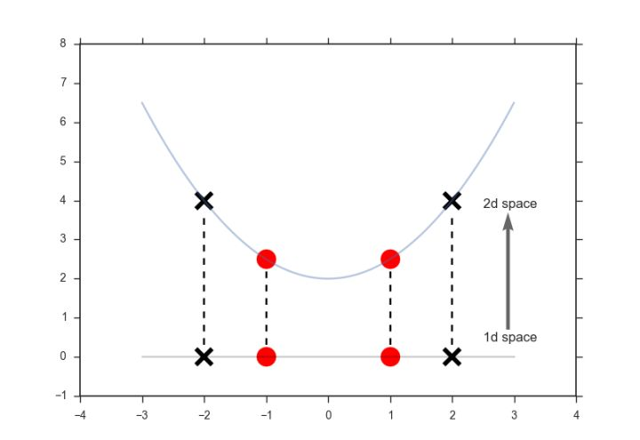
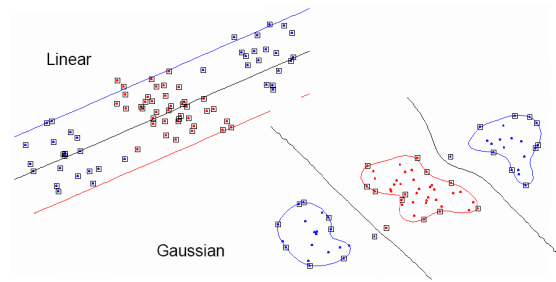

# 非线性支持向量机与核函数

* [返回上层目录](../support-vector-machine.md)

* [核技巧](#核技巧)
  * [非线性分类问题](#非线性分类问题)
  * [核函数的定义](#核函数的定义)
  * [对核函数的理解](#对核函数的理解)
  * [核技巧在支持向量空间中的应用](核技巧在支持向量空间中的应用)
* [（正定）核函数有效性判定](#（正定）核函数有效性判定)
* [常用核函数](#常用核函数)
  * [线性核](#线性核)
  * [多项式核函数](#多项式核函数)
  * [高斯核函数（径向基核函数RBF）](#高斯核函数（径向基核函数RBF）)
  * [拉普拉斯核](#拉普拉斯核)
  * [逻辑核（Sigmoid Kernel）](#逻辑核（Sigmoid Kernel）)
  * [核函数的选取](#核函数的选取)
* [非线性支持向量分类机](#非线性支持向量分类机)

支持向量机（support vector machines，SVM）是一种二类分类模型。它的基本模型是定义**在特征空间上的间隔最大的线性分类器**，间隔最大使它有别于感知机；支持向量机还包括核技巧，这使它成为实质上的非线性分类器。支持向量机的**学习策略就是间隔最大化**，可形式化为一个求解凸二次规划（convex quadratic programming）的问题，也等价于正则化的合页损失函数的最小化问题。支持向量机的学习算法是求解凸二次规划的最优化算法。

支持向量机学习方法包含构建由简至繁的模型：线性可分支持向量机（ linear support vector machine in linearly separable case )、线性支持向量机（ linear support vector machine)及非线性支持向量机（non-linear support vector machine)。简单模型是复杂模型的基础，也是复杂模型的特殊情况。当训练数据线性可分时，通过硬间隔最大化（ hard margin maximization)，学习一个线性的分类器，即线性可分支持向量机，又称为硬间隔支持向量机；当训练数据近似线性可分时，通过软间隔最大化（ soft margin maximization)，也学习一个线性的分类器，即线性支持向量机，又称为软间隔支持向量机；当训练数据线性不可分时，通过使用核技巧（kemel trick）及软间隔最大化，学习非线性支持向量机。

当输入空间为欧氏空间或离散集合、特征空间为希尔伯特空间时，核函数（kernel function）表示将输入从输入空间映射到特征空间得到的特征向量之间的内积。**通过使用核函数可以学习非线性支持向量机，等价于隐式地在高维的特征空间中学习线性支持向量机**。这样的方法称为核技巧。核方法（ kernel method)是比支持向量机更为一般的机器学习方法。

Cortes与Vapnik提出线性支持向童机，Boser、Guyon与Vapnik又引入核技巧，提出非线性支持向量机。

本章按照上述思路介绍3类支持向量机、核函数及一种快速学习算法——序列最小最优化算法（SMO)。

====================

对解线性分类问题，线性分类支持向量机是一种非常有效的方法。但是，有时分类问题是非线性的，这时可以使用非线性支持向量机。本节叙述非线性支持向量机，其主要优点是利用核技巧。核技巧不仅应用于支持向量机，而且应用于其他统计学习问题。

# 核技巧

## 非线性分类问题

非线性分类问题是指通过利用非线性模型才能就很好地进行分类的问题。先看一个例子：如下图所示，是一个分类问题，图中“●”表示正实例点，“x”表示负实例点。由图可见，无法用直线（线性模型将正负实例正确分开），但可以用一条椭圆曲线（非线性模型）将他正确们分开。

一般来说，对给定的一个训练数据集$T=\{(x_1,y_1),(x_2,y_2),...,(x_N,y_N)\}$，其中实例$x_i$属于输入空间，$x_i\in X=R^n$，对应的标记有两类，$y_i\in Y=\{+1,-1\}, i=1,2,...,N$。如果能用$R^n$中的一个超曲面将正负例分开，则称这个问题为非线性可分问题。

非线性问题往往不好求解，所以希望能用解线性分类问题的方法解决这个问题，所采取的方法是进行一个变换，将非线性问题变换为线性问题，通过解变换后的线性问题的方法求解原来的非线性问题。

对上图中所示的例子，通过变换，将左图中的椭圆变换为有图中的直线，将非线性分类问题变为线性分类问题。

设原空间为$X\subseteq R^2, x=(x^{(1)},x^{(2)})^T\in X$，新空间为$Z\subseteq R^2,\ z=(z^{(1)},z^{(2)})^T\in Z$，定义从原空间到新空间的变换（映射）：
$$
z=\phi(x)=\left( (x^{(1)})^2, (x^{(2)})^2 \right)^T
$$
经过变换$z=\phi(x)$，原空间$X\subseteq R^2$变换为新空间为$Z\subseteq R^2$，原空间中的点相应地变换为新空间中的点，原空间中的椭圆
$$
w_1(x^{(1)})^2+w_2(x^{(2)})^2+b=0
$$
变换成为新空间中的直线
$$
w_1z^{(1)}+w_2z^{(2)}+b=0
$$
在变换后的新空间里，直线$w_1\cdot z_1+w_2\cdot z_2+b=0$可将变换后的正负实例点正确分开。这样，原空间中的非线性可分问题就变成了新空间里的线性可分问题。

上面的例子说明，用线性分类方法求解非线性分类问题分为两步：

* **首先使用一个变换将原空间的数据映射到新空间**
* **然后在新空间中用线性分类学习方法从训练数据中学习分类模型**

**核技巧**就属于这样的方法。

核技巧应用到支持向量机，其基本思想就是通过一个非线性变换将输入空间（欧式空间或离散集合）对应于一个特征空间（希尔伯特空间$H$），使得在输入空间$R^n$中的**超曲面模型**对应于特征空间中的**超平面模型（支持向量机）**。这样，分类问题的学习任务通过在特征空间求解线性支持向量机就可以完成。

## 核函数的定义

**核函数**：设X是输入空间，又设$H$为特征空间（希尔伯特空间）如果存在一个从$X$到$H$的映射
$$
\phi(x):X\rightarrow H
$$
使得对所有$x,z\in X$，函数$K(x,z)$满足条件
$$
K(x,z)=\phi(x)\cdot \phi(z)
$$
则称$K(x,z)$为核函数，$\phi(x)$为映射函数，式中$\phi(x)·\phi(z)$为$\phi(x)$和$\phi(z)$的**内积**。

核技巧的想法是，在学习与预测中只定义核函数$K(x,z)$，而不显式地定义映射函数$\phi$（**这样其实有一个问题就是，你得知道定义的这个函数K到底是不是核函数，如何验证？接下来会讲到**）。为什么要用核函数？**其高维空间内积后的结果可等效为在低维空间的样本向量通过核函数直接求得。所以用核函数**。通常，直接计算$K(x,z)$比较容易，而通过$\phi(x)$和$\phi(z)$计算$K(x,z)$并不容易。注意，**$\phi$是输入空间$R^n$到特征空间的映射，特征空间一般是高维的，甚至是无穷维的**。

可以看到，对于给定的核$K(x,z)$，特征空间$H$和映射函数$\phi$的取法并不是唯一的，可以取不同的特征空间，即便是同一特征空间里，也可以取不同的映射。

下面举一个简单的例子来说明核函数和映射函数的关系。

假设输入空间是$R^2$，核函数是$K(x,z)=(x\cdot z)^2$，试找出其相关的特征空间$H$和映射$\phi(x):R^2\rightarrow H$。

解：取特征空间$H=R^3$，记
$$
x=(x^{(1)},x^{(2)})^T,\quad z=(z^{(1)},z^{(2)})^T
$$
，由于
$$
(x\cdot z)^2=(x^{(1)}z^{(1)}+x^{(2)}z^{(2)})^2=(x^{(1)}z^{(1)})^2+2x^{(1)}z^{(1)}x^{(2)}z^{(2)}+(x^{(2)}z^{(2)})^2
$$
所以可以取映射
$$
\phi(x)=\left( (x^{(1)})^2,\sqrt{2}x^{(1)}x^{(2)},(x^{(2)})^2 \right)^T
$$
容易验证
$$
\phi(x)\cdot\phi(z)=(x\cdot z)^2=K(x,z)
$$
。仍取$H=R^3$以及
$$
\phi(x)=\frac{1}{\sqrt{2}}\left( (x^{(1)})^2-(x^{(2)})^2,\ 2x^{(1)}x^{(2)},\ (x^{(2)})^2 \right)^T
$$
同样有
$$
\phi(x)\cdot\phi(z)=(x\cdot z)^2=K(x,z)
$$
。还可以取$H=R^4$和
$$
\phi(x)=\left( (x^{(1)})^2,\ x^{(1)}x^{(2)},\ x^{(1)}x^{(2)},\ (x^{(2)})^2 \right)^T
$$

## 对核函数的理解

考虑我们最初在“线性回归”中提出的问题，特征是房子的面积x，这里的x是实数，结果y是房子的价格。假设我们从样本点的分布中看到x和y符合3次曲线，那么我们希望使用x的三次多项式来逼近这些样本点。那么首先需要将特征x扩展到三维$(x,x^2,x^3)$，然后寻找特征和结果之间的模型。我们将这种特征变换称作特征映射（feature mapping）。映射函数称作$\phi$，在这个例子中
$$
\begin{aligned}
\phi(x)=
\begin{bmatrix}
x\\ 
x^2\\
x^3
\end{bmatrix}
\end{aligned}
$$
我们希望将得到的特征映射后的特征用于SVM分类，而不是最初的特征。这样，我们需要将前面线性可分SVM的w·x+b公式中的内积从$<x^{(i)}, x>$，映射到$<\phi(x^{(i)}),\phi(x)>$。具体的讲：

前面已经得到线性支持向量机的分界线：
$$
\sum_{i=1}^N\alpha_i^*y_i<x_i\cdot x>+b^*=0
$$
如果我们已经求得a\*和b\*，那么分界线就只依赖于x和$x_i$的矢量积形式，这一点非常关键。很多时候我们需要从数据中挖掘新的特征来进行训练，而不是简单粗暴地用原始数据，比如我们从x中挖掘出新的特征$x^2$，那我们还需要再一步步重新推导y的表达式吗？只需要将$<x_i, x>$换成$<x_i^2, x^2>$即可，更一般的描述：

如果存在一种映射关系Φ(x)，将x映射到另一空间中，已知
$$
y=\sum_{k=1}^m\alpha_iy^{(i)}<x^{(i)},x>+b
$$
，那么新空间中的
$$
y=\sum_{k=1}^m\alpha_iy^{(i)}<\phi(x^{(i)}),\phi(x)>+b
$$
整个过程非常的顺溜，$\phi(x)$可以将数据从低维映射到高维空间当中，为分类提供了新的视角。

至于为什么需要映射后的特征而不是最初的特征来参与计算，上面提到的（为了**更好地拟合**）是其中一个原因，另外的一个重要原因是**样例可能存在线性不可分的情况，而将特征映射到高维空间后，往往就可分了**。（在《数据挖掘导论》Pang-Ning Tan等人著的《支持向量机》那一章有个很好的例子说明）

如下图所示，一维空间中的数据点X和O互相交杂，在一维空间中我们无法找到一个分界点进行划分，但是通过
$$
\phi(x)=(x,\ 0.5x^2+2)
$$
映射到二维空间中以后，很容易找到分界线将这些不同类型的点区分开来

将核函数形式化定义，如果原始特征内积是\<x,z\>，映射后为\<Φ(x),Φ(z)\>，那么定义核函数（Kernel）为
$$
K(x,z)=\phi(x)^T\phi(z)
$$
映射函数Φ通常将低维的数据（m）映射到高维空间中，核函数K表示的是映射之后高维空间中两个**矢量的点积**。

到这里，我们可以得出结论，

通过映射函数，我们能从原始数据中（低维空间）抽象出所需的**特征**（高维空间），**由低维空间向高维空间的转化很多时候非常的麻烦，有意思的是，无论是1维、10维、100维还是更高维的空间，其矢量点积的结果都是一个常数，那么有没有什么捷径，可以跳过维度转换的过程，通过相对简单的计算直接得到矢量积？答案就是核函数**，

具体地讲，如果要实现该节开头的效果，只需先计算Φ(x)，然后计算Φ(x)·Φ(z)即可，然而这种计算方式是非常低效的。比如最初的特征是n维的，我们将其映射到$n^2$维，然后再计算，这样需要$O(n^2)$的时间。那么我们能不能想办法减少计算时间呢？

还是举一个例子来说明吧：

先看一个例子，

令
$$
x=[x_1,x_2,x_3]^T,\ y=[y_1,y_2,y_3]^T
$$
，我们定义
$$
\phi(x)=[x_1x_1, x_1x_2, x_1x_3, x_2x_1,x_2x_2,x_2x_3,x_3x_1,x_3x_2,x_3x_3]^T
$$
将原始数据从三维空间映射到九维空间中，让我们来计算Φ(1,2,3)·Φ(4,5,6)：
$$
\begin{aligned}
\phi(1,2,3)=&[1,2,3,2,4,6,3,6,9]^T\\
\phi(4,5,6)=&[16,20,24,20,25,30,24,30,36]^T\\
\phi(1,2,3)\cdot\phi(4,5,6)=&1\times16+2\times20+3\times24+2\times20\\
&+4\times25+6\times30+3\times24+6\times30+9\times36\\
=&16+40+72+40+100+180+72+180+324\\
=&1024\\
\end{aligned}
$$
可以看出计算相当繁琐，嗯，我们来尝试找找对应的核函数：
$$
\begin{aligned}
\phi(x)\cdot\phi(y)=&[x_1x_1, x_1x_2, x_1x_3, x_2x_1,x_2x_2,x_2x_3,x_3x_1,x_3x_2,x_3x_3]
\begin{bmatrix}
y_1y_1\\ 
y_1y_2\\
y_1y_3\\
y_2y_1\\
y_2y_2\\
y_2y_3\\
y_3y_1\\
y_3y_2\\
y_3y_3\\
\end{bmatrix}\\
=&x_1y_1x_1y_1+x_1y_1x_2y_2+x_1y_1x_3y_3+x_2y_2x_1y_1+x_2y_2x_2y_2\\
&+x_2y_2x_3y_3+x_3y_3x_1y_1+x_3y_3x_2y_2+x_3y_3x_3y_3\\
=&(x_1y_1 + x_2y_2 +x_3y_3)^2\\
=&(x^Ty)^2\\
=&K(x,y)\\
\end{aligned}
$$
通过上面的推导，我们发现虽然维度转化的过程较为繁琐复杂，但是矢量点积的结果确实相当简洁，这一次我们直接用核函数计算：
$$
K(x,y)=K((1,2,3),(4,5,6))=(1\times4+2\times5+3\times6)^2=32^2=1024
$$
相比于从低维映射到高维空间再进行矢量积运算，核函数大大简化了计算的过程，使得向更高维转化变为了可能，我们不需要知道低维空间的数据是怎样映射到高维空间的，我们只需要知道结果是怎么计算出来的。

再看一个例子：

假设x和z都是n维的，
$$
K(x,z)=(x^Tz)^2
$$
展开后，得
$$
\begin{aligned}
K(x,z)&=(x^Tz)^2\\
&=\left( \sum_{i=1}^nx_iz_i \right)\left( \sum_{i=1}^nx_iz_i \right)\\
&=\sum_{i=1}^n\sum_{j=1}^nx_ix_jz_iz_j\\
&=\sum_{i=1}^n\sum_{j=1}^n(x_ix_j)(z_iz_j)\\
&=\phi(x)^T\phi(z)
\end{aligned}
$$
这个时候发现我们可以只计算原始特征x和z内积的平方（时间复杂度是O(n)），就等价与计算映射后特征的内积。也就是说我们不需要花$O(n^2)$时间了。

现在看一下映射函数（n=3时），根据上面的公式，得到
$$
\begin{aligned}
\phi(x)=
\begin{bmatrix}
x_1x_1\\ 
x_1x_2\\
x_1x_3\\
x_2x_1\\
x_2x_2\\
x_2x_3\\
x_3x_1\\
x_3x_2\\
x_3x_3
\end{bmatrix}
\end{aligned}
$$
也就是说核函数
$$
K(x,z)=(x^Tz)^2
$$
只能在选择这样的Φ作为映射函数时才能够等价于映射后特征的内积。

---

由于计算的是内积，我们可以想到余弦相似度，如果x和z向量夹角越小，那么核函数值越大，反之，越小。因此，**核函数值是Φ(x)和Φ(z)的相似度**。即可将核函理解为两个数据点的相似程度，两个向量的点乘其实就是将其中一个向量投影到另一个向量上，重叠的长度越大，相似度越大，向量点乘的结果也越大。以高斯核为例， 
$$
K(x,y)=\text{exp}\left( -\frac{||x-y||^2}{2\sigma^2} \right)
$$
衡量的是向量x和y在无限空间的相似度，当x=y时，K(x,y)=1，表示两个向量完全重合，当||x-y||→∞时，K(x,y)=0，两个向量之间的相似度很小；另一方面，当$\sigma^2$的值很小时，核函数的值越有可能趋向于0，向量x和y只有在相当接近的情况下才会被判别为相似，也就是说只有在y邻域相当小的范围内才会被认为是相似于它的向量，这样严苛的条件确保了高精度（低偏差）但是却很容易过拟合（高方差）。

---

**为什么从低维映射到高维就线性可分了？**

下面有张图说明在低维线性不可分时，映射到高维后就可分了，使用高斯核函数。

这里举一个**核函数把低维空间映射到高维空间**的例子。

下面这张图位于第一、二象限内。我们关注红色的门，以及“北京四合院”这几个字下面的紫色的字母。我们把**红色的门**上的点看成是“+”数据，**紫色字母**上的点看成是“-”数据，它们的横、纵坐标是两个特征。显然，在这个二维空间内，“+”“-”两类数据不是线性可分的。

我们现在考虑核函数
$$
K(x,z)=<x,z>^2
$$
，即“内积平方”。这里面$x=(x_1,x_2), z=(z_1,z_2)$是二维空间中的两个点。

这个核函数对应着一个二维空间到三维空间的映射，它的表达式是：
$$
\phi(x)=(x_1^2,\sqrt{2}x_1x_2,x_2^2)
$$
可以验证，
$$
\begin{aligned}
<\phi(x), \phi(z)>&=<(x_1^2,\sqrt{2}x_1x_2,x_2^2),(z_1^2,\sqrt{2}z_1z_2,z_2^2)>\\
&=x_1^2z_1^2+2x_1x_2z_1z_2+x_2^2z_2^2\\
&=(x_1z_1+x_2z_2)^2\\
&=<x,z>^2\\
&=K(x,z)\\
\end{aligned}
$$
在Φ的映射下，原来二维空间中的图在三维空间中的像是这个样子：

（前后轴为x轴，左右轴为y轴，上下轴为z轴）

注意到绿色的平面可以完美地分割红色和紫色，也就是说，两类数据在三维空间中变成线性可分的了。

而三维中的这个判决边界，再映射回二维空间中是这样的：

这是一条**双曲线，它不是线性的**。

核函数的作用就是**隐含着一个从低维空间到高维空间的映射**，而这个映射可以**把低维空间中线性不可分的两类点变成线性可分**的。

当然，举的这个具体例子强烈地依赖于数据在原始空间中的位置。
事实中使用的核函数往往比这个例子复杂得多。它们对应的映射并不一定能够显式地表达出来；它们映射到的高维空间的维数也比我举的例子（三维）高得多，甚至是无穷维的。这样，就可以期待原来并不线性可分的两类点变成线性可分的了。

在实用中，很多使用者都是盲目地试验各种核函数，并扫描其中的参数，选择效果最好的。至于什么样的核函数适用于什么样的问题，大多数人都不懂。

## 核函数的本质

上面说了这么一大堆，读者可能还是没明白核函数到底是个什么东西？再简要概括下，即以下三点： 

* 实际中，我们会经常遇到线性不可分的样例，此时，我们的常用做法是把样例特征映射到高维空间中去(如上文2.2节最开始的那幅图所示，映射到高维空间后，相关特征便被分开了，也就达到了分类的目的)；
* 但进一步，如果凡是遇到线性不可分的样例，一律映射到高维空间，那么这个维度大小是会高到可怕的(如上文中19维乃至无穷维的例子)。那咋办呢？
* 此时，核函数就隆重登场了，核函数的价值在于它虽然也是将特征进行从低维到高维的转换，但核函数绝就绝在它事先在低维上进行计算，而将实质上的分类效果表现在了高维上，也就如上文所说的避免了直接在高维空间中的复杂计算。

## 核技巧在支持向量空间中的应用

这里首先要明白：kernel在SVM中的应用真心只是冰山一角，做kernel的人基本不关心在SVM上怎么用的问题，就像用SVM的人也不关心kernel是啥一样。kernel和SVM完全是两个正交的概念，早在SVM提出以前，reproducing kernel Hilbert space（RKHS）的应用就比较广泛了。（更详细的说明点[这里](https://www.zhihu.com/question/24627666/answer/35507744)）

**我们注意到在线性支持向量机的对偶问题中，无论是目标函数还是决策函数（分离超平面）都只涉及输入实例与实例之间的内积。**

**在对偶问题的目标函数中的内积$xi\cdot x_j$可以用核函数$K(x_i,x_j)=\phi(x_i)\cdot \phi(x_j)$来代替**。此时目标函数成为
$$
W(\alpha)=\frac{1}{2}\sum_{i=1}^N\sum_{j=1}^N\alpha_i\alpha_jy_iy_jK(x_i,x_j)-\sum_{i=1}^N\alpha_i
$$
同样，分类决策函数中的内积也可以用核函数代替，则分类决策函数成为f
$$
\begin{aligned}
f(x)&=\text{sign}\left( \sum_{i=1}^{N_s}\alpha_i^*y_i\phi(x_i)\cdot\phi(x)+b^* \right)\\
&=\text{sign}\left( \sum_{i=1}^{N_s}\alpha_i^*y_iK(x_i,x)+b^* \right)
\end{aligned}
$$
这等价于**经过映射函数Φ将原来的输入空间变换到一个新的特征空间，将输入空间中的内积$x_i\cdot x_j$变换为特征空间中的内积$\phi(x_i)\cdot \phi(x_j)$，在新的特征空间里从训练样本中学习线性支持向量机**，当映射函数是非线性函数时，学习到的含有核函数的支持向量机是非线性分类模型。

也就是说，在核函数K(x,z)给定的条件下，可以利用解线性分类问题的方法求解非线性分类问题的支持向量机。**学习是隐式地在特征空间中进行的，不需要显式地定义特征空间和映射函数**。这样的技巧成为**核技巧**，它是巧妙地**利用线性分类学习方法与核函数解决非线性问题**的技术。在实际应用中，往往**依赖领域知识直接选择核函数**，核函数选择的有效性需要通过实验验证。

最后用一个例子举例说明下核函数解决非线性问题的直观效果。

假设现在你是一个农场主，圈养了一批羊群，但为预防狼群袭击羊群，你需要搭建一个篱笆来把羊群围起来。但是篱笆应该建在哪里呢？你很可能需要依据牛群和狼群的位置建立一个“分类器”，比较下图这几种不同的分类器，我们可以看到SVM完成了一个很完美的解决方案。

这个例子从侧面简单说明了SVM使用非线性分类器的优势，而逻辑模式以及决策树模式都是使用了直线方法。

# （正定）核函数有效性判定

这里先提前说明一个**Gram矩阵的概念**，接下来会用到。什么是Gram矩阵？

**Gram矩阵定义**：n维欧式空间中任意k(k≤n)个向量$\alpha_1,\alpha_2,...,\alpha_k$的内积欧组成的矩阵
$$
\begin{aligned}
\bigtriangleup(\alpha_1,\alpha_2,...,\alpha_k)=
\begin{bmatrix}
(\alpha_1,\alpha_1)&  (\alpha_1,\alpha_2)& ... & (\alpha_1,\alpha_k)\\ 
(\alpha_2,\alpha_1)&  (\alpha_2,\alpha_2)& ... & (\alpha_2,\alpha_k)\\ 
...& ...& ... & ...\\ 
(\alpha_k,\alpha_1)&  (\alpha_k,\alpha_2)& ... & (\alpha_k,\alpha_k)\\ 
\end{bmatrix}
\end{aligned}
$$
称为k个向量$\alpha_1,\alpha_2,...,\alpha_k$的格拉姆（Gram）矩阵，它的行列式称为Gram行列式。

举例：正例样本点是$x_1=(3, 3)^T,\ x_2=(4, 3)^T$，负例样本点是$x_3=(1, 1)^T$，则Gram矩阵为
$$
\begin{aligned}
\bigtriangleup(\alpha_1,\alpha_2,...,\alpha_k)=
\begin{bmatrix}
18&  21&6\\ 
21&  25&7\\ 
6&  7& 2\\ 
\end{bmatrix}
\end{aligned}
$$

---

已知映射函数Φ，可以通过Φ(x)和Φ(z)的内积求得核函数K(x,z)。**不用构造映射Φ(x)能否直接判断一个给定的函数K(x,z)是不是核函数？**或者说，函数K(x,z)满足什么条件才能成为核函数？

本节叙述正定核的充要条件。**通常所的核函数就是正定核函数**。

问题：给定一个函数K(x,z)，我们能否使用K(x,z)来替代计算Φ(x)·Φ(z)。也就是说，是否能够找出一个Φ，使得对于所有的x和z，都有K(x,z)=Φ(x)·Φ(z)？

比如给出了
$$
K(x,z)=(x^Tz)^2
$$
，能否认为K(x,z)是一个有效的核函数？

下面来解决这个问题：

给定m个训练样本
$$
\{ x^{(1))}, x^{(2)},...,x^{(m)} \}
$$
，每一个$x^{(i)}$对应一个特征向量。那么，我们可以将任意两个$x^{(i)}$和$x^{(j)}$带入K(x,z)中，计算得到
$$
K_{ij}=K(x^{(i)},x^{(j)})
$$
。i可以从1到m，j可以从1到m，这样可以计算出m x m的核函数矩阵（Kernel Matrix）。为了方便，我们将核函数矩阵和K(x,z)都使用K来表示。

如何假设K是有效的核函数，那么根据核函数定义
$$
K_{ij}=K(x^{(i)},x^{(j)})=\phi(x^{(i)})^T\phi(x^{(j)})=\phi(x^{(j)})^T\phi(x^{(i)})=K(x^{(j)},x^{(i)})=K_{ji}
$$
可见，**矩阵K应该是个对称阵**。

接下来**让我们得出一个更强的结论吧**。首先使用符号$\phi_k(x)$来表示映射函数Φ(x)的第k维属性值。那么对于任意向量z，得
$$
\begin{aligned}
z^TKz&=\sum_i\sum_jz_iK_{ij}z_j\\
&=\sum_i\sum_jz_i\phi(x^{(i)})^T\phi(x^{(j)})z_j\\
&=\sum_i\sum_jz_i\sum_k\phi_k(x^{(i)})\phi_k(x^{(j)})z_j\\
&=\sum_k\sum_i\sum_jz_i\phi_k(x^{(i)})\phi_k(x^{(j)})z_j\\
&=\sum_k\left( \sum_i z_i\phi_k(x^{(i)}) \right)^2\\
&\geqslant 0\\
\end{aligned}
$$
从这个公式我们可以看出，如果K是个有效的核函数（即K(x,z)和Φ(x)·Φ(z)等价），那么，在训练集上得到的核函数K应该是半正定的（K≥0）

这样我们就得到**成为一个核函数的必要条件**：

**K是有效的核函数 ==> 核函数矩阵K是对称半正定的**。

幸运的是，**这个条件也是充分的**，由Mercer定理来表达。

>**Mercer定理**：
>
>如果函数K是$R^n\times R^n$上的映射（也就是从两个n维向量映射到实数域）。那么如果K是一个有效核函数（也称为Mercer核函数），那么当且仅当对于训练样例$\{x^{(1)}, x^{(2)}, ... ,x^{(m)}\}$，其相应的核函数矩阵是对称半正定的。

即，由Mercer定理我们知道，当且仅当核函数矩阵K是对称半正定的，K才是一个有效核函数。

关于 Mercer's theorem 的证明超出了这篇文章的范畴，有兴趣的同学可以自己查找相关资料或者戳这里 [CLT2008S-lecture18.pdf](http://web.iitd.ac.in/~sumeet/CLT2008S-lecture18.pdf) 了解如何证明其充分性。

Mercer定理表明为了证明K是有效的核函数，那么我们不用去寻找Φ，而只需要在训练集上求出各个$K_{ij}$，然后判断矩阵K是否是半正定（使用左上角主子式大于等于零等方法）即可。

许多其他的教科书在Mercer定理证明过程中使用了$L_2$数和再生希尔伯特空间等概念，但在特征是n维的情况下，这里给出的证明是等价的。

使用SVM的很多人甚至都不知道这个Mercer定理，也不关心它；有些不满足该条件的函数也被拿来当核函数用。

**这里为什么要求核矩阵是半正定的呢？因为在svm里面核函数的作用是计算两个数据点在另一个高维空间的inner product，而核函数是半正定的话能保证这个高维空间的存在，也就是保证计算得到的核函数的值真的是在某一个空间里的inner product。**

核函数不仅仅用在SVM上，但凡在一个模型后算法中出现了\<x,z\>，我们都可以常使用K(x,z)去替换，这可能能够很好地改善我们的算法。

总结一下上面的证明过程，我们有

**正定核的充要条件**

设K：$X\times X\rightarrow R$是对称函数，则K(x,z)为正定核函数的充要条件是对任意$x_i\in X,\ i=1,2,...,m$，K(x,z)对应的Gram矩阵：
$$
K=\left[ K(x_i,x_j) \right]_{m\times m}
$$
是半正定矩阵。

注意：这里没有对称的要求，因为这是正定核，不是Mercer核，正定核比Mercer核更具一般性。

上述定理给出了正定核的充要条件，因此可以作为正定核，即核函数的另一定义。

**正定核的等价定义**

设$X\subseteq R^n$，K(x,z)是定义在X x X上的对称函数，如果对任意$x_i\in X,\ i=1,2,...,m$，K(x,z)对应的Gram矩阵
$$
K=\left[ K(x_i,x_j) \right]_{m\times m}
$$
是对称半正定矩阵，则称K(x,z)是正定核。

这一定义在构造核函数时很有用，但对于一个具体函数K(x,z)来说，**检验它是否为半正定核函数并不容易**，因为要求要对任意有限输入集$\{x_1, x_2,...,x_m\}$验证K对应的Gram矩阵是否为半正定的，这不容易啊。**在实际问题中往往应用已有的核函数**。

另外，**由Mercer定理可以得到Mercer核，正定核比Mercer核更具有一般性**。

# 常用核函数

我们可以自己构造一个核函数，但是往往比较复杂，因为我们要证明K是对称的、K是半正定的这两个充分必要条件。所以，我们往往是用已经有的有效的核函数去解决问题。

关于核方法的理论部分涉及到泛函分析、微积分等等，水比较深，推荐一本书：《Kernel Methods for Pattern Analysi》(模式分析的核方法)，作者是：John Shawe-Taylor和Nello Cristianini 。

在支持向量机中常用的几种核函数是：

## 线性核

$$
K(x,z)=x^Tz
$$

线性核，实际上就是原始空间中的内积。这个核存在的主要目的是使得“映射后空间中的问题”和“映射前空间中的问题”两者在形式上统一起来了(意思是说，咱们有的时候，写代码，或写公式的时候，只要写个模板或通用表达式，然后再代入不同的核，便可以了，于此，便在形式上统一了起来，不用再分别写一个线性的，和一个非线性的)。

## 多项式核函数

$$
K(x,z)=(x^Tz+1)^p
$$

该空间的维度是
$$
\binom{m+d}{d}
$$
，其中m是原始空间的维度。（求解方法点击[这里](http://zhidao.baidu.com/question/16706714.html)）。

多项式核函数的低维到高维的映射函数为
$$
\begin{aligned}
K(x,z)&=(x^Tz+c)^2\\
&=\sum_{i=1}^n\sum_{j=1}^n(x_ix_j)(z_iz_j)+\sum_{i=1}^n(\sqrt{2c}x_i)(\sqrt{2c}z_i)+c^2
\end{aligned}
$$
对应的映射函数（n=3时）是
$$
\begin{aligned}
\phi(x)=
\begin{bmatrix}
x_1x_1\\ 
x_1x_2\\
x_1x_3\\
x_2x_1\\
x_2x_2\\
x_2x_3\\
x_3x_1\\
x_3x_2\\
x_3x_3\\
\sqrt{2c}x_1\\
\sqrt{2c}x_2\\
\sqrt{2c}x_3\\
c
\end{bmatrix}
\end{aligned}
$$

## 高斯核函数（径向基核函数RBF）

高斯核函数会将原始空间映射到无穷维空间
$$
K(x,z)=\text{exp}\left( -\frac{||x-z||^2}{2\sigma^2} \right)
$$
注：线性核函数是RBF的一个特例。解释点击[这里](https://scholar.google.com/scholar?hl=en&q=Asymptotic+behaviors+of+support+vector+machines+with+Gaussian+kernel&btnG=&as_sdt=1%2C5&as_sdtp=)。

如果x和z很相近（$||x-z||\approx 0$），那么核函数值为1，如果x和z相差很大（$||x-z||\gg 0$），那么核函数值约等于0。由于这个函数类似于高斯分布，因此称为**高斯核函数**，也叫做**径向基函数(Radial Basis Function 简称RBF)**。**它能够把原始特征映射到无穷维**。

高斯核函数衡量的是向量x和y在无限空间的相似度，当x=y时，K(x,y)=1，表示两个向量完全重合，当$||x-y||\rightarrow \infty$时，K(x,y)=0，两个向量之间的相似度很小；另一方面，当$\sigma^2$的值很小时，核函数的值越有可能趋向于0，向量x和y只有在相当接近的情况下才会被判别为相似，也就是说只有在y邻域相当小的范围内才会被认为是相似于它的向量，这样严苛的条件确保了高精度（低偏差）但是却很容易过拟合（高方差）。

如果$\sigma$选得很大的话，高次特征上的权重实际上衰减得非常快，所以实际上（数值上近似一下）相当于一个低维的子空间；反过来，如果$\sigma$选得很小，则可以将任意的数据映射为线性可分——当然，这并不一定是好事，因为随之而来的可能是非常严重的过拟合问题。不过，总的来说，通过调控参数$\sigma$，高斯核实际上具有相当高的灵活性，也是使用最广泛的核函数之一。下图所示的例子便是把低维线性不可分的数据通过高斯核函数映射到了高维空间：

既然高斯核函数能够比较x和z的相似度，并映射到0到1，回想logistic回归，sigmoid函数可以，因此还有**sigmoid核函数**等等。

这里解释下高斯核函数为什么会将原始空间映射到无穷维空间。
$$
\begin{aligned}
K(x,z)&=\text{exp}\left( -\frac{||x-z||^2}{2\sigma^2} \right)\\
&=\text{exp}( -x^2)\text{exp}( -z^2)\text{exp}(2xz)\quad \text{(ignore constant term)}\\
&=\text{exp}( -x^2)\text{exp}( -z^2)\left( \sum_{i=0}^{\infty}\frac{(2xz)^i}{i!} \right)\quad \text{(Tylor)}\\
&=\sum_{i=0}^{\infty}\left(\text{exp}( -x^2)\text{exp}( -z^2)\sqrt{\frac{2^i}{i!}}\sqrt{\frac{2^i}{i!}}x^iz^i\right)\\
&=\phi(x)^T\phi(z)\\
\end{aligned}
$$
由上式，显然可得高斯核的映射函数
$$
\phi(x)=\text{exp}( -\frac{1}{4\sigma^2})\cdot\text{exp}( -x^2)\cdot\left(1,\sqrt{\frac{2}{1!}}x,\sqrt{\frac{2^2}{2!}}x^2,...\right)
$$
$\sigma$过大，为什么高维权重衰减会很快？所有维度的权值都会衰减啊？有待学习！

**RBF核的优点**：

SVM关键是选取核函数的类型，主要有线性内核，多项式内核，径向基内核（RBF），sigmoid核。
这些函数中应用最广的应该就是RBF核了，无论是小样本还是大样本，高维还是低维等情况，RBF核函数均适用，它相比其他的函数有一下优点：

* RBF核函数可以将一个样本映射到一个更高维的空间，而且线性核函数是RBF的一个特例，也就是说如果考虑使用RBF，那么就没有必要考虑线性核函数了。
* 与多项式核函数相比，RBF需要确定的参数要少，核函数参数的多少直接影响函数的复杂程度。另外，当多项式的阶数比较高时，核矩阵的元素值将趋于无穷大或无穷小，而RBF则在上，会减少数值的计算困难。
* 对于某些参数，RBF和sigmoid具有相似的性能。

## 拉普拉斯核

$$
K(x,z)=\text{exp}\left( -\frac{||x-z||}{\sigma} \right)
$$

## 逻辑核（Sigmoid Kernel）

$$
K(x,z)=\text{tanh}(\beta x^Tz+\theta)
$$

## 核函数的选取

在不知道特征映射的形式时，我们并不知道什么样的核函数是合适的，而核函数也仅隐式地定义了这个特征空间，于是“核函数选择”称为支持向量机最大的变数。

选择合适的核函数并不是一件容易的事情，因为评估数据点之间的相似度往往需要专业领域的知识，幸运的是大多数情况下高斯核都能取得不错的结果。核函数并不是支持向量机专用的技巧，任何算法只要能写成向量相乘的形式就可以运用核函数进行优化。

**一般用线性核和高斯核**，也就是Linear核与RBF核。需要注意的是需要对数据归一化处理，很多使用者忘了这个小细节

个人经验：

* **RBF kernel**是第一选择，几乎效果都是最好的，一般情况下RBF效果是不会差于Linear，但是时间上RBF会耗费更多。
* 此外，**linear kernel**也有用武之地，（其实linear kernel本身就是RBF的一种特殊情况），因为当features的数量很多的时候，linear kernel的速度优势比较明显。

当然有时间当然最好是都试一遍，看看哪个更符合自己的数据分布特性了。

下面是**吴恩达**的见解：

* 如果Feature的数量很大，跟样本数量差不多，这时候选用LR或者是Linear Kernel的SVM

  如果特征维数很高，往往线性可分（SVM解决非线性分类问题的思路就是将样本映射到更高维的特征空间中），可以采用LR或者线性核的SVM

* 如果Feature的数量比较小，而样本数量很多，需要手工添加一些feature变成第一种情况

  如果样本数量很多，由于求解最优化问题的时候，目标函数涉及两两样本计算内积，使用高斯核明显计算量会大于线性核，所以手动添加一些特征，使得线性可分，然后可以用LR或者线性核的SVM

* 如果Feature的数量比较小，样本数量一般，不算大也不算小，选用SVM+Gaussian Kernel

  如果不满足上述两点，即特征维数少，样本数量正常，可以使用高斯核的SVM

# 非线性支持向量分类机

如上所述，利用核技巧，可以将线性分类的学习方法应用到非线性分类问题上。将线性支持向量机扩展到非线性支持向量机，只需要**将线性支持向量机对偶形式中的内积换成核函数**。

**非线性支持向量机**

从非线性分类训练集，通过和函数与软间隔最大化，或凸二次规划，学习得到的分类决策函数
$$
f(x)=\text{sign}\left( \sum_{i=1}^N\alpha_i^*y_iK(x,x_i)+b^* \right)
$$
称为非线性支持向量，K(x,z)是正定核函数。

下面叙述非线性支持向量机学习算法

**非线性支持向量机学习算法**

输入：训练数据集\{(x1,y1),(x2,y2), ... ,(xN,yN)\}

，其中，xi∈X=R^n，yi∈Y=\{+1,-1\}，i=1,2,...,N

输出：分类决策函数。

（1）选取适当的核函数K(x,z)和适当的参数C，构造并求解最优化问题
$$
\begin{aligned}
&\mathop{\text{min}}_{\alpha}\quad \frac{1}{2}\sum_{i=1}^N\sum_{j=1}^N\alpha_i\alpha_jy_iy_jK(x_i, x_j)-\sum_{i=1}^N\alpha_i\\
&\text{s.t.}\ \quad \sum_{i=1}^N\alpha_iy_i=0\\
&\ \ \ \quad \quad 0\leqslant\alpha_i\leqslant C,\ i=1,2,...,N\\
\end{aligned}
$$
求得最优解α\*=(α1\*, α2\*, ... , αN\*)^T。

（2）选择α\*的一个正分量0<αj\*<C，计算
$$
b^*=y_j-\sum_{i=1}^N\alpha_i^*y_iK(x_i, x_j)
$$
（3）构造决策函数：
$$
f(x)=\text{sign}\left( \sum_{i=1}^N\alpha_i^*y_iK(x, x_i)+b^* \right)
$$
当K(x,z)是正定核函数时，上述最优化问题是凸二次规划函数，解是存在的。

# 参考资料

* 《统计学习方法》李航

本章的结构和大部分内容均参考此书对应章节。

* [支持向量机（三）核函数](https://www.cnblogs.com/jerrylead/archive/2011/03/18/1988406.html)

"对核函数的理解"和“（正定）核函数有效性判定”这两节参考此博客。

* [我所理解的 SVM 2——核函数的应用](https://zhuanlan.zhihu.com/p/24291579)

"对核函数的理解"一节参考此博客。

* [支持向量机通俗导论（理解SVM的三层境界）](https://blog.csdn.net/v_july_v/article/details/7624837)

"对核函数的理解"和“核函数的本质”两节参考此博客。

* [如何理解高斯核函数的公式？](https://www.zhihu.com/question/46587416/answer/343002184)

"高斯核函数"参考了此知乎。

* [SVM的核函数如何选取？](https://www.zhihu.com/question/21883548/answer/19693213)

"核函数的选取"参考了此知乎回答。

===

[RBF 核函数背后隐藏着怎样的映射？](https://zhuanlan.zhihu.com/p/135898326)

