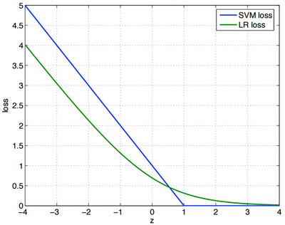

# SVM总结

* [返回上层目录](../support-vector-machine.md)
* [SVM的正则化](#SVM的正则化)
* [逻辑回归和SVM的区别](#逻辑回归和SVM的区别)
* [SVM总结](#SVM总结)

支持向量机（support vector machines，SVM）是一种二类分类模型。它的基本模型是定义**在特征空间上的间隔最大的线性分类器**，间隔最大使它有别于感知机；支持向量机还包括核技巧，这使它成为实质上的非线性分类器。支持向量机的**学习策略就是间隔最大化**，可形式化为一个求解凸二次规划（convex quadratic programming）的问题，也等价于正则化的合页损失函数的最小化问题。支持向量机的学习算法是求解凸二次规划的最优化算法。

支持向量机学习方法包含构建由简至繁的模型：线性可分支持向量机（ linear support vector machine in linearly separable case )、线性支持向量机（ linear support vector machine)及非线性支持向量机（non-linear support vector machine)。简单模型是复杂模型的基础，也是复杂模型的特殊情况。当训练数据线性可分时，通过硬间隔最大化（ hard margin maximization)，学习一个线性的分类器，即线性可分支持向量机，又称为硬间隔支持向量机；当训练数据近似线性可分时，通过软间隔最大化（ soft margin maximization)，也学习一个线性的分类器，即线性支持向量机，又称为软间隔支持向量机；当训练数据线性不可分时，通过使用核技巧（kemel trick）及软间隔最大化，学习非线性支持向量机。

当输入空间为欧氏空间或离散集合、特征空间为希尔伯特空间时，核函数（kernel function）表示将输入从输入空间映射到特征空间得到的特征向量之间的内积。**通过使用核函数可以学习非线性支持向量机，等价于隐式地在高维的特征空间中学习线性支持向量机**。这样的方法称为核技巧。核方法（ kernel method)是比支持向量机更为一般的机器学习方法。

Cortes与Vapnik提出线性支持向童机，Boser、Guyon与Vapnik又引入核技巧，提出非线性支持向量机。

本章按照上述思路介绍3类支持向量机、核函数及一种快速学习算法——序列最小最优化算法（SMO)。

# SVM的正则化

支持向量机SVM优化目的为寻找一个超平面，使得正负样本能够以最大间隔分离开，从而得到更好的泛化性能，其通过引入核函数来将低维线性不可分的样本映射到高维空间从而线性可分，通过引入惩罚参数C(类似于正则化参数)来对错分样本进行惩罚，从而减少模型复杂度，提高泛化能力，其优化目标如下：
$$
\mathop{\text{min}}_{\theta,b}\frac{1}{n}\sum_{i=1}^n\text{max}(1-y_i(\theta^Tx_i+b),0)+\frac{1}{2CN}\theta^T\theta
$$
其中，正则项系数为
$$
\lambda=\frac{1}{2C}
$$
惩罚参数C作用和正则化参数λ作用一致，只是反相关而已。

需要明白以下结论：

* C越大，λ越小，表示对分错样本的惩罚程度越大，正则化作用越小，偏差越小，方差越大，越容易出现过拟合(通俗理解，原本将低维空间映射到5维空间正好线性可分，但是由于惩罚过于严重，任何一个样本分错了都不可原谅，结果系统只能不断提高维数来拟合样本，假设为10维，最终导致映射维数过高，出现过拟合样本现象，数学上称为VC维较大)；
* C越小，λ越大，表示对分错样本的惩罚程度越小，正则化作用越大，偏差越大，方差越小，越容易出现欠拟合(通俗理解，原本将低维空间映射到5维空间正好线性可分，但是由于惩罚过小，分错了好多样本都可以理解，比较随意，结果系统也采用简化版来拟合样本，假设为3维，最终导致映射维数过低，出现欠拟合样本现象，数学上称为VC维较小)。

# 逻辑回归和SVM的区别

逻辑回归是广义的线性回归，通过S型函数变化而已，取一个阈值作为分类标志，在行业的应用中很多直接用概率值解决放贷或者营销策略，不同概率值使用不同策略，逻辑回归便于实施易于解释都是业务常用的。逻辑回归常用于处理大数据，而SVM则正好相反。

支持向量机通过超平面分割数据，追求的是分类结果。SVM的理论性强，最nb的地方是核函数的引入，可以来逼近非线性目标函数。不过如果非线性的话，工业界GBDT用得更广些。

两者的不同具体表现在：

* 损失函数不一样，逻辑回归的损失函数是log loss，svm的损失函数是hinge loss

  损失函数的不同，导致了逻辑回归侧重于所有点，svm侧重于超平面边缘的点

  即SVM考虑分界面处的局部点（不关心已经确定远离的点），而逻辑回归考虑全局（已经远离的点可能通过调整中间线使其能够更加远离）

* 损失函数的优化方法不一样，逻辑回归用梯度下降法优化，svm用smo方法进行优化

* 对非线性问题的处理方式不同。LR主要靠特征构造，必须组合交叉特征，特征离散化。SVM也可以这样，还可以通过kernel。

* 处理的数据规模不同。**LR一般用来处理大规模的学习问题**。如十亿级别的样本，亿级别的特征。

**为什么逻辑回归和SVM的本质区别在于损失函数？**

逻辑回归和支持向量机之间的区别也经常被问到的，特地找了一些相关资料看了下。

我们先来看一下SVM 和正则化的逻辑回归它们的**损失函数**：
$$
\begin{aligned}
&\text{SVM: } &\frac{1}{n}\sum_{i=1}^n(1-y_i\left[ w_0+x_i^Tw_1 \right])^{\text{+}}+\lambda||w_1||/2\\
&\text{Logistic: } &\frac{1}{n}\sum_{i=1}^n-\text{log }g(y_i\left[ w_0+x_i^Tw_1 \right])+\lambda||w_1||/2\\
\end{aligned}
$$
其中，g(z)是Sigmoid函数，即
$$
g(z)=\frac{1}{1+\text{exp}(-z)}
$$
可以将逻辑回归和SVM统一起来：
$$
\text{Both: } \frac{1}{n}\sum_{i=1}^n\text{Loss}(y_i\left[ w_0+x_i^Tw_1 \right])+\lambda||w_1||/2
$$
**也就是说，他们的区别在于逻辑回归采用的是log loss（对数损失函数），SVM采用的是hinge loss（E(z)=max(0,1-z)）。**

也即

* SVM损失函数：
  $
  \text{Loss}(z)=(1-z)^{\text{+}}
  $

* LR损失函数：
  $
  \text{Loss}(z)=\text{log}(1+\text{exp}(-z))
  $

其实，这两个损失函数的目的都是增加对分类影响较大的数据点的权重，减少与分类关系较小的数据点的权重。SVM的处理方法是只考虑**support vectors**，也就是和分类最相关的少数点，去学习分类器。而逻辑回归通过非线性映射，大大减小了离分类平面较远的点的权重，相对提升了与分类最相关的数据点的权重，**两者的根本目的都是一样的**。

svm考虑**局部**（支持向量），而logistic回归考虑**全局**，就像大学里的辅导员和教师间的区别：

>辅导员关心的是挂科边缘的人，常常找他们谈话，告诫他们一定得好好学习，不要浪费大好青春，挂科了会拿不到毕业证、学位证等等，相反，对于那些相对优秀或者良好的学生，他们却很少去问，因为辅导员相信他们一定会按部就班的做好分内的事；而大学里的教师却不是这样的，他们关心的是班里的整体情况，大家是不是基本都理解了，平均分怎么样，至于某个人的分数是59还是61，他们倒不是很在意。

如果给SVM换用其他的Loss函数的话，SVM就不再是SVM了。正是因为Hinge Loss的零区域对应的正是非支持向量的普通样本，从而所有的普通样本都不参与最终超平面的决定，这才是支持向量机最大的优势所在，对训练样本数目的依赖大大减少，而且提高了训练效率。

# SVM总结

这份SVM的讲义重点概括了SVM的基本概念和基本推导，中规中矩却又让人醍醐灌顶。起初让我最头疼的是拉格朗日对偶和SMO，后来逐渐明白拉格朗日对偶的重要作用是将w的计算提前并消除w，使得优化函数变为拉格朗日乘子的单一参数优化问题。而SMO里面迭代公式的推导也着实让我花费了不少时间。

对比这么复杂的推导过程，SVM的思想确实那么简单。它不再像logistic回归一样企图去拟合样本点（中间加了一层sigmoid函数变换），而是就在样本中去找分隔线，为了评判哪条分界线更好，引入了几何间隔最大化的目标。

之后所有的推导都是去解决目标函数的最优化上了。在解决最优化的过程中，发现了w可以由特征向量内积来表示，进而发现了核函数，仅需要调整核函数就可以将特征进行低维到高维的变换，在低维上进行计算，实质结果表现在高维上。由于并不是所有的样本都可分，为了保证SVM的通用性，进行了软间隔的处理，导致的结果就是将优化问题变得更加复杂，然而惊奇的是松弛变量没有出现在最后的目标函数中。最后的优化求解问题，也被拉格朗日对偶和SMO算法化解，使SVM趋向于完美。

对于非线性SVM：SVM通过一个非线性映射Φ(x)，把样本空间映射到一个高维乃至无穷维的特征空间中（Hilbert空间），使得在原来的样本空间中非线性可分的问题转化为在特征空间中的线性可分的问题。简单地说，就是升维和线性化。作为分类、回归等问题来说，很可能在低维样本空间无法线性处理的样本集，在高维特征空间中却可以通过一个线性超平面实现线性划分（或回归）。一般的升维都会带来计算的复杂化，但SVM方法巧妙地应用核函数的展开定理简化了计算，不需要知道非线性映射的显式表达式。简单来说，SVM是在高维特征空间中建立线性学习机，几乎不增加计算的复杂性，并且在某种程度上避免了“维数灾难”，这一切要归功于核函数的展开和计算理论。

# 参考资料

* [史上最全面的正则化技术总结与分析--part2](https://zhuanlan.zhihu.com/p/35432128)

“SVM的正则化”参考此知乎专栏文章。

* [支持向量机SVM（一）](https://www.cnblogs.com/jerrylead/archive/2011/03/13/1982639.html)

这份材料从前几节讲的logistic回归出发，引出了SVM，既揭示了模型间的联系，也让人觉得过渡更自然。“逻辑回归和SVM的区别”一节参考了此博客。

* [逻辑回归和SVM的区别是什么？各适用于解决什么问题？](https://www.zhihu.com/question/24904422)

“逻辑回归和SVM的区别”一节参考了此博客。

