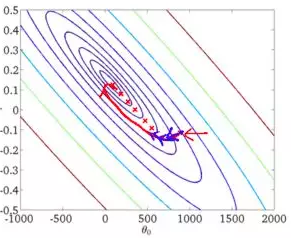
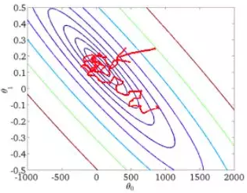

# 随机梯度下降

* [返回上层目录](../offline-learning.md)
* [三类梯度下降算法概述](#三类梯度下降算法概述)
* [批量梯度下降BGD](#批量梯度下降BGD)
* [随机梯度下降SGD](#随机梯度下降SGD)
  * [随机梯度下降的原理](#随机梯度下降的原理)
  * [随机梯度下降的性质](#随机梯度下降的性质)
* [小批量梯度下降MBGD](#小批量梯度下降MBGD)
  * [BatchSize的理解](#BatchSize的理解)
* [最速梯度下降法和梯度下降法的区别](#最速梯度下降法和梯度下降法的区别)

最优化问题在机器学习中有非常重要的地位，很多机器学习算法最后都归结为求解最优化问题。在各种最优化算法中，梯度下降法是最简单、最常见的一种。

# 三类梯度下降算法概述

GD（Gradient Descent）：就是没有利用Batch Size，用基于整个数据库得到梯度，梯度准确，但数据量大时，计算非常耗时，同时神经网络常是非凸的，网络最终可能收敛到初始点附近的局部最优点。

SGD（Stochastic Gradient Descent）：就是Batch Size=1，每次计算一个样本，梯度不准确，所以学习率要降低。

mini-batch SGD：就是选着合适Batch Size的SGD算法，mini-batch利用噪声梯度，一定程度上缓解了GD算法直接掉进初始点附近的局部最优值。同时梯度准确了，学习率要加大。 

总结：

* **Batch gradient descent:** Use all examples in each iteration；

* **Stochastic gradient descent:** Use 1 example in each iteration；

* **Mini-batch gradient descent:** Use b examples in each iteration.

# 批量梯度下降BGD

批量梯度下降法（Batch Gradient Descent，简称BGD）是梯度下降法最原始的形式，它的具体思路是在更新每一参数时都使用所有的样本来进行更新，其数学形式如下：

$$
g=\frac{1}{m}\bigtriangledown_{\theta}\sum^{m}_{i=1}L(x^{(i)},y^{(i)},\theta)
$$
其中，$m$为样本总数。

**这个运算的计算复杂度是$O(m)$。随着训练集规模增长为数十亿的样本，计算一步梯度也会消耗相当长的时间**。虽然它得到的是一个全局最优解，但是每迭代一步，都要用到训练集所有的数据，如果样本数目$m$很大，那么可想而知这种方法的迭代速度！所以，这就引入了另外两种方法，随机梯度下降和批量梯度下降。

批量梯度下降BGD的优缺点：

**优点：**全局最优解；易于并行实现；

**缺点：**当样本数目很多时，训练过程会很慢。

从迭代的次数上来看，BGD迭代的次数相对较少。其迭代的收敛曲线示意图可以表示如下：

# 随机梯度下降SGD

几乎所有的深度学习算法都用到了随机梯度下降，它是梯度下降算法的拓展。

机器学习中反复出现的一个问题是：好的泛化需要大的训练集，但是，训练集越大，计算代价也越大。

## 随机梯度下降的原理

由于批量梯度下降法在更新每一个参数时，都需要所有的训练样本，所以训练过程会随着样本数量的加大而变得异常的缓慢。随机梯度下降法（Stochastic Gradient Descent，简称SGD）正是为了解决批量梯度下降法这一弊端而提出的。其数学形式如下：
$$
g=\bigtriangledown_{\theta}L(x^{(i)},y^{(i)},\theta)
$$
随机梯度下降是通过每个样本来迭代更新一次，如果样本量很大的情况（例如几十万），那么可能只用其中几万条或者几千条的样本，就已经将$\theta$迭代到最优解了，对比上面的批量梯度下降，迭代一次需要用到十几万训练样本，一次迭代不可能最优，如果迭代10次的话就需要遍历训练样本10次。但是，SGD伴随的一个问题是噪音较BGD要多，使得SGD并不是每次迭代都向着整体最优化方向。

**优点：**训练速度快；

**缺点：**准确度下降，并不是全局最优；不易于并行实现。

从迭代的次数上来看，SGD迭代的次数较多，在解空间的搜索过程看起来很盲目。其迭代的收敛曲线示意图可以表示如下：

## 随机梯度下降的性质

梯度下降往往被认为很慢或不可靠。

**在以前，将梯度下降应用到非凸优化问题被认为很鲁莽或者没有原则**。而现在，在深度学习中，使用梯度下降的训练效果很不错。虽然优化算法不一定能保证在合理的时间内达到一个局部最小值，但它通常能及时地找到代价函数一个很小的值，并且是有用的。

在深度学习之外，随机梯度下降有很多重要的应用。它是在大规模数据上训练大型线性模型的主要方法。对于固定大小的模型，每一步随机梯度下降更新的计算量不取决于训练集的大小$m$。在实践中，当训练集大小增长时，我们通常会使用一个更大的模型，但是这并非是必须的。**达到收敛模型所需的更新次数通常会随着训练集规模增大而增加。然而，当$m$趋于无穷大时，该模型最终会随机梯度下降抽样完训练集上所有样本之前收敛到可能的最优测试误差。继续增加$m$不会延长达到模型可能的最优测试误差的时间**。从这点来看，我们可以认为用SGD训练模型的渐进代价是关于$m$的函数的$O(1)$级别。

# 小批量梯度下降MBGD

由上述的两种梯度下降法可以看出，其各自均有优缺点，那么能不能在两种方法的性能之间取得一个折衷呢？即，算法的训练过程比较快，而且也要保证最终参数训练的准确率，而这正是小批量梯度下降法（Mini-batch Gradient Descent，简称MBGD）的初衷。

mini-batch SGD其实就是选着合适Batch Size的SGD算法，mini-batch利用噪声梯度，一定程度上缓解了GD算法直接掉进初始点附近的局部最优值。同时梯度准确了，学习率要加大。 

小批量梯度下降的**核心**是，**梯度是期望。期望可使用小规模的样本近似估计**。

具体步骤：我们在每一步都从训练集中均匀抽出一**小批量（minibatch）**样本
$$
\mathbb{B}=\{x^{(1)},...,x^{(m^{'})}\}
$$
，小批量的数目$m'$通常是一个相对较小的数，从一到几百（一般为10）。重要的是，当训练集大小$m$增长时，$m'$通常是固定的。我们可能在拟合几十亿样本时，每次更新计算只用到几百个样本。

梯度的估计可以表示成
$$
g=\frac{1}{m^{'}}\bigtriangledown_{\theta}\sum^{m^{'}}_{i=1}L(x^{(i)},y^{(i)},\theta)
$$
使用来自小批量$\mathbb{B}$的样本。然后，随机梯度下降算法使用如下的梯度下降算法估计：
$$
\theta=\theta-\epsilon g
$$
其中，$\epsilon$是学习率。

## BatchSize的理解

**直观的理解：** 

Batch Size定义：一次训练所选取的样本数。 

Batch Size的大小影响模型的优化程度和速度。同时其直接影响到GPU内存的使用情况，假如你GPU内存不大，该数值最好设置小一点。

---

**为什么要提出Batch Size？**

在没有使用Batch Size之前，这意味着网络在训练时，是一次把所有的数据（整个数据库）输入网络中，然后计算它们的梯度进行反向传播，由于在计算梯度时使用了整个数据库，所以计算得到的梯度方向更为准确。但在这情况下，计算得到不同梯度值差别巨大，难以使用一个全局的学习率，所以这时一般使用Rprop这种基于梯度符号的训练算法，单独进行梯度更新。 

在小样本数的数据库中，不使用Batch Size是可行的，而且效果也很好。但是一旦是大型的数据库，一次性把所有数据输进网络，肯定会引起内存的爆炸。所以就提出Batch Size的概念。

---

**Batch Size设置合适时的优点：**

1、通过并行化提高内存的利用率。就是尽量让你的GPU满载运行，提高训练速度。 

2、单个epoch的迭代次数减少了，参数的调整也慢了，假如要达到相同的识别精度，需要更多的epoch。 

3、适当Batch Size使得梯度下降方向更加准确。

---

**Batch Size从小到大的变化对网络影响**

1、没有Batch Size，梯度准确，只适用于小样本数据库

2、Batch Size=1，梯度变来变去，非常不准确，网络很难收敛。

3、Batch Size增大，梯度变准确， 

4、Batch Size增大，梯度已经非常准确，再增加Batch Size也没有用

注意：Batch Size增大了，要到达相同的准确度，必须要增大epoch。

---

**为什么说Batch size的增大能使网络的梯度更准确？**

梯度的方差表示： 
$$
\begin{aligned}
Var(g)&=Var\left(\frac{1}{m}\sum_{i=1}^mg(x_i,y_i)\right)\\
&=\frac{1}{m^2}Var\left(g(x_1,y_1)+g(x_2,y_2)+...+g(x_m,y_m)\right)\\
&=\frac{1}{m^2}\left[Var\left(g(x_1,y_1)\right)+Var\left(g(x_1,y_1)\right)+...+Cov\right]\\
&=\frac{1}{m^2}\left(mVar\left(g(x_i,y_i)\right)\right)\\
&=\frac{1}{m}Var\left(g(x_i,y_i)\right)
\end{aligned}
$$
上式第三步是因为：由于样本是随机选取的，满足独立同分布，所以所有样本具有相同的方差，且不同样本之间的协方差为0。

可以看出当Batch size为$m$时，样本的方差减少$m$倍，梯度就更准确了。

假如想要保持原来数据的梯度方差，可以增大学习率lr（learning-rate）。
$$
\frac{1}{m}Var\left(lr\cdot g(x_i,y_i)\right)
$$
只要lr取$\sqrt{m}$，上式就变成$Var(g(x_i, y_i))$。

这也说明batch size设置较大时，一般学习率要增大。但是lr的增大不是一开始就设置的很大，而是在训练过程中慢慢变大。

---

一个具体例子分析： 

在分布式训练中，Batch size随着数据并行的workers增加而增大，假如baseline的Batch Size为$B$，而学习率为$lr$，训练epoch为$N$。假如保持baseline的$lr$，一般达不到很好的收敛速度和精度。 

原因：对于收敛速度，假如有$K$个workers，则每个批次为$KB$，因此一个epoch迭代的次数为baseline的$1k$，而学习率$lr$不变，所以要达到与baseline相同的收敛情况，epoch要增大。而根据上面公式，epoch最大需要增大$KN$个epoch，但一般情况下不需要增大那么多。 

对于收敛精度，由于Batch size的使用使梯度更准确，噪声减少，所以更容易收敛。

# 最速梯度下降法和梯度下降法的区别

准确来说，它们并不是完全等价。

对于梯度下降法，我们需要预先设定步长$\alpha$。
$$
x_{i+1}=x_i-\alpha \bigtriangledown f_{x_i}
$$
而最速下降法的这个步长$\alpha_k$是通过一个优化函数结算得到的。
$$
\alpha_k=\text{argmin}_{\alpha_k}f(x_i-\alpha_k)\bigtriangledown f_{x_i}
$$

# 参考资料

- 《深度学习》Goodfellow

“随机梯度下降SGD”参考了此书的第五章5.9小节“随机梯度下降”。

* [神经网络中Batch Size的理解](https://blog.csdn.net/qq_34886403/article/details/82558399)

“BatchSize的理解”参考了此博客。

* [梯度下降法的三种形式BGD、SGD以及MBGD](https://mp.weixin.qq.com/s?__biz=MzA4NzE1NzYyMw==&mid=2247496082&idx=2&sn=e64b40dd4944a3b80b1d3495715536b1&chksm=903f0f8aa748869c1c475da4ea35131bfcf0749abff4697f1ce114ce350b11771569a08b5680&scene=0#rd)

本文参考了此微信公众号。

* [【最优化】一文搞懂最速下降法](https://zhuanlan.zhihu.com/p/32709034)
* [梯度下降法和最速下降法的细微差别](https://blog.csdn.net/Timingspace/article/details/50963564)

“最速梯度下降法和梯度下降法的区别”参考了此博客。

===

[SGD过程中的噪声如何帮助避免局部极小值和鞍点](https://zhuanlan.zhihu.com/p/36816689)

