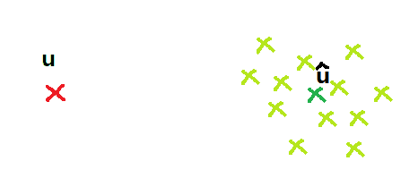

# 概率论与贝叶斯先验

* [返回顶层目录](../../README.md#目录)
* [返回上层目录](statistics-and-information-theory.md)

* [概率论基础](#概率论基础)
  * [概率与直观](#概率与直观)
    * [本福特定律](#本福特定律)
    * [条件概率](#条件概率)
    * [全概率公式](#全概率公式)
    * [贝叶斯(Bayes)公式](#贝叶斯(Bayes)公式)
  * [常见概率分布](#常见概率分布)
  * [Sigmod/Logistic函数的引入](#Sigmod/Logistic函数的引入)
* [统计量](#统计量)
  * [期望/方差/协方差/相关系数](#期望/方差/协方差/相关系数)
  * [独立和不相关](#独立和不相关)
* [大数定律](#大数定律)
* [中心极限定理](#中心极限定理)
* [最大似然估计](#最大似然估计)
  * [过拟合](#过拟合)

# 概率论基础

## 概率与直观

### 本福特定律

本福特定律（本福特法则），又称第一数字定律，是指在实际生活得出的一组数据中，以1为首位数字出现的概率约为总数的三成；是直观想象1/9的三倍。

| 数字   |   1   |   2   |   3    |  4   |  5   |  6   |  7   |  8   |  9   |
| ---- | :---: | :---: | :----: | :--: | :--: | :--: | :--: | :--: | :--: |
| 出现概率 | 30.1% | 17.6% | 12.51% | 9.7% | 7.9% | 6.7% | 5.8% | 5.1% | 4.6% |

广泛存在于生活中，比如：

* 阶乘、素数数列、斐波那契数列首位
* 住宅地址号码
* 经济数据反欺诈
* 选举投票反欺诈

### 条件概率

$$
P(A|B)=\frac{P(AB)}{P(B)}
$$

### 全概率公式

$$
P(A)=\sum_{i}P(A|B_i)P(B_{i})
$$

### 贝叶斯(Bayes)公式

$$
P(B_i|A)=\frac{P(B_iA)}{P(A)}=\frac{P(AB_i)}{P(A)}=\frac{P(A|B_i)P(B_i)}{\sum_jP(A|B_j)P(B_i)}
$$

贝叶斯公式一定要熟练的掌握运用。

**思考题**

8支步枪中有5支已校准过，3支未校准。一名射手用校准过的枪射击，中吧概率为0.8；用未校准过的枪射击，中靶概率为0.3；现从8支枪中随机取一支射击，结果中靶了。求该枪是已校准过的概率。

凡是从结果中算原因，基本就是使用贝叶斯公式。

解：
$$
\begin{aligned}
&P(G=1)=\frac{5}{8}\ \ \ \ \ \ P(G=0)=\frac{3}{8}\\
&P(A=1|G=1)=0.8\ \ \ \ \ \ P(A=0|G=1)=0.2\\
&P(A=1|G=0)=0.3\ \ \ \ \ \ P(A=0|G=0)=0.7\\
&P(G=1|A=1)=?\\
&P(G=1|A=1)=\frac{P(A=1|G=1)}{\sum_{i\in G}P(A=1|G=i)P(G=i)}=\frac{0.8\times \frac{5}{8}}{0.8\times\frac{5}{8}+0.3\times\frac{3}{8}}=0.8163
\end{aligned}
$$
我们后面会聊到贝叶斯网络，里面会讲到朴素贝叶斯，贝叶斯概率和朴素贝叶斯的关系就像是雷锋和雷峰塔的区别，就是JavaScript和Java的区别。朴素贝叶斯是假定条件独立，假定特征均衡，进行分类的非常重要的分类器，曾经也被誉为十大数据挖掘算法之一。而贝叶斯呢？得看上下文，贝叶斯公式是贝叶斯；说模型是用贝叶斯的方法做，那意思就是想加入先验，想把它的参数当作是随机变量。

****

给定某系统的若干样本x，计算该系统的参数，即
$$
P(\theta|x)=\frac{P(x|\theta)P(\theta)}{P(xc)}
$$

* $P(\theta)$：没有数据支持下，$\theta$发生的概率，即在获取经验之前的概率：先验概率。
* $P(\theta|x)$：在数据x的支持下，$\theta$发生的概率：后验概率。
* $P(x|\theta)$：给定某参数$\theta$的概率分布：似然函数。想算算在某个参数给定的时候，换句话，系统给定了的时候，那么说，这个样本x的发生概率，即$x_1,x_2,x_3...,x_n$发生的联合概率，那么说，像$x_1,x_2,x_3...,x_n$这样发生的概率，那就是似然概率，**不是很理解**
* $P(xf)$：没有任何参数影响下样本x的发生概率。不同的参数$\theta$，对于$P(x)$没有任何影响。

假设$x=(x_1,x_2,x_3,...x_m)$一共m个样本，给定了m个样本x，看哪个参数$\theta$取最大，这不就是这个意思嘛。我们想算算哪个参数可能概率取最大，哪个就最有可能的参数嘛。因为$P(x)$和任何参数的取值都无关，所以，我们想取$P(\theta|x)$最大，就是$P(x|\theta)P(\theta)$取最大，跟底下分母的$P(x)$无关，可以把分母$P(x)$扔掉，即
$$
P(\theta|x)\propto P(x|\theta)P(\theta)
$$

例如：

* 在没有任何信息的前提下，猜测某人姓氏：先猜李王张刘......猜对的概率相对较大：先验概率。
* 若知道某人来自"牛家村"，则他姓牛的概率很大：后验概率——但不排除他姓郭、杨等情况。

## 常见概率分布

常见分布可以完美统一为一类分布。

### 两点分布(伯努利分布)

0-1分布，Bernoulli distribution

已知随机变量X的分布律为

|  X   |  1   |  0   |
| :--: | :--: | :--: |
|  p   |  p   | 1-p  |

则有
$$
\begin{aligned}
E(X)&=1\cdot p+0\cdot q=p\\
D(X)&=E(X^2)-[E(X)]^2\\
&=1^2\cdot p+0^2\cdot (1-p)-p^2=pq
\end{aligned}
$$

### 二项分布

Binomial Distribution

两点分布做n次试验，那么就变成了二项分布

设随机变量X服从参数为$n,p$的两点分布,如何求期望和方差？

（**法一**）设$X_i$为第$i$次试验中事件A的发生次数，$i=1,2,...,n$，则
$$
X=\sum_{i=1}^{n}X_i
$$
显然，$X_i$相互独立均服从参数为p的0-1分布，

所以
$$
\begin{aligned}
E(X)=E(\sum_{i=1}^n X_i)=\sum_{i=1}^n E(X_i)=np\\
D(X)=D(\sum_{i=1}^n X_i)=\sum_{i=1}^n D(X_i)=np(1-p)
\end{aligned}
$$
（**法二**）X的分布律为
$$
P(X=k)=\binom{n}{k}p^k(1-p)^{n-k},(k=0,1,2,...,n),
$$
则有
$$
\begin{aligned}
E(X)&=\sum_{k=0}^{n}k\cdot P(X=k)\\
&=\sum_{k=0}^{n}k\binom{n}{k}p^k(1-p)^{n-k}\\
&=\sum_{k=0}^{n}\frac{kn!}{k!(n-k)!}p^k(1-p)^{n-k}\\
&=\sum_{k=0}^{n}\frac{n!}{(k-1)!(n-k)!}p^k(1-p)^{n-k}\\
\end{aligned}
$$

### 正态分布

[正态分布的前世今生(四)](http://www.52nlp.cn/%E6%AD%A3%E6%80%81%E5%88%86%E5%B8%83%E7%9A%84%E5%89%8D%E4%B8%96%E4%BB%8A%E7%94%9F%E5%9B%9B)

## Sigmod/Logistic函数的引入

# 统计量

## 期望/方差/协方差/相关系数

## 样本方差的有偏与无偏估计

[为什么样本方差（sample variance）的分母是 n-1？](https://www.zhihu.com/question/20099757/answer/26586088)(魏天闻的回答)

[为什么样本方差（sample variance）的分母是 n-1？](https://www.zhihu.com/question/20099757/answer/312670291)(马同学的回答)

为什么$\frac{1}{n}\sum_{i=1}^n(x^{(i)}-\hat{\mu)}$要小于$\frac{1}{n}\sum_{i=1}^n(x^{(i)}-\mu)$？

因为显然$\hat{\mu}\neq\mu$啊。

如果对MSE进行分解，它可以写成bias的平方＋估计量的方差，所以它同时衡量了精度（accuracy）和准度（precision）。

## 独立和不相关

# 大数定律

# 中心极限定理

# 最大似然估计

## 过拟合

# 参考资料

* [小象学院-邹博老师-机器学习-第二课](http://www.chinahadoop.cn/course/1068/learn#lesson/20294)

本节主要照抄自本课程。
