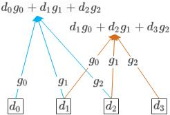
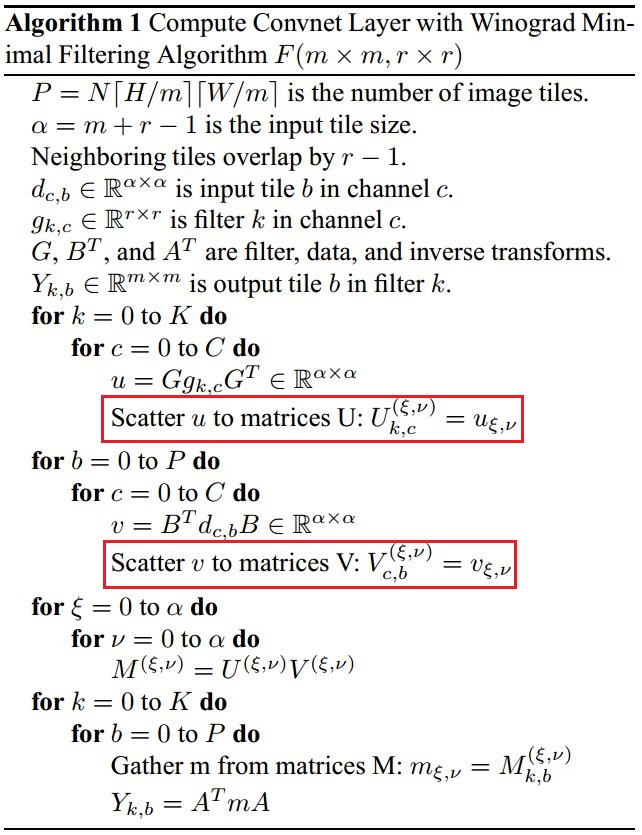
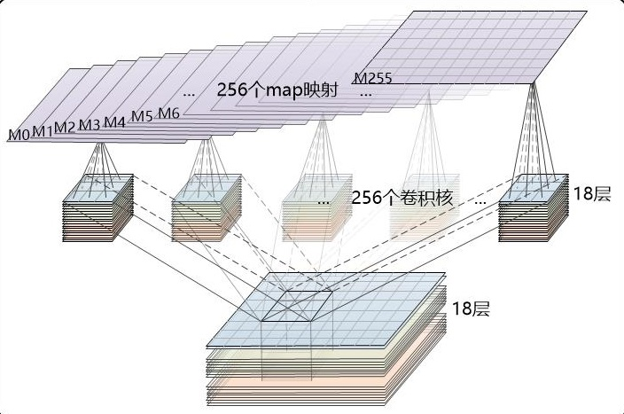

# Fast Algorithms for Convolutional Neural Networks

* [返回上层目录](../matrix-acceleration-algorithm.md)
* [问题定义](#问题定义)
* [一维Winograd卷积](#一维Winograd卷积)
* [二维Winograd卷积](#二维Winograd卷积)
* [三维Winograd卷积](#三维Winograd卷积)
* [winograd优化小结](#winograd优化小结)

pdf: [Fast Algorithms for Convolutional Neural Networks](https://arxiv.org/pdf/1509.09308.pdf)

虽然现在深度卷积神经网络在计算机视觉领域表现的非常优秀，但它在大型数据集上训练时需要花费大量GPU计算时间，并且前向推理需要大量的计算力。我们希望深度卷积网络可以在嵌入式平台部署，并且希望在保证精度的情况下加快它的推理速度。常规的基于FFT的卷积对于大型滤波器是快速的，但是现有技术的卷积神经网络一般使用小的3×3滤波器。论文引入了基于Winograd的最小滤波算法，一种新的卷积神经网络快速算法。算法在小卷积上计算复杂度最小，这使得它在滤波器和batch小的情况下更快。

winograd算法最早是1980年由Shmuel Winograd提出的《Fast Algorithms for Convolutional Neural Networks》，当时并没有引起太大的轰动。在CVPR 2016会议上，Lavin等人提出了利用winograd加速卷积运算，于是winograd加速卷积优化在算法圈里火了一把。

winograd为什么能加速卷积运算呢，简单来说就是用更多的加法计算来减少乘法计算，从而降低计算量，且不像FFT那样会引入复数，但前提是，处理器中的乘法计算的时钟周期要大于加法计算的时钟周期。好了，下面开始。

# 问题定义

将一维卷积运算定义为$F(m,r)$，$m$为Output Size，$r$为Filter Size，则输入信号的长度为$m+r−1$，卷积运算是对应位置相乘然后求和，**输入信号每个位置至少要参与1次乘法**，所以乘法数量最少与输入信号长度相同，记为
$$
\mu(F(m,r))=m+r-1
$$
在行列上分别进行一维卷积运算，可得到二维卷积，记为$F(m\times n,r\times s)$，输出为$m\times n$，卷积核为$r\times s$，则输入信号为$(m+r−1)(n+s−1)$，乘法数量至少为
$$
\begin{aligned}
&\mu(F(m\times n,r\times s))\\
=&\mu(F(m,r)\mu(F(n,s)))\\
=&(m+r-1)(n+s-1)
\end{aligned}
$$
若是直接按滑动窗口方式计算卷积，一维时需要$m\times r$次乘法，二维时需要$m\times n\times r\times s$次乘法，**远大于上面计算的最少乘法次数**，即
$$
\begin{aligned}
m\times r &\gg m+r-1\\
m\times n\times r\times s &\gg (m+r-1)(n+s-1)
\end{aligned}
$$
使用Winograd算法计算卷积快在哪里？一言以蔽之：**快在减少了乘法的数量**，将乘法数量减少至$m+r−1$或$(m+r−1)(n+s−1)$。

怎么减少的？请看下面的例子。

**一个例子$F(2, 3)$**

先以1维卷积为例，输入信号为$d=[d_0,d_1,d_2,d_3]^T$，卷积核为$g=[g_0,g_1,g_2]T$，则卷积可写成如下矩阵乘法形式：
$$
F(2,3)=
\begin{bmatrix}
d_0&d_1&d_2\\
d_1&d_2&d_3\\
\end{bmatrix}
\begin{bmatrix}
g_0\\
g_1\\
g_2\\
\end{bmatrix}
=
\begin{bmatrix}
r_0\\
r_1\\
\end{bmatrix}
$$
如果是一般的矩阵乘法，则需要**6次乘法和4次加法**，如下：
$$
\begin{aligned}
r_0&=(d_0\cdot g_0)+(d_1\cdot g_1)+(d_2\cdot g_2)\\
r_1&=(d_1\cdot g_0)+(d_2\cdot g_1)+(d_3\cdot g_2)
\end{aligned}
$$
但是，卷积运算中输入信号转换成的矩阵不是任意矩阵，其中**有规律地分布着大量的重复元素**，比如第1行和第2行的$d_1$和$d_2$，卷积转换成的矩阵乘法比一般矩阵乘法的问题域更小，这就让优化存在了可能。

Winograd是怎么做的呢？
$$
F(2,3)=
\begin{bmatrix}
d_0&d_1&d_2\\
d_1&d_2&d_3\\
\end{bmatrix}
\begin{bmatrix}
g_0\\
g_1\\
g_2\\
\end{bmatrix}
=
\begin{bmatrix}
m_1+m_2+m_3\\
m_2-m_3-m_4\\
\end{bmatrix}
$$
其中，
$$
\begin{aligned}
m_1&=(d_0-d_2)g_0\\
m_2&=(d_1+d_2)\frac{g_0+g_1+g_2}{2}\\
m_3&=(-d_1+d_2)\frac{g_0-g_1+g_2}{2}\\
m_4&=(d_1-d_3)g_2\\
\end{aligned}
$$
乍看上去，为了计算$\begin{bmatrix}r_0=m_1+m_2+m_3\\r_1=m_2-m_3-m_4\end{bmatrix}$，需要的运算次数分别为：

- 输入信号$d$上：4次加法（减法）
- [**不算**]卷积核$g$上：3次加法（$g_1+g_2$中间结果可保留），2次乘法（除法）
- 输出$m$上：4次乘法，4次加法

**在神经网络的推理阶段，卷积核上的元素是固定的**，因此**卷积核$g$上的运算可以提前算好**，**预测阶段只需计算一次**，可以忽略，所以一共所需的运算次数为$d$与$m$上的运算次数之和，**即4次乘法和8次加法**。

与直接运算的6次乘法和4次加法相比，**乘法次数减少，加法次数增加**。在计算机中，乘法一般比加法慢，通过减少减法次数，增加少量加法，可以实现加速。

# 一维Winograd卷积

设卷积操作$F(2,3)$的含义为：输出维度为2，卷积核维度为3，则可推出输入维度为4，如下图所示：

**输入**：$d=[d_0,d_1,d_2,d_3]^T$

**卷积核**：$g=[g_0,g_1,g_2]^T$

**输出**：$r=[r_0,r_1]^T$

则$r$可以表示为
$$
r=A^T\left[(Gg)\odot(B^Td)\right]
$$
其中，

**卷积核变换矩阵**$G$：
$$
G=
\begin{bmatrix}
1&0&0\\
\frac{1}{2}&\frac{1}{2}&\frac{1}{2}\\
\frac{1}{2}&-\frac{1}{2}&\frac{1}{2}\\
0&0&1\\
\end{bmatrix}_{4\times3}
$$
**输入变换矩阵**$B^T$：
$$
B^T=
\begin{bmatrix}
1&0&-1&0\\
0&1&1&0\\
0&-1&1&0\\
0&1&0&-1\\
\end{bmatrix}_{4\times4}
$$
**输出变换矩阵**$A^T$：
$$
A^T=
\begin{bmatrix}
1&1&1&0\\
0&1&-1&-1\\
\end{bmatrix}_{2\times4}
$$
下面来看对上式的展开和解释，严谨推导为[详解Winograd变换矩阵生成原理](https://zhuanlan.zhihu.com/p/102351953)，这里建议无需看这个严谨推导，因为比较复杂，不看也不影响后续理解。

上述卷积的矩阵形式为
$$
r=
\begin{bmatrix}
d_0&d_1&d_2\\
d_1&d_2&d_3\\
\end{bmatrix}
\begin{bmatrix}
g_0\\
g_1\\
g_2\\
\end{bmatrix}
=
\begin{bmatrix}
r_0\\
r_1\\
\end{bmatrix}
$$
**输入变换**$B^Td$：$B^T$是输入变化矩阵，输入信号为$d=[d_0,d_1,d_2,d_3]^T$。
$$
B^Td =
\begin{bmatrix}
1&0&-1&0\\
0&1&1&0\\
0&-1&1&0\\
0&1&0&-1\\
\end{bmatrix}
\begin{bmatrix}
d_0\\
d_1\\
d_2\\
d_3\\
\end{bmatrix}
=
\begin{bmatrix}
d_0-d_2\\
d_1+d_2\\
-d_1+d_2\\
d_1-d_3\\
\end{bmatrix}
$$
**卷积核变换**$Gg$：$G$是卷积核变换矩阵，卷积核为$g=[g_0,g_1,g_2]^T$，在神经网络的推理阶段，卷积核上的元素是固定的，因此$G^Tg$上的运算**可以提前算好，预测阶段只需计算一次**。
$$
Gg =
\begin{bmatrix}
1&0&0\\
\frac{1}{2}&\frac{1}{2}&\frac{1}{2}\\
\frac{1}{2}&-\frac{1}{2}&\frac{1}{2}\\
0&0&1\\
\end{bmatrix}
\begin{bmatrix}
g_0\\
g_1\\
g_2\\
\end{bmatrix}
=
\begin{bmatrix}
g_0\\
\frac{g_0+g_1+g_2}{2}\\
\frac{g_0-g_1+g_2}{2}\\
g_2\\
\end{bmatrix}
$$
**Hadamar积**$(Gg)\odot(B^Td)$：输入变换结果和卷积核变换结果逐元素相乘。
$$
\begin{aligned}
(Gg)\odot(B^Td) &=
\begin{bmatrix}
d_0-d_2\\
d_1+d_2\\
-d_1+d_2\\
d_1-d_3\\
\end{bmatrix}
\odot
\begin{bmatrix}
g_0\\
\frac{g_0+g_1+g_2}{2}\\
\frac{g_0-g_1+g_2}{2}\\
g_2\\
\end{bmatrix}\\
&=
\begin{bmatrix}
(d_0-d_2)g_0\\
(d_1+d_2)\frac{g_0+g_1+g_2}{2}\\
(-d_1+d_2)\frac{g_0-g_1+g_2}{2}\\
(d_1-d_3)g_2\\
\end{bmatrix}
\end{aligned}
$$
**输出变换**$r=A^T\left[(Gg)\odot(B^Td)\right]$：$A^T$是输出变换矩阵。
$$
\begin{aligned}
r&=A^T\left[(Gg)\odot(B^Td)\right]\\
&=
\begin{bmatrix}
1&1&1&0\\
0&1&-1&-1\\
\end{bmatrix}
\begin{bmatrix}
(d_0-d_2)g_0\\
(d_1+d_2)\frac{g_0+g_1+g_2}{2}\\
(-d_1+d_2)\frac{g_0-g_1+g_2}{2}\\
(d_1-d_3)g_2\\
\end{bmatrix}\\
&=
\begin{bmatrix}
d_0g_0+d_1g_1+d_2g_2\\
d_1g_0+d_2g_1+d_3g_2\\
\end{bmatrix}
\end{aligned}
$$

# 二维Winograd卷积

先直接给结论，便于复习回顾：

对于二维Winograd卷积，则有：
$$
[\vec{r_0}, \vec{r_1}]=A^T[(GKG^T)\odot(B^TDB)]A
$$
其中，$K$是卷积核，$D$是输入。

例如，

$F(2\times2,3\times3)$，即输入尺寸为$4\times4$,卷积核尺寸为$3\times3$,输出尺寸为$2\times2$，

$F(4\times4,3\times3)$，即输入尺寸为$6\times6$,卷积核尺寸为$3\times3$,输出尺寸为$4\times4$。

2D Winograd可以由1D Winograd外推得到，因此为解决2D Winograd问题，首先要**重温1D 卷积解决的问题**。在此复述一遍： 

假设一个卷积核尺寸为3的一维卷积，假设每次我们输出2个卷积点，则我们形式化此问题：$F(2, 3)$。

因为输出为2，卷积核大小为3，对应的输入点数应该为4，则此问题表述为：

输入：
$$
D=
\begin{bmatrix}
d_{00}&d_{01}&d_{02}&d_{03}\\
d_{10}&d_{11}&d_{12}&d_{13}\\
d_{20}&d_{21}&d_{22}&d_{23}\\
d_{30}&d_{31}&d_{32}&d_{33}\\
\end{bmatrix}
$$
卷积核：
$$
K=
\begin{bmatrix}
k_{00}&k_{01}&k_{02}\\
k_{10}&k_{11}&k_{12}\\
k_{20}&k_{21}&k_{22}
\end{bmatrix}
$$
因此，此卷积的矩阵乘形式应为：
$$
\begin{bmatrix}
d_{00}&d_{01}&d_{02}&d_{10}&d_{11}&d_{12}&d_{20}&d_{21}&d_{22}\\
d_{01}&d_{02}&d_{03}&d_{11}&d_{12}&d_{13}&d_{21}&d_{22}&d_{23}\\
d_{10}&d_{11}&d_{12}&d_{20}&d_{21}&d_{22}&d_{30}&d_{31}&d_{32}\\
d_{11}&d_{12}&d_{13}&d_{21}&d_{22}&d_{23}&d_{31}&d_{32}&d_{33}
\end{bmatrix}
\begin{bmatrix}
k_{00}\\k_{01}\\k_{02}\\k_{10}\\k_{11}\\k_{12}\\k_{20}\\k_{21}\\k_{22}
\end{bmatrix}
=
\begin{bmatrix}
r_{00}\\r_{01}\\r_{10}\\r_{11}
\end{bmatrix}
$$
从这个式子里，我们可以看到1D卷积的影子，这个影子在我们对矩阵作了分块后会更加明显：
$$
\left[\begin{array}{ccc|ccc|ccc}
d_{00}&d_{01}&d_{02}&d_{10}&d_{11}&d_{12}&d_{20}&d_{21}&d_{22}\\
d_{01}&d_{02}&d_{03}&d_{11}&d_{12}&d_{13}&d_{21}&d_{22}&d_{23}\\ \hline
d_{10}&d_{11}&d_{12}&d_{20}&d_{21}&d_{22}&d_{30}&d_{31}&d_{32}\\
d_{11}&d_{12}&d_{13}&d_{21}&d_{22}&d_{23}&d_{31}&d_{32}&d_{33}
\end{array}\right]
\begin{bmatrix}
k_{00}\\k_{01}\\k_{02}\\\hline
k_{10}\\k_{11}\\k_{12}\\\hline
k_{20}\\k_{21}\\k_{22}
\end{bmatrix}
=
\begin{bmatrix}
r_{00}\\r_{01}\\\hline
r_{10}\\r_{11}
\end{bmatrix}
$$
再明显一点，我们写成分块矩阵乘的形式：
$$
\begin{bmatrix}
D_{0}&D_{1}&D_{2}\\
D_{1}&D_{2}&D_{3}
\end{bmatrix}
\begin{bmatrix}
\vec{k_{0}}\\\vec{k_{1}}\\\vec{k_{2}}
\end{bmatrix}
=
\begin{bmatrix}
\vec{r_{0}}\\\vec{r_{1}}
\end{bmatrix}
$$
至此，我们对2D卷积推导出了跟1D形式一致的公式，只不过1D中的标量在2D中变成了小矩阵或者向量。

**实操粉**

对实操粉而言，到这个形式为止，已经可以写代码了。 

由1D Winograd可知，我们可以将该式改写为Winograd形式，如下： 
$$
\begin{bmatrix}
D_{0}&D_{1}&D_{2}\\
D_{1}&D_{2}&D_{3}
\end{bmatrix}
\begin{bmatrix}
\vec{k_{0}}\\\vec{k_{1}}\\\vec{k_{2}}
\end{bmatrix}
=
\begin{bmatrix}
\vec{r_{0}}\\\vec{r_{1}}
\end{bmatrix}
=
\begin{bmatrix}
M_{0}+M_{1}+M_{2}\\
M_{1}-M_{2}-M_{3}
\end{bmatrix}
$$
其中：
$$
\begin{aligned}
&M_0=(D_0-D_2)\vec{k_0}\\
&M_1=(D_1+D_2)\frac{\vec{k_0}+\vec{k_1}+\vec{k_2}}{2}\\
&M_2=(-D_1+D_2)\frac{\vec{k_0}-\vec{k_1}+\vec{k_2}}{2}\\
&M_3=(D_1-D_3)\vec{k_2}\\
\end{aligned}
$$
注意，这四个M的计算又可以用一维的F(2, 3) Winograd来做，因此2D Winograd是个**嵌套(nested)**的算法。

**理论粉**

对一个有追求的理论粉来说，只是得到可以写程序的递归表达肯定是不完美的，他们还是希望有一个最终的解析表达的。其实也很简单，我们把上面的式子规整规整，使得输出成为一个标准的2x2矩阵，有： 
$$
\begin{bmatrix}
\vec{r_0},\vec{r_1}
\end{bmatrix}
=
\begin{bmatrix}
M_0,M_1,M_2,M_3
\end{bmatrix}
\begin{bmatrix}
1&0\\
1&1\\
1&-1\\
0&-1
\end{bmatrix}
$$
依1D Winograd公式$[\vec{r_0}, \vec{r_1}]=A^T[(GKG^T)\odot(B^TDB)]A$, 并结合各M的公式，有下式。
$$
\begin{aligned}
\begin{bmatrix}
\vec{r_0},\vec{r_1}
\end{bmatrix}
&=\begin{bmatrix}
M_0,M_1,M_2,M_3
\end{bmatrix}
A\\
&=\begin{bmatrix}
M_0\\M_1\\M_2\\M_3
\end{bmatrix}^TA\\
&=\begin{bmatrix}
A^T\left[(G\vec{k_0})\odot(B^T(\vec{d_0}-\vec{d_2}))\right]\\
A^T\left[(G\frac{\vec{k_0}+\vec{k_1}+\vec{k_2}}{2})\odot(B^T(\vec{d_1}+\vec{d_2}))\right]\\
A^T\left[(G\frac{\vec{k_0}-\vec{k_1}+\vec{k_2}}{2})\odot(B^T(-\vec{d_1}+\vec{d_2}))\right]\\
A^T\left[(G\vec{k_2})\odot(B^T(\vec{d_1}-\vec{d_3}))\right]\\
\end{bmatrix}^TA\\
&=A^T\begin{bmatrix}
(G\vec{k_0})\odot(B^T(\vec{d_0}-\vec{d_2}))\\
(G\frac{\vec{k_0}+\vec{k_1}+\vec{k_2}}{2})\odot(B^T(\vec{d_1}+\vec{d_2}))\\
(G\frac{\vec{k_0}-\vec{k_1}+\vec{k_2}}{2})\odot(B^T(-\vec{d_1}+\vec{d_2}))\\
(G\vec{k_2})\odot(B^T(\vec{d_1}-\vec{d_3}))\\
\end{bmatrix}^TA
\end{aligned}
$$
注意到像$(G\vec{k_0})$这些都是2维列向量，hadamard product和concat可以交换而不影响结果，因此：
$$
\begin{aligned}
\begin{bmatrix}
\vec{r_0},\vec{r_1}
\end{bmatrix}
&=A^T\begin{bmatrix}
(G\vec{k_0})\odot(B^T(\vec{d_0}-\vec{d_2}))\\
(G\frac{\vec{k_0}+\vec{k_1}+\vec{k_2}}{2})\odot(B^T(\vec{d_1}+\vec{d_2}))\\
(G\frac{\vec{k_0}-\vec{k_1}+\vec{k_2}}{2})\odot(B^T(-\vec{d_1}+\vec{d_2}))\\
(G\vec{k_2})\odot(B^T(\vec{d_1}-\vec{d_3}))\\
\end{bmatrix}^TA\\
&=A^T\begin{bmatrix}
\left(G[\vec{k_0},\frac{\vec{k_0}+\vec{k_1}+\vec{k_2}}{2},\frac{\vec{k_0}-\vec{k_1}+\vec{k_2}}{2},\vec{k_2}]\right)
\odot
\left(B^T[\vec{d_0}-\vec{d_2},\vec{d_1}+\vec{d_2},-\vec{d_1}+\vec{d_2},\vec{d_1}-\vec{d_3}]\right)
\end{bmatrix}A\\
&=A^T\begin{bmatrix}
\left(G[\vec{k_0},\vec{k_1},\vec{k_2}]
\begin{bmatrix}
1&\frac{1}{2}&\frac{1}{2}&0\\
0&\frac{1}{2}&-\frac{1}{2}&0\\
0&\frac{1}{2}&\frac{1}{2}&1
\end{bmatrix}\right)
\odot
\left(B^T[\vec{d_0},\vec{d_1},\vec{d_2},\vec{d_3}]
\begin{bmatrix}
1&0&0&0\\
0&1&-1&1\\
-1&1&1&0\\
0&0&0&-1
\end{bmatrix}\right)
\end{bmatrix}A\\
&=A^T\left[\left(G[\vec{k_0},\vec{k_1},\vec{k_2}]G^T\right)\odot\left(B^T[\vec{d_0},\vec{d_1},\vec{d_2},\vec{d_3}]B\right)\right]A\\
&=A^T\left[\left(GKG^T\right)\odot\left(B^TDB\right)\right]A
\end{aligned}
$$
至此证得。

# 三维Winograd卷积

卷积神经网络中的卷积基本都是三维卷积，则三维Winograd卷积该怎么进行呢？

要将Winograd应用在卷积神经网络中，还需要回答下面两个问题：

- 上面我们仅仅是针对一个小的image tile，但是在卷积神经网络中，feature map的尺寸可能很大，难道我们要实现$F(224,3)$吗？
- 在卷积神经网络中，feature map是3维的，卷积核也是3维的，3D的winograd该怎么做？

第一个问题，在实践中，会将input feature map切分成一个个等大小有重叠的tile，在每个tile上面进行winograd卷积。

第二个问题，3维卷积，相当于逐层做2维卷积，然后将每层对应位置的结果相加，下面我们会看到多个卷积核时更巧妙的做法。

整体仍可分为4步，

- Input transform
- Filter transform（这一步其实在只需要在最开始算一次就可以了，因为卷积核的值不变嘛）
- Batched-GEMM（批量矩阵乘法）
- Output transform

注：对于上图红圈中的scatter步骤，就是为什么可以转成矩阵乘法呢，$\xi$和$\nu$又是什么意思，其实你第一次看的话必然搞不明白，没事，下面会详细讲解，保证你看明白。

算法流程可视化如下，图片出自论文《[Sparse Winograd Convolutional neural networks on small-scale systolic arrays](https://www.researchgate.net/publication/328091476_Sparse_Winograd_Convolutional_neural_networks_on_small-scale_systolic_arrays)》：

注意：图中的Matrix Multiplication，对应3维卷积中逐channel卷积后的对应位置求和，相当于(m+r−1)2个矩阵乘积，参与乘积的矩阵尺寸分别为⌈H/m⌉⌈W/m⌉×C和C×K，把Channel那一维消掉。

现在，对照以上两图，我们来详细讲解scatter的细节。

以alphagozero神经网络卷积为例，alphagozero的神经网络输入为18层19x19的图像，卷积核有256个通道，每个通道为18层3x3的卷积核。即$H=W=19$，$C=18$，$K=256$，$r=3$。

​

使用$F(4\times4, 3\times3)$的Winograd卷积算法（如下图左侧所示），则$m=4$，即输出块尺寸为$m\times m=4\times4$，则该卷积算法的块输入大小为$6\times6$，即$m+r-1=6$。就是说，输入大小为$(m+r-1)\times(m+r-1)$=$6\times6$，卷积核大小为$r\times r=3\times3$，输出大小为$m\times m=4\times 4$。

.png)

为了凑出输出尺寸为$19\times19$，则需要$5\times5$个$4\times4$的输出块，如上图所示，每个$4\times4$的输出块的输入尺寸为$6\times6$，则这$6\times6$个输入块之间需要有重叠，如上图右侧所示。

也就是说，为了能将$F(4\times4, 3\times3)$的Winograd卷积算法用于这里的$19\times19$的大尺寸输入卷积，需要用$5\times5$个$F(4\times4, 3\times3)$卷积，并且其相邻的输入块之间有重叠。

我们前面已经知道，对于二维Winograd卷积，有：
$$
[\vec{r_0}, \vec{r_1}]=A^T[(GKG^T)\odot(B^TDB)]A
$$
其中，$K$是卷积核，$D$是输入。

对于$F(4\times4,3\times3)$，其输入$D$大小为$6\times6$，卷积核$K$大小为$3\times3$,输出大小为$4\times4$。

先进行输入变换，即$B_{[6\times6]}^TD_{[6\times6]}B_{[6\times6]}$：

-input-trans.png)

注意上图，$5\times5$个输入块（尺寸$6\times6$）之间是有重叠的（相邻的绿色块之间有重叠），这是为了$5\times5$个输出块（尺寸$4\times4$）刚好能拼接成$20\times20$的大小。

下面详细展示了$(GKG^T)\odot(B^TDB)$的计算过程，如下图所示：

输入变换和卷积核变换的绿色块均表示变换的结果。下图详述了前面的3D总体流程图中提到的scatter过程，其实就是对于$6\times6$的各个位置，依次进行$(GKG^T)\odot(B^TDB)$，并且可以把$(GKG^T)\odot(B^TDB)$操作变为$(GKG^T)\cdot(B^TDB)$矩阵乘法操作，是不是很神奇啊，仔细看下图就懂了。

-single-trans.png)

之前看不懂的红框里的内容，现在应该看懂了吧？$\xi\times\nu$就是输入块的尺寸$6\times6$。上图中的矩阵乘，其实就是原论文中的公式(12)和(13)，即：
$$
M_{k,b}^{(\xi,\nu)}=\sum_{c=1}^CU_{k,c}^{(\xi,\nu)}V_{c,b}^{(\xi,\nu)}\\
M^{(\xi,\nu)}=U^{(\xi,\nu)}V^{(\xi,\nu)}
$$
公式里的$b$就是那个$5\times5$。

上图为什么要费尽心机对于$6\times6$的各个位置把按位相乘变为矩阵乘法呢？因为这样可以利用GPU进行加速啊。

经过了上述操作，我们再在$(GKG^T)\odot(B^TDB)$的两端乘以$A$，即$A^T[(GKG^T)\odot(B^TDB)]A$，就是我们想要的结果了。

# winograd优化小结

1、在winograd卷积加速算法中，对于一维卷积，当输出为$m$，卷积核长为$r$，对应的乘法计算次数为$m+r-1$次；将一维卷积扩展到二维，如果输出维度是$m\times n$，卷积核维度为$r\times s$，则需要的乘法次数是$(m+r-1)\times(n+s-1)$。对一个矩阵大小为$4\times4$的输入，卷积核大小为$3\times3$，对应的输出为$2\times2$，正常计算的情况下，使用im2col加速方法的乘法次数为$2\times2\times3\times3=36$次，而当使用winograd时，对应的乘法次数为$(2+3−1)\times(2+3−1)=16$，可以看到乘法次数明显减少，从而加速效果会更加明显。

2、winograd算法通过减少乘法次数来实现提速，但是加法的数量会相应增加，同时需要额外的转换计算以及存储转换矩阵，随着卷积核（kernel）和分块（tile，对于大尺寸feature map，会将feature map切分成一个个等大小有重叠的tile，在每个tile上面进行winograd卷积）的尺寸增大，就需要考虑加法、转换计算和存储的代价，而且tile越大，转换矩阵越大，计算精度的损失会进一步增加，所以一般winograd只适用于较小的卷积核和tile（对大尺寸的卷积核，可使用FFT进行加速）。在目前流行的网络中，小尺寸卷积核是主流，典型实现如$F(6\times6,3\times3)$、$F(4\times4,3\times3)$、$F(2\times2,3\times3)$等，可参见[NCNN](https://github.com/Tencent/ncnn/tree/master/src/layer/arm)、[FeatherCNN](https://github.com/Tencent/FeatherCNN/blob/booster/src/booster/arm/winograd_kernels_F63.cpp)、[ARM-ComputeLibrary](https://github.com/ARM-software/ComputeLibrary/tree/master/src/core/NEON/kernels/convolution/winograd/transforms)等源码实现。

3、就卷积而言，Winograd算法和FFT类似，都是先通过线性变换将input和filter映射到新的空间，在那个空间里简单运算后，再映射回原空间。

# 参考资料

* [卷积神经网络中的Winograd快速卷积算法](https://blog.csdn.net/weixin_30781107/article/details/97511432)

以此知识来入门，但中间的二维推理是错的

* [【模型推理】一文看懂 winograd 卷积加速算法](https://blog.csdn.net/weixin_42405819/article/details/120224277)

讲了算法的复杂度，还讲了算法的不严谨推导

* [详解Winograd变换矩阵生成原理](https://zhuanlan.zhihu.com/p/102351953)

这是1维严谨推公式，大意是提取公因式。

* [Winograd Convolution 推导 - 从1D到2D](https://www.cnblogs.com/Matrix_Yao/p/11640310.html)

这个的二维公式推导写的很正确。

* [卷积计算优化方法：Winograd](https://murphypei.github.io/blog/2019/06/winograd)

但是 Winograd 应用也有一些局限：

1、在目前使用越来越多的 depthwise conv 中其优势不明显了。

2、在 tile 较大的时候，Winograd 方法不适用，因为，在做 inverse transform 的时候的计算开销抵消了 Winograd 带来的计算节省。

3、**Winograd 会产生误差**，这个一定要注意，要做好相应的精度损失测试。

* [andravin/**wincnn**](https://github.com/andravin)

A simple python module for computing minimal Winograd convolution algorithms for use with convolutional neural networks as proposed in [Fast Algorithms for Convolutional Neural Networks].

===

* [基于ARM平台的CNN加速算法Winograd的量化原理及实现过程](https://zhuanlan.zhihu.com/p/67718316)

本文尽量从工程角度来介绍Int8 Winograd F(2x2,3x3)的实现细节。

* [ncnn 快速入门编译使用](https://blog.csdn.net/pc153262603/article/details/84984681)
* [Tencent/ncnn](https://github.com/Tencent/ncnn)
* [图解ncnn实现Winograd卷积](https://blog.csdn.net/hsqyc/article/details/116205504)

参考腾讯开源的NNCN对winograd的实现，NCNN。

ncnn前向框架简介。以下介绍来自官网介绍：ncnn是一个为手机端极致优化的高性能神经网络前向计算框架。ncnn从设计之初深刻考虑手机端的部署和使用。无第三方依赖，跨平台，手机端cpu的速度快于目前所有已知的开源框架。基于ncnn，开发者能够将深度学习算法轻松移植到手机端高效执行，开发出人工智能APP，将AI带到你的指尖。ncnn目前已在腾讯多款应用中使用，如QQ，Qzone，微信，天天P图等。

功能概述：支持卷积神经网络，支持多输入和多分支结构，可计算部分分支；无任何第三方库依赖，不依赖BLAS/NNPACK等计算框架；纯 C++ 实现，跨平台，支持android ios等；ARM NEON汇编级良心优化，计算速度极快；精细的内存管理和数据结构设计，内存占用极低；支持多核并行计算加速，ARM big.LITTLE cpu调度优化；整体库体积小于500K，并可轻松精简到小于300K；可扩展的模型设计，支持8bit量化和半精度浮点存储，可导入caffe模型；支持直接内存零拷贝引用加载网络模型；可注册自定义层实现并扩展。

* [cblas_sgemm和cublasSgemm参数详解](https://blog.csdn.net/yutianzuijin/article/details/90411622)

机器学习最核心的底层运算肯定是矩阵乘法无疑了，为了让矩阵乘法执行更快，大家也是绞尽脑汁。从算法层面，stranssen算法将矩阵乘法复杂度由$O(n^3)$降到$O(n^{2.81})$，最新的算法好像已经降到$O(n^{2.37})$左右了（Coppersmith–Winograd algorithm），但这只是理论复杂度，只有在矩阵超大的情况下才能体现出优势。从并行角度，我们可以从很多层面对矩阵乘法进行加速：1. 指令集并行，现在的CPU都会有很多并行指令可以一次完成多个乘法运算，Intel下有mmx指令集，arm下有neon指令集；2. 多核并行，除了指令集并行，我们还可以将矩阵分块，放在不同的核上进行数据层面的并行；3. GPU加速，利用GPU上的众核完成并行；4. 多机并行，针对超大矩阵或者众多矩阵乘法还可以采用多机并行。

在实际中，我们往往会采用指令集并行和GPU对矩阵乘法进行加速。用指令集优化矩阵乘法难度比较大，非专业人士不建议采用，而且幸运的是我们现在有很多开源矩阵运算库，性能大概率超过手写的矩阵乘法。**CPU下的矩阵运算库有openblas和mkl等，GPU下有cublas，它们都是对fortran blas接口的实现**。在上述加速库的基础上，我们可以再对矩阵进行分割实现多核或者多机的并行。

