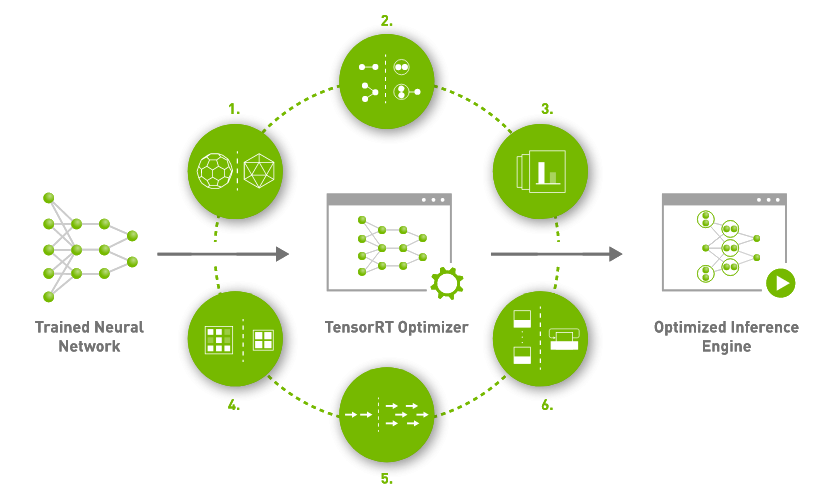
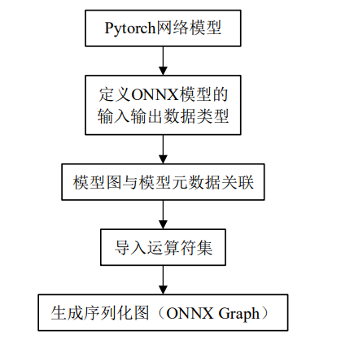

# TensorRT

* [返回上层目录](../model-deployment.md)
* [TensorRT简介](#TensorRT简介)
  * [TensorRT的输入](#TensorRT的输入)
  * [TensorRT的输出](#TensorRT的输出)
  * [TensorRT部署流程](#TensorRT部署流程)
* [模型导入](#模型导入)
  * [Tensorflow框架](#Tensorflow框架)
  * [Pytorch框架](#Pytorch框架)
  * [Caffe框架](#Caffe框架)

# TensorRT简介

TensorRT是NVIDIA公司发布的一个高性能的深度学习推理加速框架，

* 官网示例：[nvidia: speeding up deep learning inference using tensorrt updated](https://developer.nvidia.com/zh-cn/blog/speeding-up-deep-learning-inference-using-tensorrt-updated/)

* 官方文档：[nvidia: tensorrt](https://docs.nvidia.com/deeplearning/tensorrt/archives/index.html)

下面先看一下使用TensorRT的背景：

训练主要是获得层与层之间的权重参数，目的是为了获得一个性能优异的模型，关注点集中在模型的准确度、精度等指标。

推理（inference）则不一样，其没有了训练中的反向迭代过程，只是针对新的数据进行预测。相较于训练，推理的更关注的是部署简单、处理速度快、吞吐率高和资源消耗少。

作用：TensorRT优化深度学习模型结构，并提供高吞吐率和低延迟的推理部署。

应用：TensorRT可用于大规模数据中心、嵌入式平台或自动驾驶平台进行推理加速。

## TensorRT的输入

在输入方面，TensorRT支持所有常见的深度学习框架包括Caffe、Tensorflow、Pytorch、MXNet、Paddle Paddle等。

得到的网络模型需要导入到TensorRT，对于模型的导入方式，TensorRT支持的导入方式包括C++ API、Python API、NvCaffeParser和NvUffParser等

还可以借助中间转换工具ONNX，比如：先将模型由Pytorch保存的模型文件转换成ONNX模型，然后再将ONNX模型转换成TensorRT推理引擎。后面再结合具体案例，详细分析。

## TensorRT的输出

将模型导入TensorRT以生成引擎（engine）文件，将engine文件序列化保存，之后即可以方便快速地调用它来执行模型的加速推理。

输出方面，对于系统平台，TensorRT支持Linux x86、Linux aarch64、Android aarch64和QNX  aarch64。

## TensorRT部署流程

Tensor RT 的部署分为两个部分：（TensorRT部署流程如下图所示）

- 一是**优化训练好的模型**并**生成计算流图**；
- 二是**部署计算流图**。



# 模型导入

这里介绍Caffe框架、Tensorflow框架、Pytorch框架等，进行模型导入，重点分析一下Pytorch框架。

## Tensorflow框架

方法1：使用uff python接口将模型转成uff格式，之后使用NvUffParser导入。

方法2：使用Freeze graph来生成.Pb(protobuf)文件，之后使用convert-to-uff工具将.pb文件转化成uff格式，然后利用NvUffParser导入。

方法3：将Tensorflow训练好的模型（xx.pb）进行TensorRT推理加速，需要先将模型由Pytorch保存的模型文件转换成ONNX模型，然后再将ONNX模型转换成TensorRT推理引擎。处理流程如下图所示


### 方法2：ckpt->pb->uff->NvUffParser

下面详细介绍方法2：使用Freeze graph来生成.Pb(protobuf)文件，之后使用convert-to-uff工具将.pb文件转化成uff格式，然后利用NvUffParser导入。

**（1）模型持久化：ckpt转成pb文件**

这个请参考介绍tensorflow对应部分，此处就不重复讲了。

**（2）生成uff模型：用convert-to-uff工具将.pb文件转化成uff格式**

有了pb模型，需要将其转换为tensorRT可用的uff模型，只需要调用uff包自带的convert脚本即可。

先安装uff包：

```shell
pip install nvidia-pyindex
pip install uff
```

然后在下述路径中找到`convert_to_uff.py`：

```shell
C:\Users\your_name\Anaconda3\envs\tf1.14\Lib\site-packages\uff\bin\convert_to_uff.py
```

然后使用如下命令：

```shell
python C:\Users\your_name\Anaconda3\envs\tf1.14\Lib\site-packages\uff\bin\convert_to_uff.py pb_model.pb
```

注意，在使用上述命令前，确保conda到了正确的环境下，使用下面的命令来切换到正确的环境下：

```shell
conda activate tf1.14
```

然后可能会出错，让你安装某个包，就`pip install xxx`就行，然后运行前面的`convert_to_uff.py`命令，成功，显示入如下：

```shell
python C:\Users\your_name\Anaconda3\envs\tf1.14\Lib\site-packages\uff\bin\convert_to_uff.py .\pb_model.pb
Loading .\pb_model.pb

NOTE: UFF has been tested with TensorFlow 1.15.0.
WARNING: The version of TensorFlow installed on this system is not guaranteed to work with UFF.
UFF Version 0.6.9
=== Automatically deduced input nodes ===
[name: "state"
op: "Placeholder"
attr {
  key: "dtype"
  value {
    type: DT_FLOAT
  }
}
attr {
  key: "shape"
  value {
    shape {
      dim {
        size: -1
      }
      dim {
        size: 7
      }
    }
  }
}
]
=========================================

=== Automatically deduced output nodes ===
[name: "pi/mul"
op: "Mul"
input: "pi/mul/x"
input: "pi/actor_mu/Tanh"
attr {
  key: "T"
  value {
    type: DT_FLOAT
  }
}
]
==========================================

Using output node pi/mul
Converting to UFF graph
DEBUG [C:\Users\your_name\Anaconda3\envs\tf1.14\Lib\site-packages\uff\bin\..\..\uff\converters\tensorflow\converter.py:143] Marking ['pi/mul'] as outputs
No. nodes: 14
UFF Output written to .\pd_model.uff
```

转换成功后会输出包含总结点的个数以及推断出的输入输出节点的信息。

**（3）TensorRT部署模型**

使用tensorrt部署生成好的uff模型需要先将uff中保存的模型权值以及网络结构导入进来，然后执行优化算法生成对应的inference engine。

注：这里尝试过官网给的简单例子，见`C:\Program Files\TensorRT-7.2.3.4\samples\sampleUffMNIST`，用VS2017打开，但是没有成功。由于时间紧迫，就没有再尝试跑通了，暂时就停在这了。本段内容参考的下面的博客：

[TensorRT-tensorflow模型tensorrt部署](https://blog.csdn.net/weixin_43941538/article/details/120852269)

## Pytorch框架

为了将Pytorch训练好的模型（xx.pt）进行TensorRT推理加速，需要先将模型由Pytorch保存的模型文件转换成ONNX模型，然后再将ONNX模型转换成TensorRT推理引擎。

**A、Pytorch-ONNX模型转换**

ONNX（Open Neural Network Exchange，开放神经网络交换）模型格式是一种用于表示深度学习模型的文件格式，可以使深度学习模型在不同框架之间相互转换。

* 目前ONNX支持应用于：Pytorch、Caffe2、Tensorflow、MXNet、Microsoft CNTK和TensorRT等深度学习框架。

* ONNX组成：由可扩展计算图模型的定义、标准数据类型的定义和内置运算符的定义三个部分组成。

* 与Pytorch模型不同，ONNX格式的权重文件除了包含权重值外，还包含：神经网络中的网络流动信息、每层网络的输入输出信息以及一些辅助信息。

为得到TensorRT推理引擎，首先将经过网络训练得到的Pytorch模型转换成ONNX模型，然后进行ONNX模型的解析，最终生成用于加速的网络推理引擎（engine）。Pytorch模型转换生成ONNX模型的流程如下图所示。



* 第一步定义ONNX模型的输入、输出数据类型；

* 第二步将模型图与模型元数据进行关联，模型图中含有可执行元素，模型元数据是一种特殊的数据类型，用于数据描述；

* 第三步先定义导入模型的运算符集， 再将运算符集导入相应的图（Graph）中；

* 第四步生成由元数据、模型参数列表、计算列表构成的序列化图（ONNX Graph）。

成功转换后，得到ONNX模型。

* 其中，PyTorch 中自带的torch.onnx模块。此模块包含将模型导出为onnx IR格式的函数。这些模型可以从onnx库加载，然后转换为可以在其他深度学习框架上运行的模型。

* 基本流程为：模型读取、参数设置、tensor张量生成和模型转化。

* 其中关键的export函数为：torch.onnx.export()

**B、ONNX-TensorRT模型转换**

创建并保存engine文件流程，如下图所示：


* 第一步创建engine类为构建器，engine类是TensorRT中创建推理引擎所 用的函数，创建engine类为 nvinfer::IBuilder；
* 第二步使用builder->createNetworkV2创建网络（Network）；
* 第三步使用nvonnxparser::createParser创建ONNX模型的解析器；
* 第四步通过builder->setMaxBatchSize设置网络每个批次处理的图片数量，通过builder->setMaxWorkspaceSize设置内存空间以及通过config->setFlag设置推理时模型参 数的精度类型；
* 第五步通过解析器来解析ONNX模型；最后生成engine文件并保存。

## Caffe框架

**方法1**：使用C++/Python API导入模型，通过代码定义网络结构，并载入模型weights的方式导入。

**方法2**：使用NvCaffeParser导入模型，导入时输入网络结构prototxt文件及caffemodel文件。


# 参考资料

* [TensorRT 模型加速 1-输入、输出、部署流程](https://blog.csdn.net/qq_41204464/article/details/123998448)

本文主要参考此博客。

* [TensorRT-tensorflow模型tensorrt部署](https://blog.csdn.net/weixin_43941538/article/details/120852269)

"TensorFLow框架 方法2：ckpt->pb->uff->NvUffParser"参考此博客。

===

* [高性能深度学习支持引擎实战——TensorRT](https://zhuanlan.zhihu.com/p/35657027)

介绍了TensorRT。

* [使用 NVIDIA TensorRT 加速深度学习推理（更新）](https://developer.nvidia.com/zh-cn/blog/speeding-up-deep-learning-inference-using-tensorrt-updated/)

介绍了具体操作案例。

===

* [TensorRT学习（二）通过C++使用](https://blog.csdn.net/yangjf91/article/details/97912773)

有具体代码，但不知道是干啥的

* [TensorRT快速上手指南](https://zhuanlan.zhihu.com/p/402074214)

有具体流程。

* [tensorflow 小于_用TensorRT C++ API加速TensorFlow模型实例](https://blog.csdn.net/weixin_29502579/article/details/112439506)

- [TensorRT部署深度学习模型](https://zhuanlan.zhihu.com/p/84125533)

* [TensorRT之第一个示例：mnist手写体识别](https://blog.csdn.net/shanglianlm/article/details/93386306)
* [【代码分析】TensorRT sampleMNIST 详解](https://blog.csdn.net/HaoBBNuanMM/article/details/102841685)