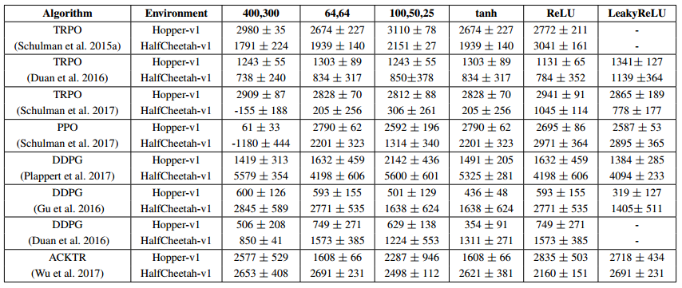
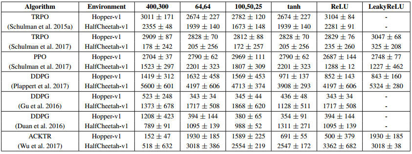
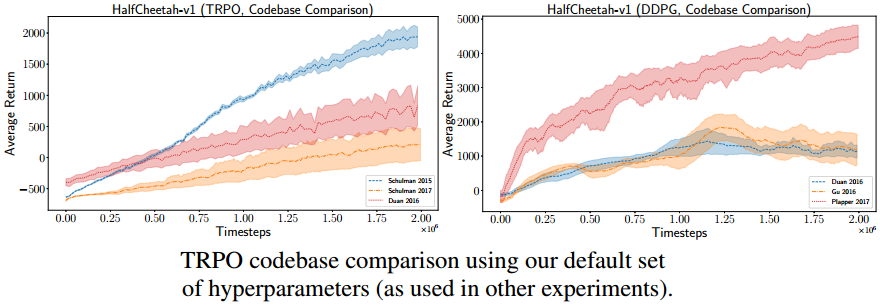
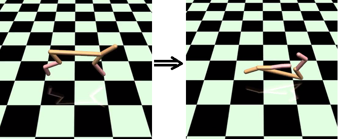
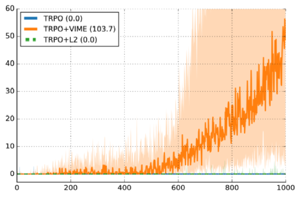

# 强化学习前景

- [返回顶层目录](../../README.md)
- [本章在学习地图中的位置](#本章在学习地图中的位置)
- [本章简介](#本章简介)
  - [课程小结](#课程小结)
  - [课程目标](#课程目标)
- [对深度强化学习的综述](#对深度强化学习的综述)
  - [Reward-Driven Behaviour](#Reward-Driven Behaviour)
  - [RL算法](#RL算法)
  - [研究方向和挑战](#研究方向和挑战)
    - [Model-based RL](#Model-based RL)
    - [Exploration vs. Exploitation](#Exploration vs. Exploitation)
    - [Hierarchical RL](#Hierarchical RL)
    - [Imitation Learning and Inverse RL](#Imitation Learning and Inverse RL)
    - [Multi-agent RL](#Multi-agent RL)
    - [Memory and Attention](#Memory and Attention)
    - [Transfer Learning](#Transfer Learning)
    - [Benchmarks](#Benchmarks)
- [影响强化学习复现的要素](#影响强化学习复现的要素)
  - [文章概要](#文章概要)
  - [Hyperparameters](#Hyperparameters)
  - [Network Architecture](#Network Architecture)
  - [Reward Scale](#Reward Scale)
  - [Random Seeds and Trials](#Random Seeds and Trials)
  - [Environments](#Environments)
  - [Codebases](#Codebases)
- [深度强化学习劝退文](#深度强化学习劝退文)
  - [Sample Inefcient](#Sample Inefcient)
  - [Poor Performance](#Poor Performance)
  - [Reward Function](#Reward Function)
  - [Local Optima](#Local Optima)
  - [Overftting to Weird Patterns](#Overftting to Weird Patterns)
  - [Hard to reproduce](#Hard to reproduce)
  - [Common properties that make learning easier](#Common properties that make learning easier)
  - [Looking to The Future](#Looking to The Future)

# 本章在学习地图中的位置

本章主要是梳理一下目前强化学习比较热门的研究方向，以及之前没有提到的一些问题。

# 本章简介

## 课程小结

* 从传统强化学习出发
  * 数学化地介绍了强化学习问题——建模为MDP
  * 着重介绍了无模型方法（表格情况下）
  * 以及在无模型下的函数近似的方法
  * 主要介绍了基于值函数的方法
  * 同时补充了策略梯度方法
* 概要式地梳理了DRL一些算法
* 简要介绍了基于模型的强化学习

## 课程目标

希望大家学习完这门课后，能够回答以下问题：

* 知道强化学习究竟在解决什么问题？
* 其数学基础是什么？
* 主要的方法基础是什么？
* 每种方法背后的原理是什么？
* 不同的方法之间的优缺点是什么？
* 是否有一个清晰的知识树？

# 对深度强化学习的综述

综述来源于这篇文献：

>[《A Brief Survey of Deep Reinforcement Learning》](https://arxiv.org/abs/1708.05866)
>Kai Arulkumaran, Marc Peter Deisenroth, Miles Brundage, Anil Anthony Bharath 
>
>[翻译](https://blog.csdn.net/KyrieHe/article/details/79504481)

讲了深度强化学习的发展以及未来的研究方向。它对于整个强化学习的概述是基于奖励驱动的行为。

## Reward-Driven Behaviour 

* 强化学习的所有行为都是由**奖励**驱动的

  * 最大化期望回报值
  * 奖励函数的设置是强化学习中的关键

* 通过**交互**来学习

* RL所面临的一些独特的挑战

  * 最优的策略只能通过试错来获得，唯一的学习信号就是奖励

    导致样本复杂度很高，并不是每个经验都有可供学习的奖励

  * 观测数据和动作相关，具有时间相关性

    需要打破时间相关性，比如经验回放

  * 序列化的动作导致了奖励信号，因此存在信度分配问题

    通过贝尔曼方程，将整个轨迹上的回报值，有效地分配到每一个状态

## RL算法

* 值函数方法
  * 动态规划，蒙特卡洛，Sarsa，Q学习，采样
* 策略搜索
  * 进化算法，策略梯度，REINFORCE
* Actor-Critic（前面两种的结合）
  * 方差减小，优势函数
* 规划
  * Dyna，MCTS
* DRL
  * DQN，A2C，DPPG，PPO

## 研究方向和挑战

* Model-based RL
* Exploration vs. Exploitation（探索vs利用）
* Hierarchical RL（分层强化学习）
* Imitation Learning and Inverse RL（模仿学习和反（逆向）强化学习）
* Multi-agent RL
* Memory and Attention
* Transfer Learning
* Benchmarks

### Model-based RL

* 大幅减少真实样本复杂度
* 精确的模型可以降低策略的复杂度
* 可以融入人为先验
* 学习的环境模型可以指导探索

### Exploration vs. Exploitation

* RL中的基本问题

  探索与利用的权衡

  探索有很多种方法，之前只讲了ε-greedy

* ε-greedy

  是最基础的探索方法，只考虑了最优的动作和非最优的动作

* Noise Net

* Upper confdence bound

* 好奇心算法

### Hierarchical RL

之前的强化学习，输入是状态，输出是动作

而分层强化学习分为两部分，分为底层策略（输出动作）和高层策略（输出选择）。

* 分层策略

* 分层的动作：action和option（带时间抽象的动作）

  控制机械臂抓水杯，高层策略option分为两个动作（选择子策略）：1识别定位水杯，2机械臂抓水杯。底层策略：识别怎么一步步把眼睛对焦，抓水杯怎么一步步做，是基本动作，时间粒度很细

  射击游戏，option（抽象动作）：1探索地图2，瞄准射击。action：1射击：怎么一步步移动鼠标，点鼠标。即action是为了实现action，而抽闲动作构成上层逻辑链条

* 高层策略负责选择子策略执行的顺序，子策略负责执行

* 高层策略负责生成子目标，子策略负责完成子目标

  每一个子策略就有一个网络。有一个网络专门负责怎么探索地图，另一个专门负责射击。高层就是开关，负责什么时候探索地图，什么时候射击

  另一个高层策略的组织方式是：高层策略的输出不是开关，而是标量，而子策略会把这个标量作为输入。这个方式一般用于走迷宫。高层策略输入钥匙的坐标，子策略执行，高层策略再输入门的坐标，然后子策略去执行

* 大大减小学习的复杂度

  高层探索的尺度特别大，不会考虑那么细，更容易靠近最优目标，学习起来很容易

* 能够具有更高的可解释性和迁移性

  以射击游戏为例：即会了瞄准射击技能，但迁移到更复杂的地图时，这个技能还是可以用的

### Imitation Learning and Inverse RL

模仿学习和反（逆向）强化学习

* 使用监督学习从专家示例中学习
* Behaviour cloning
* 学习奖励函数
* 使用对抗学习来学习奖励函数

### Multi-agent RL

* 考虑多个智能体

* 博弈论

* 完全信息和不完全信息

* 允许交流和不允许交流

  例子：股票博弈（不允许交流）

* 竞争，合作

### Memory and Attention

将强化学习和memory去做结合，把过去的历史记住。因为有很多情况下不满足马尔科夫性。

* 把CNN变成RNN，整合序列信息，拥有记忆功能，处理POMDP
* 使用Attention选择下个关注的输入部分
* 除了处理序列信息外，可以增加可微分的Memory
* 学习可微分的读写操作
* 给智能体增加了利用记忆的功能

### Transfer Learning

* 迁移学习，多任务学习，课程学习

* 从一个任务迁移到另一个任务

* 从虚拟环境迁移到真实的环境

* 辅助任务

* distillation（蒸馏）

  从多个任务中学到的策略中，提取一个通用的策略

### Benchmarks

怎么构造一些标准，有一个公有的验证评判强化学习性能好坏的平台。

* Atari
* Vizdoom（3D射击游戏）
* Mujoco（多关节的连续控制）
* StarCraft（星际争霸）
* Deepmind Lab（是开源的）

# 影响强化学习复现的要素

怎么去复现论文的强化学习算法，这里根据一篇paper来讲述。

>[《Deep Reinforcement Learning that Matters》](https://arxiv.org/abs/1709.06560)
>
>Peter Henderson, Riashat Islam, Philip Bachman, Joelle Pineau, Doina Precup, David Meger

这篇paper做了一个实验，真正公平的对比了到底哪些东西影响了深度强化学习算法。在实现强化学习算法和调参的时候，大家可以看看这篇文章，知道哪些东西是有用的。更重要的是，揭露了深度强化学习的一些问题。

## 文章概要

这篇文章都做了哪些事：

* Reproducing existing work

* Accurately judging the improvements offered by novel methods

  复现已有工作的目的是精确判断这些已有的工作中的哪些东西真正对强化学习有帮助

* Investigate challenges posed by reproducibility, proper experimental techniques, and reporting procedures

* Reproducibility can be affected by:

  * Extrinsic factors (e.g. hyperparameters and codebases（代码框架）)
  * Intrinsic factors (e.g. random seeds and environments properties)

* Focus on DDPG, PPO, TRPO, ACKTR

  集中在策略梯度的一些方法。

## Hyperparameters

超参数：

What is the magnitude of the effect hyperparameter settings can have on baseline performance? 

很多论文，会把超参数调得特别好，让你觉得这个方法很好，但你自己真正去复现的时候，因为你的超参数和论文中的不一样，导致你觉得实验结果并没有像论文中说的那么好，并不会很基本的一些方法好很多。

以PPO为例：每一个超参数的变化，都对性能影响较大：

PPO
– Policy Network: (64, tanh, 64, tanh, Linear) + Standard Deviation variable; Value Network (64, tanh, 64, tanh, linear)
– Normalized observations with running mean filter
– Timesteps per batch 2048
– clip param = 0.2
– entropy coeff = 0.0
– Optimizer epochs per iteration = 10
– Optimizer step size 3e - 4
– Optimizer batch size 64
– Discount γ = 0:995, GAE λ = 0:97
– learning rate schedule is constant 

##Network Architecture

How does the choice of network architecture for the policy and value function approximation affect performance? 

这里节选了论文的一部分：

这里做了三个网络结构的对比，改变网络结构对结果影响挺大的，大家并不知道为什么，所以这叫玄学。所以复现很难，即使网络是正确的。激活函数的不同，结果也差距挺大。

**Policy Network**

不同的算法去改变网络结构、激活函数，在这总不同的配置下，其性能表现是完全不一样的。

改变Actor网络：

Table 1: Results for our policy architecture permutations across various implementations and algorithms. Final average ± standard error across 5 trials of returns across the last 100 trajectories after 2M training samples. For ACKTR, we use ELU activations instead of leaky ReLU. 

**Value Network**

改变critic网络：

Table 2: Results for our value function (Q or V ) architecture permutations across various implementations and algorithms. Final average ± standard error across 5 trials of returns across the last 100 trajectories after 2M training samples. For ACKTR, we use ELU activations instead of leaky ReLU. 

## Reward Scale

Reward Scale是什么？

比如你和别人下棋，你可以这样定义奖励规则，赢了给1，输了给0；也可以赢了给100，输了给0。按道理来说，一个强化学习算法，只比较相对大小就可以了，不论赢了给1还是给100，对实际性能没有影响。但实际不是这样，因为这个幅度会影响神经网络的学习，这个问题其实是由神经网络带来的。

How can the reward scale affect results? Why is reward rescaling used?

## Random Seeds and Trials

Can random seeds drastically alter performance? Can one distort results by averaging an improper number of trials? 

即使其他任何参数都一样，只改下随机种子，结果都是不一样的。这就是说，有时候实验做得好不好，说句玩笑话，看命！到目前为止，也没人给出很好的解释。

## Environments

How do the environment properties affect variability in reported RL algorithm performance?

不同的算法对不同的环境，其实都是不一样的。

## Codebases

Are commonly used baseline implementations comparable? 

同样的算法，同样的超参数，但通过不同的框架去实现，比如通过TensorFlow或Theano框架去实现，结果都是不一样的。这就是玄学。

所以啊，深度强化学习里面的问题还是很多的，既然多，那就来劝退大家了。。。

# 深度强化学习劝退文

上一节中的文章《Deep Reinforcement Learning That Matters》是打响DRL深度强化学习劝退第一枪的文章，又有一篇爆文[《**Deep Reinforcement Learning Doesn't Work Yet**》Alex](https://www.alexirpan.com/2018/02/14/rl-hard.html)，或可直译为深度强化学习还玩不转或意译为深度强化学习远不能即插即玩。

> Whenever someone asks me if reinforcement learning can solve their problem, I tell them it can’t. I think this is right at least 70% of the time.

看完以后很多从自己去年七月入坑以来隐隐约约的困惑都得到了解答。读完大有如不见此文，万古如长夜之感。心里激动，一时难以自抑。

这篇文章是我入坑以来看到的深度强化学习方面最好的阶段性总结，强烈建议应该作为深度强化学习的第一课，看完以后大家再慎重考虑到底要不要入坑。

先看一下作者的背景。作者叫Alex Irpan，现为谷歌大脑机器人团队的软件工程师。他从伯克利拿到的计算机科学本科学位，本科的时候曾经在伯克利人工智能实验室（Berkeley AI Research (BAIR) Lab）进行本科科研，导师是DRL大牛 Pieter Abbeel，他还和John Schulman工作过。

这篇文章一上来就指出深度强化学习是个大坑。它的成功案例其实很少，但每个都太有名了，例如用 Deep Q Network（DQN）在Atari games上用原始像素图片作为状态达到甚至超越人类专家的表现、通过左右互搏（self-play）等方式在围棋上碾压人类、大大降低了谷歌能源中心的能耗等等。造成的结果就是没有从事过深度强化学习的研究人员对它产生了很大的错觉，高估了它的能力，低估了它的难度。

强化学习本身是一个非常通用的人工智能范式，在直觉上让人觉得非常适合用来模拟各种时序决策任务，如语音、文本类任务。当它和深度神经网络这种只要给我足够层和足够多的神经元，可以逼近任何函数的非线性函数近似模型结合在一起感觉要上天啊，无怪乎DeepMind 经常号称人工智能=深度学习+强化学习。

然而Alex告诉我们别急，让我们先来审视一些问题：

## Sample Inefcient

**它的样本利用率非常低**。换言之为了让模型的表现达到一定高度需要极为大量的训练样本。

* Deep Reinforcement Learning Can Be Horribly Sample Inefcient
* Atari:
  * Rainbow: 18 million frames: 83 hours of play experience
  * Distributional DQN: 70 million frames
  * Nature DQN: 200 million frames
* Mujoco benchmarks: 10^5 ∼ 10^7 steps
* DeepMind parkour paper: using 64 workers(CPU) for over 100 hours 

## Poor Performance

**最终表现很多时候不够好**。在很多任务上用非强化学习甚至非学习的其它方法，如基于模型的控制（model based control），线性二次型调节器（Linear Quadratic Regulator）等等可以获得好得多的表现。最气人的是这些模型很多时候样本利用率还高。当然这些模型有的时候会有一些假设，比如有训练好的模型可以模仿，比如可以进行蒙特卡洛树搜索等等。

就是说，如果你只关注问题的结果，很多时候都不需要强化学习算法。

* If You Just Care About Final Performance, Many Problems are **Better** Solved by Other Methods

* For purely getting good performance, deep RL’s track record isn’t that great

* Model based control and Linear Quadratic Regulator can achievehigher performance and lower sample complexity

* MCTS

  很多时候，单纯地用蒙特卡洛树MCTS加一个UCT探索，就能比DQN做的还要好

  

## Reward Function

**DRL成功的关键离不开一个好的奖励函数（reward function）**，然而这种奖励函数往往**很难设计**。在《Deep Reinforcement Learning That Matters》中作者提到有时候把奖励乘以一个常数模型表现就会有天和地的区别。但奖励函数的坑爹之处还不止如此。奖励函数的设计需要保证：

* 加入了合适的先验，良好的定义了问题和在一切可能状态下的对应动作。坑爹的是模型很多时候会找到作弊的手段。Alex举的一个例子是有一个任务需要把红色的乐高积木放到蓝色的乐高积木上面，奖励函数的值基于红色乐高积木底部的高度而定。结果一个模型直接把红色乐高积木翻了一个底朝天。仔啊，你咋学坏了，阿爸对你很失望啊。
* 奖励函数的值太过稀疏。换言之大部分情况下奖励函数在一个状态返回的值都是0。这就和我们人学习也需要鼓励，学太久都没什么回报就容易气馁。都说 21 世纪是生物的世纪，怎么我还没感觉到呢？21世纪才刚开始呢。我等不到了啊啊啊啊啊。
* 有的时候在奖励函数上下太多功夫会引入新的偏见（bias）。
* 要找到一个大家都使用而又具有好的性质的奖励函数。这里Alex没很深入地讨论，但链接了一篇陶神（Terence Tao）的博客，大家有兴趣可以去看下。

---

* Reinforcement Learning Usually Requires a Reward Function
* Reward Function Design is Difficult

不合适的奖励函数导致的奇怪行为（作弊）的例子：

In talks with other RL researchers, I’ve heard several anecdotes about the novel behavior they’ve seen from improperly defined rewards.

- A coworker is teaching an agent to navigate a room. The episode terminates if the agent walks out of bounds. He didn’t add any penalty if the episode terminates this way. The final policy learned to be suicidal, because negative reward was plentiful, positive reward was too hard to achieve, and a quick death ending in 0 reward was preferable to a long life that risked negative reward.

  为了尽快走出房间，每走一步都有一个惩罚，但最终机器人就直接自杀了。。因为不用走路了啊。

- A friend is training a simulated robot arm to reach towards a point above a table. It turns out the point was defined *with respect to the table*, and the table wasn’t anchored to anything. The policy learned to slam the table really hard, making the table fall over, which moved the target point too. The target point *just so happened* to fall next to the end of the arm.

  机械臂够到桌子上某个点，但由于桌子没固定住，结果机器人直接把桌子打翻，然后去够那个点。

- A researcher gives a talk about using RL to train a simulated robot hand to pick up a hammer and hammer in a nail. Initially, the reward was defined by how far the nail was pushed into the hole. Instead of picking up the hammer, the robot used its own limbs to punch the nail in. So, they added a reward term to encourage picking up the hammer, and retrained the policy. They got the policy to pick up the hammer…but then it threw the hammer at the nail instead of actually using it.

## Local Optima

**局部最优/探索和剥削（exploration vs. exploitation）的不当应用**。局部最优很难跳出去，因为很难找到最优值。Alex举的一个例子是有一个连续控制的环境里，一个类似马的四足机器人在跑步，结果模型不小心多看到了马四脚朝天一顿乱踹后结果较好的情况，于是你只能看到四脚朝天的马了。

* Even Given a Good Reward, Local Optima Can Be Hard To Escape
* Exploration-exploitation trade-off wrongs

## Overftting to Weird Patterns

**对环境的过拟合**。DRL少有在多个环境上玩得转的。你训练好的DQN在一个Atari game上work了，换一个可能就完全不work。即便你想要做迁移学习，也没有任何保障你能成功。

* Even When Deep RL Works, It May Just Be Overftting to Weird Patterns In the Environment
* The fnal model won’t generalize to other games

例子：

We studied a toy 2-player combinatorial game, where there’s a closed-form analytic solution for optimal play. In one of our first experiments, we fixed player 1’s behavior, then trained player 2 with RL. By doing this, you can treat player 1’s actions as part of the environment. By training player 2 against the optimal player 1, we showed RL could reach high performance. But when we deployed the same policy against a non-optimal player 1, its performance dropped, because it didn’t generalize to non-optimal opponents.

和别人下棋，只会战胜高手，和菜鸟却赢不了。。这就是严重过拟合。

## Hard to reproduce

**不稳定性，很难复现**。

* 读 DRL 论文的时候会发现有时候作者们会给出一个模型表现随着尝试 random seed 数量下降的图，几乎所有图里模型表现最终都会降到 0。相比之下在监督学习里不同的超参数或多或少都会表现出训练带来的变化，而 DRL 里运气不好可能很长时间你模型表现的曲线都没有任何变化，因为完全不work。
* 即便知道了超参数和随机种子，你的实现只要稍有差别，模型的表现就可以千差万别。这可能就是 Deep Reinforcement Learning That Matters 一文里 John Schulman 两篇不同文章里同一个算法在同一个任务上表现截然不同的原因。
* 即便一切都很顺利，从我个人的经验和之前同某DRL研究人员的交流来看，只要时间一长你的模型表现就可能突然从很好变成完全不work。原因我不是完全确定，可能和过拟合和variance过大有关。

特别是不稳定性这一点，几乎是灾难性的。作者提到自己实习的时候一开始实现Normalized Advantage Function(NAF)，为了找出Theano本身的bugs花了六周，这还是在NAF作者就在他旁边可以供他骚扰的情况下的结果。原因就是DRL的算法很多时候在没找好超参数的情况下就是不work 的，所以你很难判断自己的代码到底有没有bug还是运气不好。

Even Ignoring Generalization Issues, The Final Results Can be Unstable and Hard to Reproduce

## Common properties that make learning easier

作者认为从这些案例里获得的**经验教训**是DRL可能在有以下条件的情况下更可能有好的表现，条件越多越好：

* It is easy to generate near unbounded amounts of experience.

  数据获取非常容易，非常cheap

* The problem is simplifed into an easier form

  不要急着一上来就攻坚克难，可以从简化的问题入手

* There is a way to introduce self-play into learning

  可以进行左右互搏，就可以通过MCTS蒙特卡洛树搜索和基于模型的方法去解决

* There’s a clean way to defne a learnable, ungameable reward

  奖励函数容易定义

* If the reward has to be shaped, it should at least be rich

  要让奖励信号非常多，反馈及时。即在中间环节给一些奖励，不让奖励信号那么稀疏。

## Looking to The Future

他也指出了强化学习一些未来潜在的发展方向和可能性：

* Local optima are good enough

  **让局部最优或许已经足够好**，就不用努力跳出局部找到全局最优了。未来某些研究可能会指出我们不必过于担心大部分情况下的局部最优。因为他们比起全局最优并没有差很多

* Hardware solves everything

  **硬件为王**。在硬件足够强的情况下我们或许就不用那么在乎样本利用率了，凡事硬刚就可以有足够好的表现。各种遗传算法玩起来

* Add more learning signal

  **人为添加一些监督信号**。在环境奖励出现频次太低的情况下可以引入自我激励（intrinsic reward）或者添加一些辅助任务，比如DeepMind就很喜欢这套，之前还写了一篇[《Reinforcement Learning with Unsupervised Auxiliary Tasks》](https://arxiv.org/abs/1611.05397)。LeCun不是嫌蛋糕上的樱桃太少吗，让我们多给他点樱桃吧！

* Model-based learning unlocks sample effeciency

  **更多融合基于模型的学习从而提高样本使用率**。这方面的尝试其实已经有很多了，具体可以去看Alex提到的那些工作。但还远不够成熟

* Use reinforcement learning just as the fine-tuning step

  **仅仅把DRL用于fine-tuning**，而不是解决问题的全部。比如最初Alpha Go就是先用监督学习学棋谱，再用强化学习进一步调优。

* Reward functions could be learnable

  **自动学习奖励函数**。这涉及到 inverse reinforcement learning（逆强化学习）和imitation learning（模仿学习）

* Transfer learning saves the day

  **迁移学习和强化学习的进一步结合**

* Good priors could heavily reduce learning time

  **好的先验**

* Harder environments could paradoxically be easier

  **有的时候越复杂的任务反而更容易学习**。Alex提到的例子是DeepMind经常喜欢让模型学习很多同一环境的变种来减小对环境的过拟合。我觉得这也涉及curriculum learning，即从简单的任务开始逐步加深难度。可以说是层层递进的迁移学习。另外一个可能的解释是很多时候人觉得困难的任务和机器觉得困难的任务是相反的。比如人觉得倒水很简单，你让机器人用学习的路子去学倒水就可以很难。但反过来人觉得下围棋很难而机器学习模型却在下围棋上把人击败了

---

最后Alex总体还是非常乐观的。他说尽管现在有很多困难，使得DRL或许还不是一个强壮（robust）到所有人都可以轻易加入的研究领域并且很多时候一些问题用DRL远没有监督学习简单和表现好，但或许过几年你再回来DRL就work了也未知啊。这还是很振奋人心的。田渊栋老师也表达过类似的想法，觉得正因为这个领域还不够成熟所以还有很多机会。他们都是了不起的研究人员。看到这篇文章我总体是非常激动的。但实话说也有些遗憾，如果去年暑假就有这篇文章的话也许我就会再慎重考虑一下到底要不要在实验室没有积累自己又离毕业和申请不远的情况下开始这样一个主题了。这是一个教训，就是开始一个领域前要对这个领域要有充分的了解，之前零零散散在网上也有了一点相关的声音，比如Karpathy就提到他在实现vanilla policy gradient的时候也遇到了很多困难。

最后的最后还是要强推Alex的这篇文章，他列的这些点很多DRL的研究人员可能已经非常了解了，但之前没有人这样完整、有组织地介绍一遍。对于想要做DRL的同学们来说实在是福音。拙作是看完他文章后第一时间的感想和概括，对于我不够了解的有些地方就一笔带过了，或者表述也不够准确。原文很长，我在对大部分内容比较熟悉的情况下看了一个半小时，但也很有意思，还是强烈推荐。最后本文可能有些标题党，并不是真的要完全劝退大家，Alex的本意是希望大家更加冷静地看待目前DRL研究的进展，避免重复踩坑。评论区里有提到因为困难才有做的价值，还有机器人、控制论背景的朋友提到他觉得drl can do anything如果你有正确的超参数，这些意见也很值得大家参考。

总之，对于DRL，挑战与机遇并存! 

# 参考文献

* [《强化学习理论与实践》第11章：前景与大作业](http://www.shenlanxueyuan.com/course/96)

本文是这节课的笔记。

* [《这里有一篇深度强化学习劝退文》](https://blog.csdn.net/r1unw1w/article/details/79385925)

“深度强化学习劝退文”一节参考此博客。

