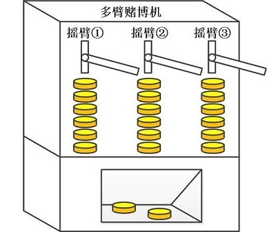

# 多臂赌博机及其解法

* [返回上层目录](../reinforcement-learning.md)
* [探索-利用困境](#探索-利用困境)
* [多臂赌博机](#多臂赌博机)

# 探索-利用困境

所谓探索（Exploration）：是指做你以前从来没有做过的事情，以便获得更高的回报。

所谓利用（Exploitation）：是指做你当前知道的能产生最大回报的事情。

对于探索和利用的理解我们举个例子：假设你家附近有十个餐馆，到目前为止，你在八家餐馆吃过饭，知道这八家餐馆中哪家的餐馆饭最好吃。有一天，你女朋友来看你，你决定带她去餐馆吃饭。请问你带她去哪家餐馆？

当然，你最想带她去你家附近十个餐馆中最好吃的那家吃饭。但是，你只吃过八家，只知道吃过的八家中最好吃的是哪家。

在这个例子中，利用（exploitation）是指你带她去你知道的八家中最好吃的那家餐馆吃饭；而探索（exploration）是你带她去你从没吃过的第九家或第十家吃饭。

问题是你该带她去八家中最好吃的那家还是去没吃过的那两家。如果你带她去八家中最好吃的那家，那么也许第九家或第十家比你吃过的八家都要好一万倍。但是，如果你带她去第九家或第十家，也许这两家比你吃过的八家最差的都要差上一万倍。

那么，你到底该去哪家呢？

这就是探索-利用困境。

一个标准的强化学习算法必然要包括探索和利用。探索帮助智能体充分了解它的状态空间，利用则帮助智能体找到最优的动作序列。

# 多臂赌博机

探索与利用平衡问题中最经典的一个问题就是多臂赌博机问题（Multi-Armed Bandit），最早的探索-利用困境是学者们在研究多臂赌博机（Multi-Armed Bandit）时遇到的。

上图为多臂赌博机的示意图。多臂赌博机由一个盛着金币的箱子、K个臂（图中为3个臂）组成。玩家通过按压摇臂来获得金币（回报）。

**多臂赌博机的问题是：你按压哪个臂能得到最大的回报？**

问题假设：按下摇臂后的回报取值为1或0，每个摇臂获得回报的概率服从不同的分布，但事先并不知道

问题目标：按照某种策略来按压摇臂以获得最大的累计回报（咦，这不就是强化学习的目标嘛）

在这个问题中，探索与利用就是：

利用（exploitation）：按压之前获得回报概率最高的那个臂，以获得更高的累计回报。但是因为回报是随机的，对每个臂的回报概率的估计并不准确，或许真实回报概率最高的那个臂并非当前估计的那个臂。

探索（exploration）：随机地去按压不同的臂，得到每个臂更精确的回报概率估计，从而找到真实的那个最优的臂。但是要探索，就要去按压目前回报概率估计并不高的臂，意味着会损失一些按压高回报摇臂的机会。

窘境：因为尝试次数有限，所以探索和利用是矛盾的，加强一方必然削弱另一方。要想回报最大，则必须在探索和利用之中达成较好的平衡。

那如何来平衡探索和利用呢？

用数学语言定义如下：

一个伯努利多臂赌博机可描述为$<\mathcal{A}, \mathcal{R}>$，其中

* 多臂赌博机有$K$个臂，其获奖概率分别为$\{\theta_1, ..., \theta_K\}$
* 每次时间步$t$只操作其中一个赌博机，该操作记为$a$，并得到奖励$r$
* $\mathcal{A}$是一组动作的集合，里面每个动作分别代表了对一个机器的操作。动作$a$的值就是期望奖励$Q(a)=\mathbb{E}[r|a]=\theta$。若时间步$t$的动作$a_t$是操作第$i$个赌博机，则$A(a_t)$

# ε-贪婪算法

# 上置信界算法

## Hoeffding不等式

Hoeffding’s Inequality

## UCB1

## 贝叶斯UCB

# Thompson采样

Thompson Sampling

# 参考文献

* [The Multi-Armed Bandit Problem and Its Solutions](https://lilianweng.github.io/lil-log/2018/01/23/the-multi-armed-bandit-problem-and-its-solutions.html)

本文参考并翻译了这篇文章。

* [UCB公式的理解](https://blog.csdn.net/songyunli1111/article/details/83384738)

本文参考了这篇博客。

===

* [UCB公式的理解](https://www.baidu.com/link?url=MJVRzwRexK_ggwql5Sz48ulGR6Rac34oHqn09iGofbvIjQ_AaPs3WGmFp2dTW13Vt00WLRgmqsC5cEUnAuGJJkbab7-hUdHlB0t8XIW_R0K&wd=&eqid=adaffffc001c57c50000000360cdcde5)
* [高级强化学习系列 第二讲 探索-利用困境（exploration-exploitation dilemma）（二）](https://zhuanlan.zhihu.com/p/33146752)

